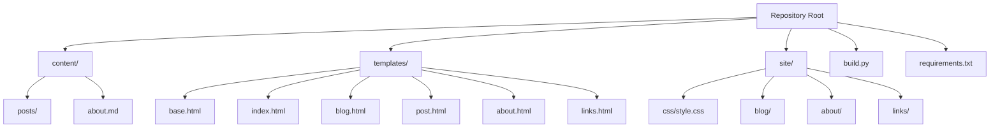
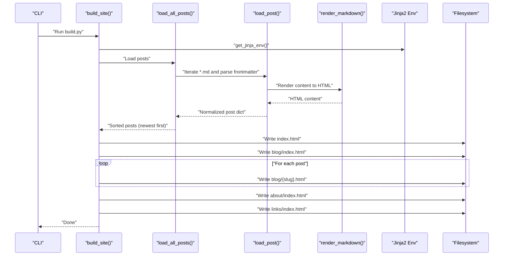
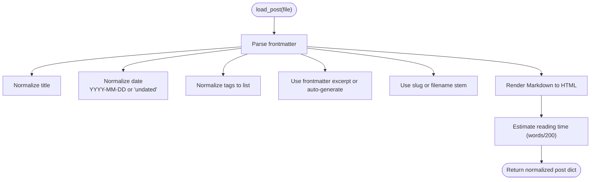
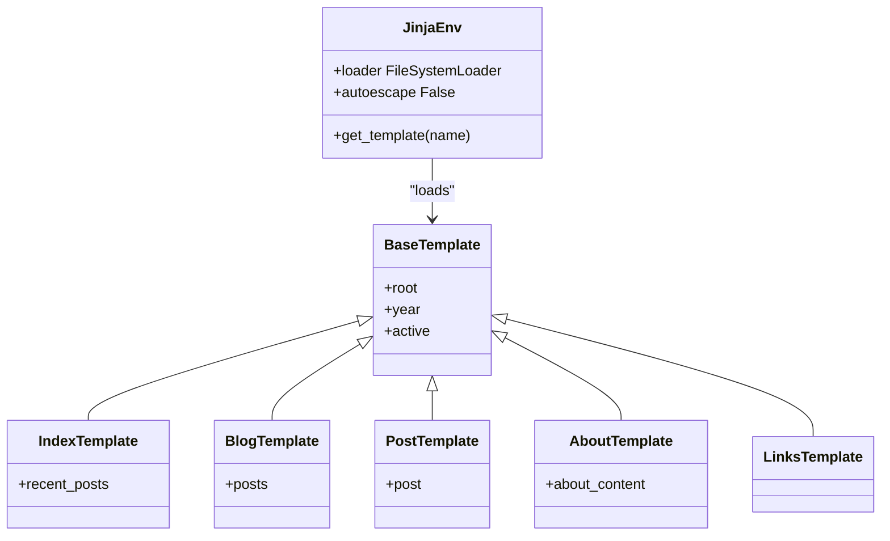
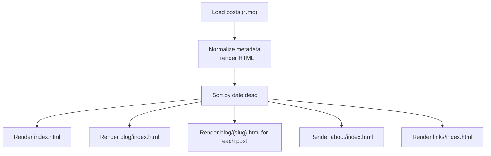
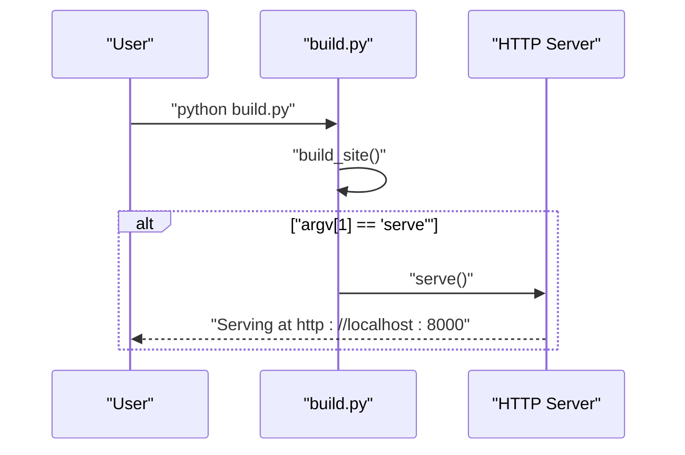
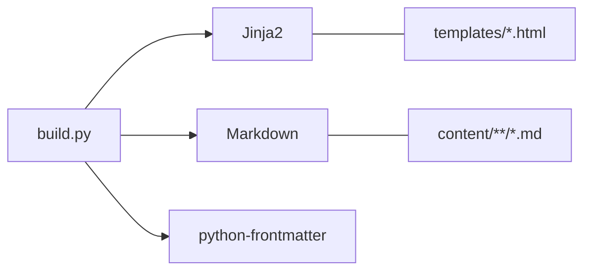

# Build Process

<cite>
**Referenced Files in This Document**
- [build.py](file://build.py)
- [requirements.txt](file://requirements.txt)
- [content/about.md](file://content/about.md)
- [content/posts/welcome-to-seisamuse.md](file://content/posts/welcome-to-seisamuse.md)
- [content/posts/environmental-seismology-intro.md](file://content/posts/environmental-seismology-intro.md)
- [templates/base.html](file://templates/base.html)
- [templates/index.html](file://templates/index.html)
- [templates/blog.html](file://templates/blog.html)
- [templates/post.html](file://templates/post.html)
- [templates/about.html](file://templates/about.html)
- [templates/links.html](file://templates/links.html)
- [site/css/style.css](file://site/css/style.css)
</cite>

## Table of Contents
1. [Introduction](#introduction)
2. [Project Structure](#project-structure)
3. [Core Components](#core-components)
4. [Architecture Overview](#architecture-overview)
5. [Detailed Component Analysis](#detailed-component-analysis)
6. [Dependency Analysis](#dependency-analysis)
7. [Performance Considerations](#performance-considerations)
8. [Troubleshooting Guide](#troubleshooting-guide)
9. [Conclusion](#conclusion)
10. [Appendices](#appendices)

## Introduction
This document explains the Seisamuse build process end-to-end. It covers how Markdown content is loaded, parsed, and transformed into a static website. The pipeline includes frontmatter extraction, metadata normalization, reading time estimation, Markdown-to-HTML conversion, and Jinja2 template rendering. The build follows a five-phase workflow: content loading, about page processing, homepage generation, blog listing creation, and individual post building. It also documents the CLI behavior, template context system, Jinja2 environment configuration, and the resulting file layout.

## Project Structure
The repository is organized into content, templates, and output directories, plus a small Python build script and dependency manifest.

**Diagram sources**
- [build.py:22-27](file://build.py#L22-L27)
- [requirements.txt:1-4](file://requirements.txt#L1-L4)

**Section sources**
- [build.py:22-27](file://build.py#L22-L27)
- [requirements.txt:1-4](file://requirements.txt#L1-L4)

## Core Components
- Content loaders: load and normalize Markdown posts and the about page.
- Rendering engine: convert Markdown to HTML and compute derived metadata.
- Template system: Jinja2 environment configured from the templates directory.
- Build orchestrator: coordinates the five-phase build and writes output files.
- CLI: supports build-only and build-plus-serve modes.

Key responsibilities:
- Frontmatter parsing and fallback defaults for missing fields.
- Date normalization and sorting for chronological ordering.
- Reading time estimation for post cards.
- Template context composition and per-page rendering.
- Output directory creation and file writing with UTF-8 encoding.

**Section sources**
- [build.py:47-53](file://build.py#L47-L53)
- [build.py:56-64](file://build.py#L56-L64)
- [build.py:67-70](file://build.py#L67-L70)
- [build.py:73-112](file://build.py#L73-L112)
- [build.py:115-130](file://build.py#L115-L130)
- [build.py:133-139](file://build.py#L133-L139)
- [build.py:154-236](file://build.py#L154-L236)
- [build.py:239-253](file://build.py#L239-L253)

## Architecture Overview
The build process is a linear pipeline orchestrated by the build script. It loads content, normalizes metadata, renders HTML, and applies templates to produce static files.

**Diagram sources**
- [build.py:154-236](file://build.py#L154-L236)
- [build.py:115-130](file://build.py#L115-L130)
- [build.py:73-112](file://build.py#L73-L112)
- [build.py:56-64](file://build.py#L56-L64)

## Detailed Component Analysis

### Markdown Frontmatter Extraction and Metadata Processing
- Frontmatter is parsed via a dedicated library and merged into a normalized dictionary.
- Fields supported include title, date, tags, excerpt, and slug. Defaults are applied when absent.
- Date handling accepts datetime objects or strings and normalizes to an ISO-like string suitable for sorting.
- Tags accept either a comma-separated string or a list and are normalized to a list.
- Excerpt prioritizes explicit frontmatter value, falls back to a short auto-excerpt from the first paragraph if empty.
- Reading time is estimated from word count using a fixed average.

**Diagram sources**
- [build.py:73-112](file://build.py#L73-L112)

**Section sources**
- [build.py:73-112](file://build.py#L73-L112)

### Template Context System and Jinja2 Environment
- A Jinja2 environment is created pointing to the templates directory.
- The environment is configured without autoescape to preserve raw HTML blocks where needed.
- The common context includes a relative root placeholder and current year for footer branding.
- Each page template extends a base layout and injects page-specific variables:
  - Home: recent posts subset.
  - Blog listing: full post list.
  - Individual post: a single post object.
  - About: pre-rendered about content.
  - Links: placeholder content.

**Diagram sources**
- [build.py:47-53](file://build.py#L47-L53)
- [build.py:164-167](file://build.py#L164-L167)
- [templates/base.html:1-43](file://templates/base.html#L1-L43)
- [templates/index.html:1-73](file://templates/index.html#L1-L73)
- [templates/blog.html:1-27](file://templates/blog.html#L1-L27)
- [templates/post.html:1-30](file://templates/post.html#L1-L30)
- [templates/about.html:1-12](file://templates/about.html#L1-L12)
- [templates/links.html:1-48](file://templates/links.html#L1-L48)

**Section sources**
- [build.py:47-53](file://build.py#L47-L53)
- [build.py:164-167](file://build.py#L164-L167)
- [templates/base.html:1-43](file://templates/base.html#L1-L43)

### Five-Phase Build Workflow
1) Content loading
- Enumerate Markdown files under the posts directory.
- Parse frontmatter and render content to HTML.
- Skip malformed entries with a warning and continue.
- Sort posts by normalized date descending.

2) About page processing
- Load the about Markdown file and render to HTML.
- Provide a default placeholder if the file is missing.

3) Homepage generation
- Render the index template with a subset of recent posts.
- Write to the site root index.

4) Blog listing creation
- Render the blog listing template with the full post list.
- Write to the blog index.

5) Individual post building
- Iterate the sorted post list and render each into a slug-named HTML file.
- Write each post page under the blog directory.

6) Additional pages
- Render and write the about page and links page.

**Diagram sources**
- [build.py:115-130](file://build.py#L115-L130)
- [build.py:154-236](file://build.py#L154-L236)

**Section sources**
- [build.py:154-236](file://build.py#L154-L236)

### Command-Line Interface and Parameter Handling
- Build-only mode runs the build and exits.
- Optional serve mode starts a local HTTP server after building.
- The serve command prints the listening address and handles graceful shutdown on interrupt.

**Diagram sources**
- [build.py:255-260](file://build.py#L255-L260)
- [build.py:239-253](file://build.py#L239-L253)

**Section sources**
- [build.py:255-260](file://build.py#L255-L260)
- [build.py:239-253](file://build.py#L239-L253)

### File Output Structure
- site/index.html (homepage)
- site/blog/index.html (blog listing)
- site/blog/{slug}.html (individual posts)
- site/about/index.html (about page)
- site/links/index.html (links page)
- site/css/style.css (styling)

The build ensures parent directories exist before writing files and prints the relative path of each written file.

**Section sources**
- [build.py:142-151](file://build.py#L142-L151)
- [build.py:178-232](file://build.py#L178-L232)
- [site/css/style.css:1-513](file://site/css/style.css#L1-L513)

## Dependency Analysis
External libraries:
- Jinja2: templating engine.
- markdown: Markdown rendering with extensions.
- python-frontmatter: frontmatter parsing.

These are declared in the requirements manifest.

**Diagram sources**
- [requirements.txt:1-4](file://requirements.txt#L1-L4)
- [build.py:18-20](file://build.py#L18-L20)

**Section sources**
- [requirements.txt:1-4](file://requirements.txt#L1-L4)
- [build.py:18-20](file://build.py#L18-L20)

## Performance Considerations
- Memory usage
  - Post list is held in memory during sorting and rendering. For very large sites, consider streaming or paginating lists.
  - Markdown rendering occurs per post; keep content reasonable in size to avoid excessive CPU time.
- I/O throughput
  - Writing many small files is I/O bound. On slower filesystems, consider batching writes or using SSD storage.
- Rendering cost
  - The Markdown pipeline includes syntax highlighting and TOC generation. Disable or simplify extensions if build time becomes a bottleneck.
- Parallelization
  - Current implementation is single-threaded. Parallelizing post rendering could reduce build time for large post counts, but requires careful synchronization of template rendering and file writes.

[No sources needed since this section provides general guidance]

## Troubleshooting Guide
Common issues and resolutions:
- Missing or malformed frontmatter
  - Symptom: Warning message and skipped file.
  - Action: Fix or remove invalid frontmatter blocks in the Markdown file.
- Unrecognized date formats
  - Symptom: Date normalized to a fallback string.
  - Action: Use ISO-like date strings or datetime objects for reliable sorting.
- Missing about.md
  - Symptom: Fallback placeholder content.
  - Action: Add or restore the about Markdown file.
- Template errors
  - Symptom: Jinja2 exceptions during render.
  - Action: Verify variable names match the context passed by the build script (e.g., recent_posts, posts, post, about_content).
- Serving fails to start
  - Symptom: Port binding or permission error.
  - Action: Choose a different port or run with appropriate permissions.

**Section sources**
- [build.py:121-127](file://build.py#L121-L127)
- [build.py:133-139](file://build.py#L133-L139)
- [build.py:239-253](file://build.py#L239-L253)

## Conclusion
Seisamuse’s build process is a straightforward, extensible pipeline that transforms Markdown content into a polished static website. By centralizing metadata normalization, rendering, and templating, it enables consistent layouts and easy maintenance. The modular design allows incremental improvements, such as adding pagination, parallelization, or advanced caching strategies, without disrupting the core workflow.

[No sources needed since this section summarizes without analyzing specific files]

## Appendices

### Example Execution Walkthrough
- Posts present:
  - A recent post with explicit frontmatter fields.
  - An older post with minimal frontmatter; excerpt auto-generated.
- Build steps:
  - Load posts and sort newest-first.
  - Render homepage with a recent posts subset.
  - Render blog listing with all posts.
  - Render individual post pages using slugs.
  - Render about and links pages.
- Output:
  - site/index.html, site/blog/index.html, site/about/index.html, site/links/index.html, and per-post files under site/blog/.

**Section sources**
- [content/posts/welcome-to-seisamuse.md:1-53](file://content/posts/welcome-to-seisamuse.md#L1-L53)
- [content/posts/environmental-seismology-intro.md:1-41](file://content/posts/environmental-seismology-intro.md#L1-L41)
- [build.py:154-236](file://build.py#L154-L236)