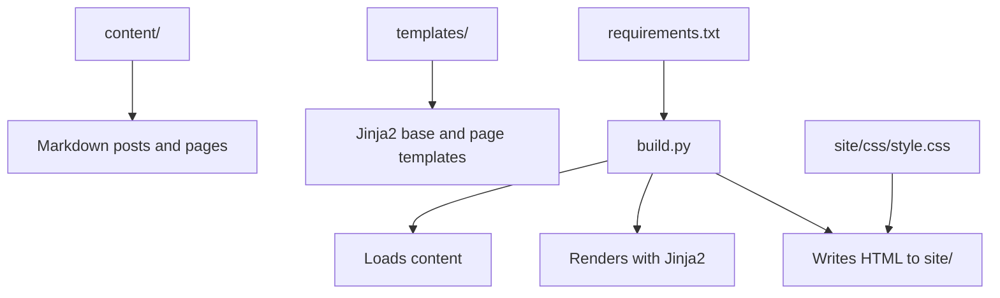
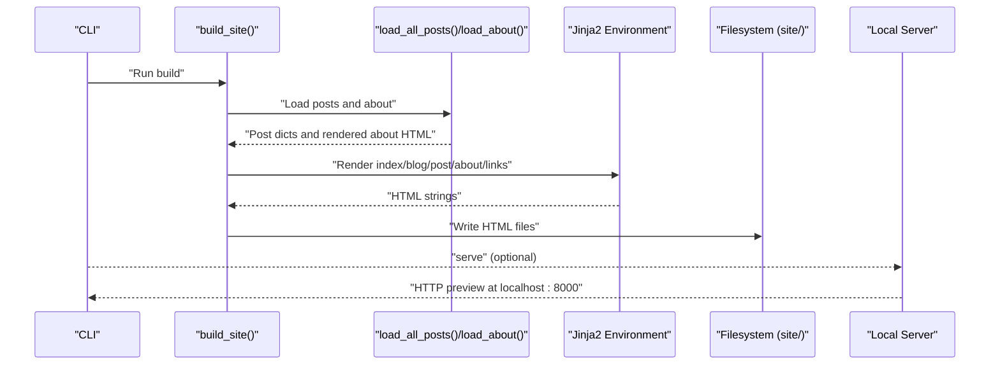
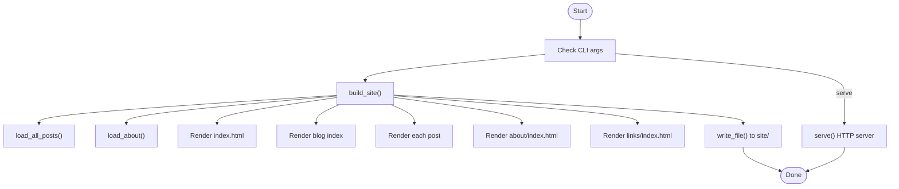
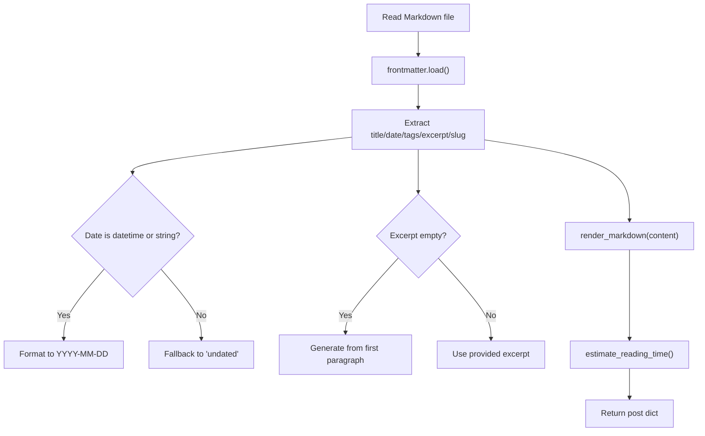
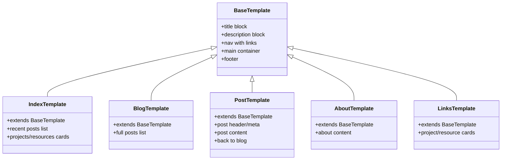
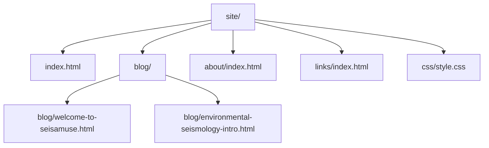
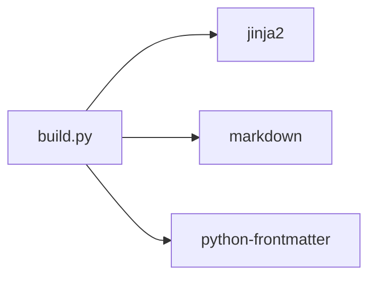

# Build and Deployment

<cite>
**Referenced Files in This Document**
- [build.py](file://build.py)
- [requirements.txt](file://requirements.txt)
- [content/about.md](file://content/about.md)
- [content/posts/welcome-to-seisamuse.md](file://content/posts/welcome-to-seisamuse.md)
- [content/posts/environmental-seismology-intro.md](file://content/posts/environmental-seismology-intro.md)
- [templates/base.html](file://templates/base.html)
- [templates/index.html](file://templates/index.html)
- [templates/blog.html](file://templates/blog.html)
- [templates/post.html](file://templates/post.html)
- [templates/about.html](file://templates/about.html)
- [templates/links.html](file://templates/links.html)
- [site/css/style.css](file://site/css/style.css)
</cite>

## Table of Contents
1. [Introduction](#introduction)
2. [Project Structure](#project-structure)
3. [Core Components](#core-components)
4. [Architecture Overview](#architecture-overview)
5. [Detailed Component Analysis](#detailed-component-analysis)
6. [Dependency Analysis](#dependency-analysis)
7. [Performance Considerations](#performance-considerations)
8. [Deployment Strategies](#deployment-strategies)
9. [Continuous Integration and Automated Deployment](#continuous-integration-and-automated-deployment)
10. [Version Control Best Practices](#version-control-best-practices)
11. [Troubleshooting Guide](#troubleshooting-guide)
12. [Conclusion](#conclusion)

## Introduction
This document explains the complete build and deployment workflow for the static site generator. It covers content creation, Markdown processing, template rendering, static file generation, the command-line interface, development server, site output structure, and deployment strategies for GitHub Pages, Netlify, and traditional web hosts. It also includes CI setup ideas, performance optimization, CDN integration, and troubleshooting guidance.

## Project Structure
The repository is organized into content, templates, and output directories, plus a small Python build script and dependencies.

- content: Markdown files for pages and posts (with frontmatter)
- templates: Jinja2 HTML templates with shared layout and page-specific blocks
- site: Generated static output (HTML, CSS, assets)
- build.py: Build and preview server
- requirements.txt: Python dependencies

**Diagram sources**
- [build.py:154-237](file://build.py#L154-L237)
- [templates/base.html:1-43](file://templates/base.html#L1-L43)
- [site/css/style.css:1-513](file://site/css/style.css#L1-L513)

**Section sources**
- [build.py:22-28](file://build.py#L22-L28)
- [requirements.txt:1-4](file://requirements.txt#L1-L4)

## Core Components
- Content loader: Reads Markdown with frontmatter and extracts metadata (title, date, tags, excerpt, slug). Converts content to HTML via Markdown with configured extensions.
- Template engine: Uses Jinja2 to render pages with a shared base template and page-specific blocks.
- Site builder: Orchestrates loading, rendering, and writing output files to the site directory.
- Local preview server: Serves the generated site locally for live preview.

Key behaviors:
- Posts are sorted by date (newest first).
- Excerpts are auto-generated if missing.
- Reading time is estimated per post.
- Templates receive a common context including active page and year.

**Section sources**
- [build.py:73-113](file://build.py#L73-L113)
- [build.py:115-130](file://build.py#L115-L130)
- [build.py:133-140](file://build.py#L133-L140)
- [build.py:47-53](file://build.py#L47-L53)
- [build.py:154-237](file://build.py#L154-L237)
- [build.py:239-253](file://build.py#L239-L253)

## Architecture Overview
The build pipeline transforms Markdown content into HTML pages using Jinja2 templates, then writes static files to the site directory. The CLI supports building and serving.

**Diagram sources**
- [build.py:154-237](file://build.py#L154-L237)
- [build.py:239-253](file://build.py#L239-L253)

## Detailed Component Analysis

### Build Script and CLI
- Entry points:
  - Build entire site
  - Optional serve mode to start a local HTTP server
- Build stages:
  - Load posts and about page
  - Render homepage, blog listing, individual posts, about page, and links page
  - Write files to site/ with progress reporting

**Diagram sources**
- [build.py:255-260](file://build.py#L255-L260)
- [build.py:154-237](file://build.py#L154-L237)
- [build.py:239-253](file://build.py#L239-L253)

**Section sources**
- [build.py:255-260](file://build.py#L255-L260)
- [build.py:154-237](file://build.py#L154-L237)
- [build.py:239-253](file://build.py#L239-L253)

### Content Loading and Metadata Extraction
- Frontmatter fields supported: title, date, tags, excerpt, slug
- Date normalization to YYYY-MM-DD
- Tags normalized to a list
- Excerpt auto-generation from the first paragraph if missing
- Reading time estimation based on word count

**Diagram sources**
- [build.py:73-113](file://build.py#L73-L113)

**Section sources**
- [build.py:73-113](file://build.py#L73-L113)

### Template Rendering and Output Generation
- Base template defines the shared layout and navigation
- Page templates extend the base and inject content blocks
- The renderer passes a common context including active page and current year
- Output is written to site/ with proper directory structure

**Diagram sources**
- [templates/base.html:1-43](file://templates/base.html#L1-L43)
- [templates/index.html:1-73](file://templates/index.html#L1-L73)
- [templates/blog.html:1-27](file://templates/blog.html#L1-L27)
- [templates/post.html:1-30](file://templates/post.html#L1-L30)
- [templates/about.html:1-12](file://templates/about.html#L1-L12)
- [templates/links.html:1-48](file://templates/links.html#L1-L48)

**Section sources**
- [templates/base.html:1-43](file://templates/base.html#L1-L43)
- [templates/index.html:1-73](file://templates/index.html#L1-L73)
- [templates/blog.html:1-27](file://templates/blog.html#L1-L27)
- [templates/post.html:1-30](file://templates/post.html#L1-L30)
- [templates/about.html:1-12](file://templates/about.html#L1-L12)
- [templates/links.html:1-48](file://templates/links.html#L1-L48)

### Site Output Structure and Directory Organization
Generated files are placed under site/. The build creates:
- site/index.html
- site/blog/index.html
- site/blog/{slug}.html for each post
- site/about/index.html
- site/links/index.html
- site/css/style.css

**Diagram sources**
- [build.py:177-232](file://build.py#L177-L232)
- [site/css/style.css:1-513](file://site/css/style.css#L1-L513)

**Section sources**
- [build.py:177-232](file://build.py#L177-L232)

## Dependency Analysis
External libraries:
- Jinja2: Templating engine
- markdown: Markdown to HTML conversion with extensions
- python-frontmatter: Parsing frontmatter metadata

**Diagram sources**
- [requirements.txt:1-4](file://requirements.txt#L1-L4)
- [build.py:18-20](file://build.py#L18-L20)

**Section sources**
- [requirements.txt:1-4](file://requirements.txt#L1-L4)
- [build.py:18-20](file://build.py#L18-L20)

## Performance Considerations
- Asset compression: Compress CSS/JS and images in site/ prior to deployment. Consider minification and image optimization.
- CDN integration: Host site/css/style.css and assets on a CDN for global delivery and reduced latency.
- Lazy loading: Add loading="lazy" to images in templates where appropriate.
- Minimize third-party scripts: Keep external dependencies minimal to reduce payload.
- Preload critical resources: Use preload hints for key fonts or styles if applicable.
- Caching: Configure cache headers on the origin or CDN for long-lived static assets.

[No sources needed since this section provides general guidance]

## Deployment Strategies

### GitHub Pages
- Build locally or in CI, commit site/ to gh-pages branch or publish from /docs.
- Set repository Pages to use the selected branch/folder.
- Configure a custom domain if desired.

[No sources needed since this section provides general guidance]

### Netlify
- Point build command to run the build script and set publish directory to site/.
- Optionally configure redirects or functions if needed.
- Enable CDN and HTTPS; configure cache headers via _headers file if necessary.

[No sources needed since this section provides general guidance]

### Traditional Web Hosts
- Upload the entire site/ directory to your web server’s document root.
- Ensure static file serving is enabled and .htaccess or equivalent is configured if needed.
- Verify MIME types for HTML/CSS/JS and images.

[No sources needed since this section provides general guidance]

## Continuous Integration and Automated Deployment
- Trigger builds on commits to main branch.
- Run the build script and upload artifacts.
- Deploy artifacts to GitHub Pages, Netlify, or a traditional host.
- Optional: run linters or tests on content before building.

[No sources needed since this section provides general guidance]

## Version Control Best Practices
- Keep content in content/ under version control; avoid committing generated site/ unless necessary.
- Use .gitignore to exclude site/ and virtual environments.
- Tag releases and keep a changelog of content changes.
- Review PRs for Markdown correctness and frontmatter completeness.

[No sources needed since this section provides general guidance]

## Troubleshooting Guide
Common issues and resolutions:
- Missing dependencies: Install requirements via pip to ensure Jinja2, markdown, and python-frontmatter are present.
- Incorrect frontmatter: Ensure YAML frontmatter keys match expectations (title, date, tags, excerpt, slug).
- Template errors: Validate Jinja2 syntax and block names in templates.
- Serving issues: Confirm the local server runs from the site/ directory and port is free.
- Broken links: Verify slugs and internal paths; ensure post slugs are unique and URL-safe.
- Styling problems: Check that site/css/style.css is present and referenced correctly by templates.

**Section sources**
- [requirements.txt:1-4](file://requirements.txt#L1-L4)
- [build.py:115-130](file://build.py#L115-L130)
- [build.py:239-253](file://build.py#L239-L253)
- [templates/base.html:8](file://templates/base.html#L8)
- [site/css/style.css:1-513](file://site/css/style.css#L1-L513)

## Conclusion
The build system converts Markdown content into a polished static site using Jinja2 templates, with a straightforward CLI for building and previewing. By following the deployment strategies and performance recommendations, you can reliably publish and maintain a fast, accessible academic website.