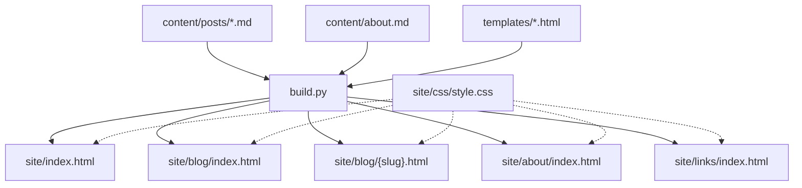
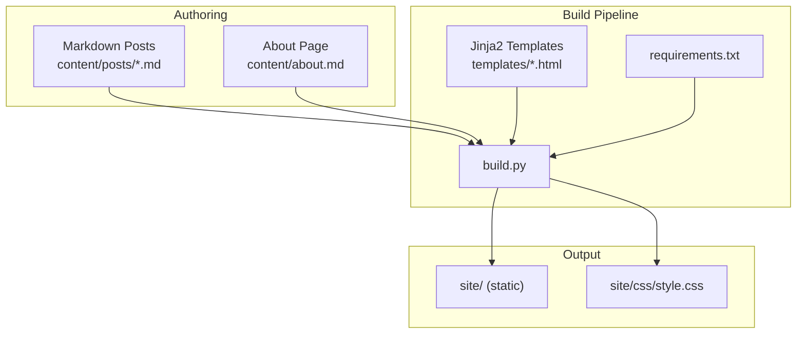
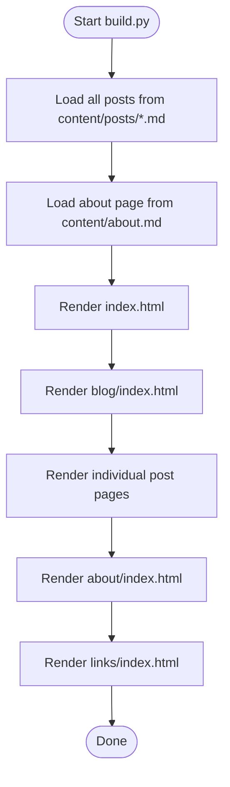
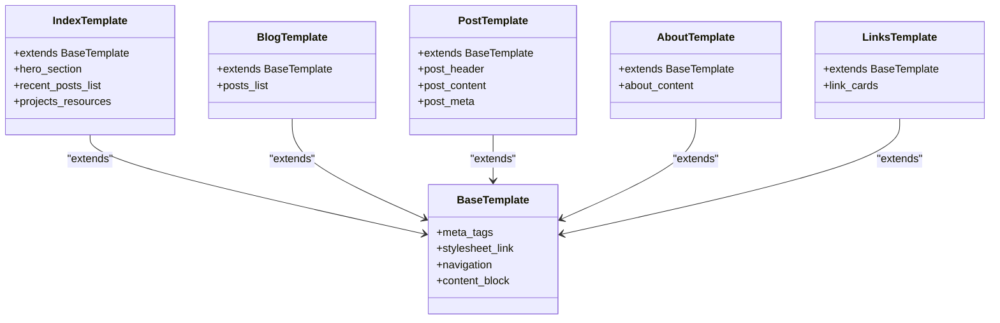
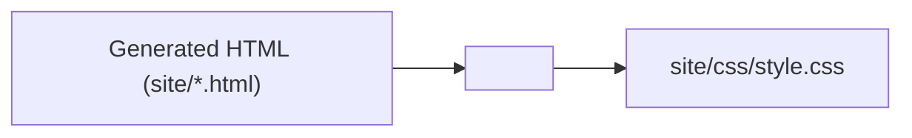

# Deployment Strategies

<cite>
**Referenced Files in This Document**
- [build.py](file://build.py)
- [requirements.txt](file://requirements.txt)
- [content/about.md](file://content/about.md)
- [content/posts/welcome-to-seisamuse.md](file://content/posts/welcome-to-seisamuse.md)
- [content/posts/environmental-seismology-intro.md](file://content/posts/environmental-seismology-intro.md)
- [templates/base.html](file://templates/base.html)
- [templates/index.html](file://templates/index.html)
- [templates/blog.html](file://templates/blog.html)
- [templates/post.html](file://templates/post.html)
- [templates/about.html](file://templates/about.html)
- [templates/links.html](file://templates/links.html)
- [site/css/style.css](file://site/css/style.css)
</cite>

## Table of Contents
1. [Introduction](#introduction)
2. [Project Structure](#project-structure)
3. [Core Components](#core-components)
4. [Architecture Overview](#architecture-overview)
5. [Detailed Component Analysis](#detailed-component-analysis)
6. [Static Hosting Deployment](#static-hosting-deployment)
7. [Continuous Integration and Automated Deployments](#continuous-integration-and-automated-deployments)
8. [CDN Integration and Asset Optimization](#cdn-integration-and-asset-optimization)
9. [Version Control Integration and Branch-Based Deployments](#version-control-integration-and-branch-based-deployments)
10. [Security Considerations and SSL Management](#security-considerations-and-ssl-management)
11. [Domain Configuration](#domain-configuration)
12. [Troubleshooting Guide](#troubleshooting-guide)
13. [Conclusion](#conclusion)

## Introduction
This document provides comprehensive deployment strategies for SEISAMUSE, a static academic website built with Python, Markdown, and Jinja2 templates. It covers supported hosting platforms (GitHub Pages, Netlify, Vercel, and traditional web hosts), site directory structure, asset delivery requirements, CI/CD automation, CDN integration, performance best practices, version control integration, branch-based deployments, rollback procedures, security considerations, SSL certificate management, and domain configuration. The goal is to enable reliable, automated, and secure production deployments across platforms while preserving the site’s academic presentation and performance.

## Project Structure
SEISAMUSE follows a clear static site generator pattern:
- Content authored in Markdown under content/, including posts and an about page
- Templates under templates/ using Jinja2
- Generated static site output under site/
- Build script orchestrating content loading, Markdown rendering, template rendering, and file emission
- CSS assets under site/css/

Key directories and files:
- content/posts/: Markdown articles with YAML front matter
- content/about.md: About page content
- templates/*.html: Base layout and page templates
- site/: Output directory containing generated HTML and CSS
- site/css/style.css: Stylesheet for the site
- build.py: Static site builder
- requirements.txt: Python dependencies

**Diagram sources**
- [build.py:154-236](file://build.py#L154-L236)
- [templates/base.html:1-43](file://templates/base.html#L1-L43)
- [site/css/style.css:1-513](file://site/css/style.css#L1-L513)

**Section sources**
- [build.py:22-27](file://build.py#L22-L27)
- [build.py:154-236](file://build.py#L154-L236)
- [requirements.txt:1-4](file://requirements.txt#L1-L4)

## Core Components
- Static site builder: Orchestrates content loading, Markdown rendering, template rendering, and file emission to site/
- Content model: Markdown files with front matter (title, date, tags, excerpt, slug)
- Template engine: Jinja2 templates with a base layout and page-specific templates
- Asset pipeline: CSS delivered via a single stylesheet referenced from the base template
- Local preview server: Optional development server for testing the generated site

Key behaviors:
- The builder loads posts from content/posts/, renders Markdown to HTML, and emits static HTML pages under site/
- The base template injects a relative root path to support both top-level and subpath deployments
- CSS is referenced via a relative path from the base template

**Section sources**
- [build.py:73-130](file://build.py#L73-L130)
- [build.py:154-236](file://build.py#L154-L236)
- [templates/base.html:8](file://templates/base.html#L8)
- [site/css/style.css:1-513](file://site/css/style.css#L1-L513)

## Architecture Overview
The deployment architecture centers on building a static site from content and templates, then serving the site via a chosen host. The build process is deterministic and reproducible, enabling reliable CI/CD and multi-platform deployments.

**Diagram sources**
- [build.py:154-236](file://build.py#L154-L236)
- [requirements.txt:1-4](file://requirements.txt#L1-L4)
- [site/css/style.css:1-513](file://site/css/style.css#L1-L513)

## Detailed Component Analysis

### Build Pipeline
The build pipeline performs:
- Directory preparation and content discovery
- Front matter parsing and metadata extraction
- Markdown rendering with extensions
- Template rendering with shared context
- File emission to the site directory

**Diagram sources**
- [build.py:154-236](file://build.py#L154-L236)

**Section sources**
- [build.py:154-236](file://build.py#L154-L236)

### Template System
Templates extend a base layout and inject content blocks. The base template defines:
- Meta tags and stylesheets
- Navigation with active state handling
- Relative root injection for flexible deployment roots

**Diagram sources**
- [templates/base.html:1-43](file://templates/base.html#L1-L43)
- [templates/index.html:1-73](file://templates/index.html#L1-L73)
- [templates/blog.html:1-27](file://templates/blog.html#L1-L27)
- [templates/post.html:1-30](file://templates/post.html#L1-L30)
- [templates/about.html:1-12](file://templates/about.html#L1-L12)
- [templates/links.html:1-48](file://templates/links.html#L1-L48)

**Section sources**
- [templates/base.html:8](file://templates/base.html#L8)
- [templates/index.html:1-73](file://templates/index.html#L1-L73)
- [templates/blog.html:1-27](file://templates/blog.html#L1-L27)
- [templates/post.html:1-30](file://templates/post.html#L1-L30)
- [templates/about.html:1-12](file://templates/about.html#L1-L12)
- [templates/links.html:1-48](file://templates/links.html#L1-L48)

### Asset Delivery
The stylesheet is referenced relatively from the base template and should be deployed alongside the generated HTML. Ensure the CSS file remains at the published path after deployment.

**Diagram sources**
- [templates/base.html:8](file://templates/base.html#L8)
- [site/css/style.css:1-513](file://site/css/style.css#L1-L513)

**Section sources**
- [templates/base.html:8](file://templates/base.html#L8)
- [site/css/style.css:1-513](file://site/css/style.css#L1-L513)

## Static Hosting Deployment
This section provides platform-agnostic guidance for deploying the generated site directory (site/) to static hosts. The site is fully static and does not require server-side processing.

- Prepare the build environment:
  - Install Python dependencies defined in requirements.txt
  - Run the build script to generate the site directory
- Upload the site/ directory to your chosen host:
  - GitHub Pages: Publish the site/ directory from the repository root or a docs/ folder depending on your configuration
  - Netlify/Vercel: Configure the publish directory to site/
  - Traditional web hosts: Upload the site/ directory to the public HTML root

Site directory structure to deploy:
- site/index.html
- site/blog/index.html
- site/blog/{slug}.html (one per post)
- site/about/index.html
- site/links/index.html
- site/css/style.css

Asset delivery requirements:
- Ensure the CSS file is accessible at the published path
- Verify internal links resolve correctly using the injected root variable

[No sources needed since this section provides general guidance]

## Continuous Integration and Automated Deployments
Automate builds and deployments using CI/CD to ensure consistent, reproducible releases. The build process is deterministic and relies on Python dependencies.

Recommended CI/CD flow:
- Trigger: Push to main branch or tagged release
- Steps:
  - Set up Python environment
  - Install dependencies from requirements.txt
  - Run the build script to generate site/
  - Deploy the site/ directory to the target host

Example CI/CD considerations:
- Cache pip dependencies to speed up builds
- Use matrix builds if testing multiple Python versions
- Store deployment credentials as encrypted secrets
- Validate generated HTML and CSS presence before deployment

[No sources needed since this section provides general guidance]

## CDN Integration and Asset Optimization
Optimize performance and global availability by integrating a CDN with the static site.

Recommendations:
- Host the site on a CDN-backed static host (e.g., GitHub Pages with CDN, Netlify, Vercel)
- Enable compression (gzip or Brotli) for HTML, CSS, and JS
- Enable caching headers for static assets (CSS, images)
- Use HTTPS and HTTP/2 or HTTP/3 where supported
- Consider preloading critical CSS or deferring non-critical CSS

[No sources needed since this section provides general guidance]

## Version Control Integration and Branch-Based Deployments
Branch-based deployments allow previewing changes before merging to main.

Recommended approach:
- Feature branches: Build and deploy previews on pull requests or feature branches
- Staging: Merge changes to a staging branch and deploy to a preview environment
- Production: Merge to main and deploy to production

Rollback procedures:
- Keep previous site artifacts or versioned assets
- Re-deploy a known-good commit hash
- Revert the last commit if necessary and re-run the deployment pipeline

[No sources needed since this section provides general guidance]

## Security Considerations and SSL Management
Security best practices for static sites:
- Enforce HTTPS on all connections
- Use HSTS headers where applicable
- Avoid exposing secrets in client-side assets
- Sanitize user-provided content if accepting external contributions
- Monitor for broken links and missing assets

SSL certificate management:
- Let the hosting platform handle certificates (most static hosts provide free SSL)
- Configure custom domains with proper DNS records and SSL termination

[No sources needed since this section provides general guidance]

## Domain Configuration
Configure domains to point to your static host:
- Point a CNAME or A/AAAA record to the hosting provider’s endpoint
- Ensure trailing slash handling and canonical URLs are consistent
- Redirect www to non-www or vice versa consistently

[No sources needed since this section provides general guidance]

## Troubleshooting Guide
Common deployment issues and resolutions:
- Missing CSS or broken styles:
  - Verify the CSS file exists at the expected path in the deployed site
  - Confirm the stylesheet link uses the correct relative path
- Incorrect internal links:
  - Ensure the injected root variable resolves correctly for subpath deployments
  - Test navigation across pages to confirm paths
- Build failures:
  - Confirm Python dependencies are installed as defined in requirements.txt
  - Validate Markdown front matter and content formatting
- Preview vs. production differences:
  - Use the local preview server to compare against the generated site
  - Check for environment-specific paths or assets

**Section sources**
- [build.py:240-253](file://build.py#L240-L253)
- [requirements.txt:1-4](file://requirements.txt#L1-L4)
- [templates/base.html:8](file://templates/base.html#L8)

## Conclusion
SEISAMUSE is a straightforward static site suitable for deployment across multiple platforms. By leveraging the deterministic build pipeline, consistent template system, and minimal asset footprint, teams can achieve reliable, automated, and secure deployments. Integrate CI/CD for continuous delivery, adopt CDN-backed hosting for performance, and follow the troubleshooting and security guidance to maintain a robust production site.