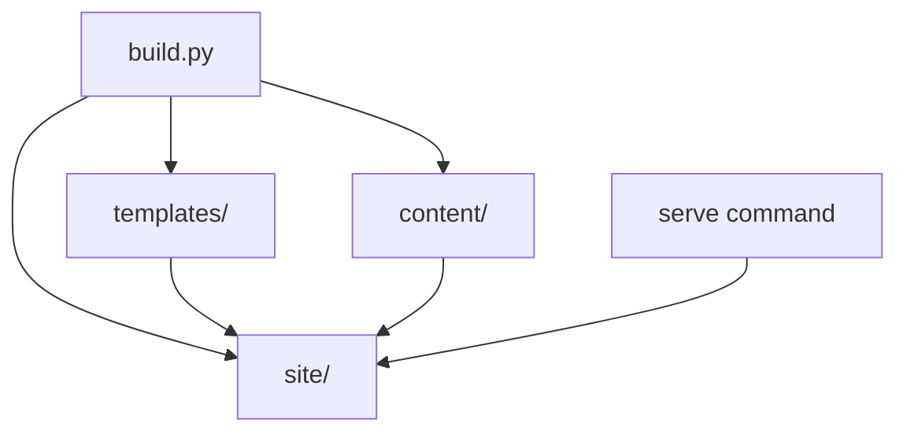
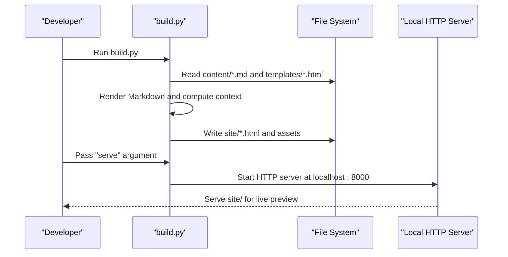
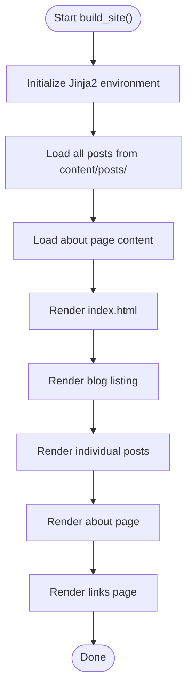
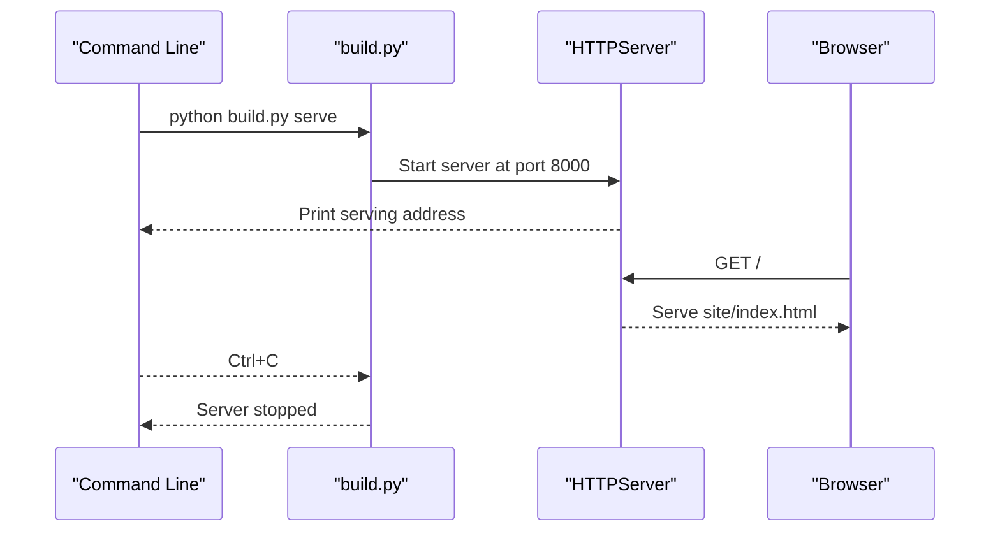
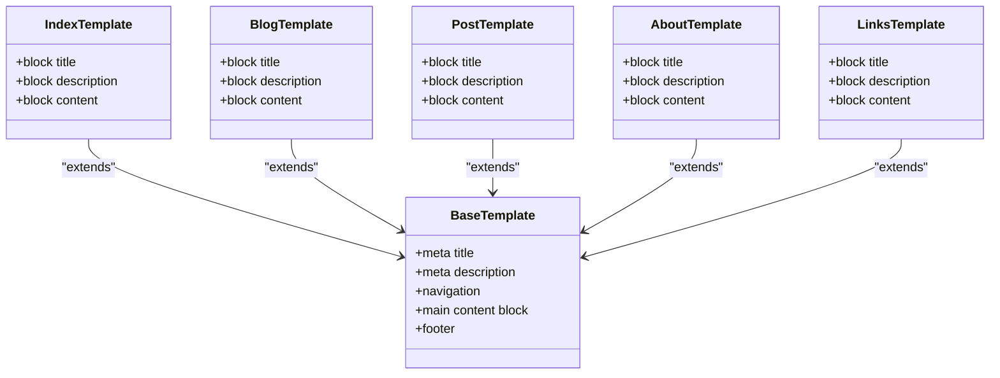
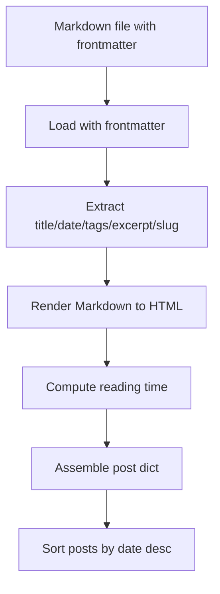
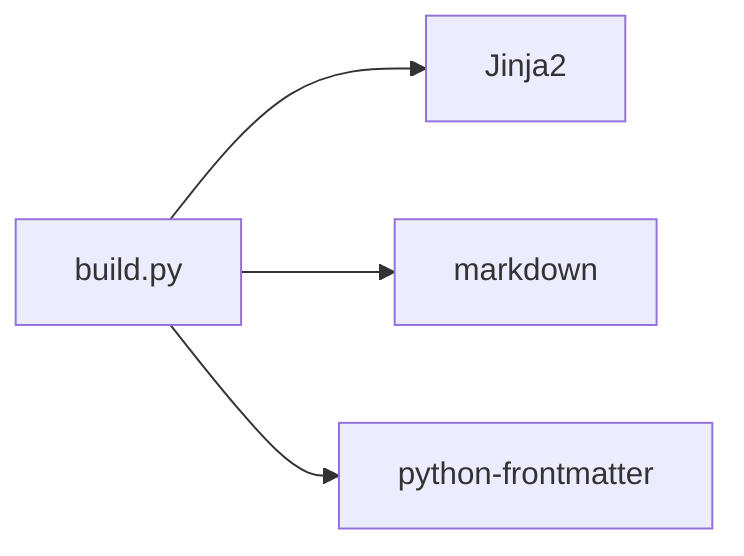

# Development Workflow

<cite>
**Referenced Files in This Document**
- [build.py](file://build.py)
- [requirements.txt](file://requirements.txt)
- [content/about.md](file://content/about.md)
- [content/posts/welcome-to-seisamuse.md](file://content/posts/welcome-to-seisamuse.md)
- [content/posts/2006-06-11-寂寞.md](file://content/posts/2006-06-11-寂寞.md)
- [templates/base.html](file://templates/base.html)
- [templates/index.html](file://templates/index.html)
- [templates/blog.html](file://templates/blog.html)
- [templates/post.html](file://templates/post.html)
- [templates/about.html](file://templates/about.html)
- [templates/links.html](file://templates/links.html)
- [site/css/style.css](file://site/css/style.css)
</cite>

## Table of Contents
1. [Introduction](#introduction)
2. [Project Structure](#project-structure)
3. [Core Components](#core-components)
4. [Architecture Overview](#architecture-overview)
5. [Detailed Component Analysis](#detailed-component-analysis)
6. [Dependency Analysis](#dependency-analysis)
7. [Performance Considerations](#performance-considerations)
8. [Troubleshooting Guide](#troubleshooting-guide)
9. [Conclusion](#conclusion)
10. [Appendices](#appendices)

## Introduction
This document explains the Seisamuse development workflow and local preview capabilities. It focuses on how content is authored, transformed, and rendered into a static site, and how the serve command starts a local HTTP server for live preview. It also covers the development cycle, incremental build behavior, file watching, and practical guidance for authoring, theming, debugging, and optimizing the development experience.

## Project Structure
Seisamuse is organized around three primary areas:
- Content: Markdown files under content/, including posts and an about page.
- Templates: Jinja2 templates under templates/ that define site layout and page types.
- Site: The generated static output under site/, served locally via the serve command.

**Diagram sources**
- [build.py:154-236](file://build.py#L154-L236)
- [build.py:239-253](file://build.py#L239-L253)

**Section sources**
- [build.py:22-27](file://build.py#L22-L27)

## Core Components
- Static site builder: Orchestrates loading content, rendering Markdown, building pages, and writing output.
- Template engine: Uses Jinja2 to render templates with computed context.
- Local preview server: Serves the built site on localhost for immediate feedback.

Key responsibilities:
- Content ingestion and metadata extraction.
- Markdown-to-HTML conversion with extensions.
- Page generation for index, blog listing, individual posts, about, and links.
- Serving the site locally for iterative development.

**Section sources**
- [build.py:47-53](file://build.py#L47-L53)
- [build.py:56-64](file://build.py#L56-L64)
- [build.py:154-236](file://build.py#L154-L236)
- [build.py:239-253](file://build.py#L239-L253)

## Architecture Overview
The build pipeline transforms Markdown content into HTML pages using templates. The serve command runs a simple HTTP server pointing at the generated site directory.

**Diagram sources**
- [build.py:154-236](file://build.py#L154-L236)
- [build.py:239-253](file://build.py#L239-L253)

## Detailed Component Analysis

### Build Pipeline
The build process follows a clear order:
1. Initialize Jinja2 environment and common context.
2. Load and process posts from content/posts/.
3. Load the about page content.
4. Render and write:
   - Homepage index.html
   - Blog listing index.html
   - Individual post pages
   - About page
   - Links page

**Diagram sources**
- [build.py:154-236](file://build.py#L154-L236)

**Section sources**
- [build.py:154-236](file://build.py#L154-L236)

### Serve Command and Local Preview
The serve command starts a local HTTP server rooted at the site directory. It prints the address and waits for requests until interrupted.

**Diagram sources**
- [build.py:255-260](file://build.py#L255-L260)
- [build.py:239-253](file://build.py#L239-L253)

**Section sources**
- [build.py:239-253](file://build.py#L239-L253)

### Template System and Theming
Templates extend a base layout and inject content blocks. The base template defines navigation, meta tags, and shared styles. Specific templates override content blocks for each page type.

**Diagram sources**
- [templates/base.html:1-43](file://templates/base.html#L1-L43)
- [templates/index.html:1-73](file://templates/index.html#L1-L73)
- [templates/blog.html:1-27](file://templates/blog.html#L1-L27)
- [templates/post.html:1-30](file://templates/post.html#L1-L30)
- [templates/about.html:1-12](file://templates/about.html#L1-L12)
- [templates/links.html:1-48](file://templates/links.html#L1-L48)

**Section sources**
- [templates/base.html:1-43](file://templates/base.html#L1-L43)
- [templates/index.html:1-73](file://templates/index.html#L1-L73)
- [templates/blog.html:1-27](file://templates/blog.html#L1-L27)
- [templates/post.html:1-30](file://templates/post.html#L1-L30)
- [templates/about.html:1-12](file://templates/about.html#L1-L12)
- [templates/links.html:1-48](file://templates/links.html#L1-L48)

### Content Authoring and Metadata
Content is authored in Markdown with frontmatter. The builder extracts metadata such as title, date, tags, and excerpt, and computes derived values like reading time. Posts are sorted by date descending.

**Diagram sources**
- [build.py:73-112](file://build.py#L73-L112)
- [build.py:115-130](file://build.py#L115-L130)

**Section sources**
- [build.py:73-112](file://build.py#L73-L112)
- [build.py:115-130](file://build.py#L115-L130)

### Example Content Files
- About page content demonstrates structured Markdown with frontmatter and lists.
- Welcome post showcases rich Markdown including code blocks and metadata.
- Additional posts illustrate legacy entries with various frontmatter keys.

**Section sources**
- [content/about.md:1-36](file://content/about.md#L1-L36)
- [content/posts/welcome-to-seisamuse.md:1-53](file://content/posts/welcome-to-seisamuse.md#L1-L53)
- [content/posts/2006-06-11-寂寞.md:1-13](file://content/posts/2006-06-11-寂寞.md#L1-L13)

### Styles and Assets
The site’s stylesheet is included via the base template and resides under site/css/style.css. It defines theme tokens, typography, layout, responsive behavior, and dark mode support.

**Section sources**
- [templates/base.html:8](file://templates/base.html#L8)
- [site/css/style.css:1-513](file://site/css/style.css#L1-L513)

## Dependency Analysis
External libraries are declared in requirements.txt and used by the build script:
- Jinja2: Template rendering.
- markdown: Markdown parsing with extensions.
- python-frontmatter: Frontmatter parsing for metadata.

**Diagram sources**
- [requirements.txt:1-4](file://requirements.txt#L1-L4)
- [build.py:18-20](file://build.py#L18-L20)

**Section sources**
- [requirements.txt:1-4](file://requirements.txt#L1-L4)
- [build.py:18-20](file://build.py#L18-L20)

## Performance Considerations
- Incremental builds: The current build script rebuilds the entire site on each run. For larger sites, consider adding file modification checks to rebuild only changed content and affected pages.
- Asset caching: The serve command does not set cache headers; for production, configure appropriate caching headers.
- Rendering cost: Markdown and template rendering are lightweight but can accumulate with many posts; consider precomputing summaries or excerpts.
- Network overhead: Serving static files locally avoids network latency; keep the site directory minimal to reduce disk I/O.

[No sources needed since this section provides general guidance]

## Troubleshooting Guide
Common issues and resolutions:
- Server port conflict: The serve command uses port 8000 by default. If occupied, choose another port and update the serve invocation accordingly.
- Missing dependencies: Ensure all packages in requirements.txt are installed.
- Broken links or missing assets: Verify asset paths in templates and confirm files exist in site/.
- Unexpected rendering: Check frontmatter keys and Markdown syntax; ensure templates match expected context keys.
- Hot reload limitations: The serve command does not watch files automatically. After editing content or templates, rerun the build to regenerate the site and refresh the browser.

**Section sources**
- [build.py:239-253](file://build.py#L239-L253)
- [requirements.txt:1-4](file://requirements.txt#L1-L4)

## Conclusion
Seisamuse provides a straightforward, Python-based static site workflow. Content is written in Markdown, processed by the build script, and rendered via Jinja2 templates. The serve command offers a quick local preview. For efficient development, iterate by rebuilding after edits, customize templates thoughtfully, and leverage the base template for consistent theming.

[No sources needed since this section summarizes without analyzing specific files]

## Appendices

### Development Cycle Checklist
- Create or edit content in content/.
- Customize templates in templates/ as needed.
- Rebuild the site to regenerate site/.
- Start the preview server to test changes locally.
- Iterate until satisfied, then deploy the site/ directory.

[No sources needed since this section provides general guidance]