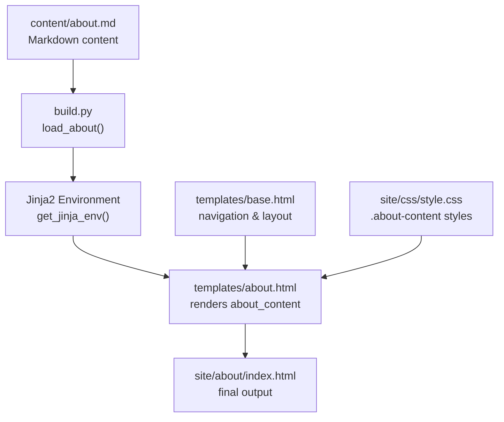
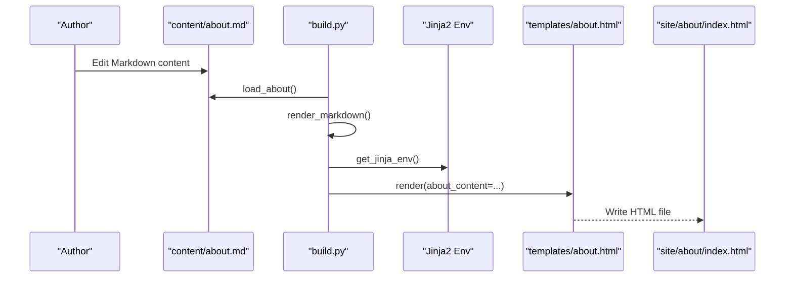
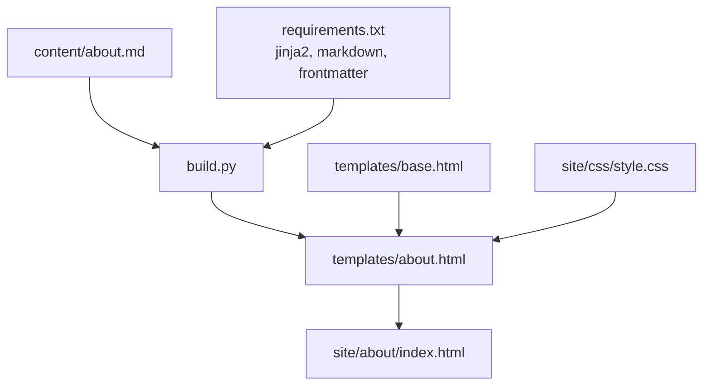

# About Page Management

<cite>
**Referenced Files in This Document**
- [content/about.md](file://content/about.md)
- [templates/about.html](file://templates/about.html)
- [templates/base.html](file://templates/base.html)
- [build.py](file://build.py)
- [site/css/style.css](file://site/css/style.css)
- [requirements.txt](file://requirements.txt)
- [content/posts/welcome-to-seisamuse.md](file://content/posts/welcome-to-seisamuse.md)
- [content/posts/environmental-seismology-intro.md](file://content/posts/environmental-seismology-intro.md)
</cite>

## Table of Contents
1. [Introduction](#introduction)
2. [Project Structure](#project-structure)
3. [Core Components](#core-components)
4. [Architecture Overview](#architecture-overview)
5. [Detailed Component Analysis](#detailed-component-analysis)
6. [Dependency Analysis](#dependency-analysis)
7. [Performance Considerations](#performance-considerations)
8. [Troubleshooting Guide](#troubleshooting-guide)
9. [Conclusion](#conclusion)

## Introduction
This document explains how to manage the about page content in Seisamuse, focusing on the content/about.md file structure and its integration with the about template system. It covers markdown formatting requirements, recommended sections, update procedures, rendering pipeline, and best practices for maintaining professional academic profiles.

## Project Structure
The about page is part of a static site built with Python, Jinja2 templates, and Markdown. The relevant parts of the repository structure are:
- Content: content/about.md holds the about page content
- Templates: templates/about.html defines the about page layout and integrates with the base template
- Build system: build.py orchestrates loading content, converting Markdown to HTML, and rendering templates
- Styles: site/css/style.css provides styling for the about page content
- Dependencies: requirements.txt lists the Python packages used

**Diagram sources**
- [content/about.md:1-38](file://content/about.md#L1-L38)
- [build.py:133-140](file://build.py#L133-L140)
- [build.py:47-53](file://build.py#L47-L53)
- [templates/about.html:1-12](file://templates/about.html#L1-L12)
- [templates/base.html:14-25](file://templates/base.html#L14-L25)
- [site/css/style.css:400-406](file://site/css/style.css#L400-L406)

**Section sources**
- [content/about.md:1-38](file://content/about.md#L1-L38)
- [templates/about.html:1-12](file://templates/about.html#L1-L12)
- [templates/base.html:14-25](file://templates/base.html#L14-L25)
- [build.py:133-140](file://build.py#L133-L140)
- [site/css/style.css:400-406](file://site/css/style.css#L400-L406)

## Core Components
- Content authoring: content/about.md uses YAML frontmatter and Markdown to define the about page content
- Template rendering: templates/about.html extends base.html and injects the processed about content
- Build pipeline: build.py loads the about content, converts Markdown to HTML, and renders the about template
- Styling: site/css/style.css applies styles specifically for the about content area

Key responsibilities:
- content/about.md: Define the content structure and sections
- templates/about.html: Provide the about page layout and integrate with the global navigation
- build.py: Convert Markdown to HTML and pass the result to the template
- site/css/style.css: Style the about content consistently

**Section sources**
- [content/about.md:1-38](file://content/about.md#L1-L38)
- [templates/about.html:1-12](file://templates/about.html#L1-L12)
- [build.py:133-140](file://build.py#L133-L140)
- [site/css/style.css:400-406](file://site/css/style.css#L400-L406)

## Architecture Overview
The about page rendering pipeline follows a standard static site generation flow:
1. The build script loads the about content file
2. It parses the Markdown and converts it to HTML
3. It renders the about template with the processed content
4. The resulting HTML is written to site/about/index.html

**Diagram sources**
- [build.py:133-140](file://build.py#L133-L140)
- [build.py:56-64](file://build.py#L56-L64)
- [build.py:47-53](file://build.py#L47-L53)
- [templates/about.html:1-12](file://templates/about.html#L1-L12)

## Detailed Component Analysis

### Content Authoring: content/about.md
The about page content is authored in Markdown with YAML frontmatter. The frontmatter sets the page title and is processed by the build system. The content itself is structured into recommended sections:
- Personal introduction
- Research interests
- Education and background
- Selected publications
- Contact information

Recommended formatting guidelines:
- Use Markdown headings to separate sections
- Use bullet points for lists (research interests, contact links)
- Use numbered lists for publication entries
- Keep contact links as clickable Markdown links
- Use bold emphasis sparingly for emphasis

Example structure and sections:
- Title frontmatter: sets the page title
- Personal introduction: a short biography and role
- Research interests: bullet list of focus areas
- Education and background: timeline of degrees and institutions
- Selected publications: numbered list with citation format
- Contact: bullet list of links and contact details

Best practices:
- Keep paragraphs concise and scannable
- Use consistent formatting for publication entries
- Keep contact information up to date and functional
- Proofread for clarity and professionalism

**Section sources**
- [content/about.md:1-38](file://content/about.md#L1-L38)

### Template Rendering: templates/about.html
The about template extends the base template and injects the processed about content into a dedicated container. It sets the page title and description blocks and renders the about content inside a styled div.

Key template features:
- Extends base.html for consistent navigation and layout
- Sets page title and description blocks
- Renders the about content in a container with class "about-content"
- Uses Jinja2 variable substitution for about_content

Integration with base template:
- Inherits navigation and footer from base.html
- Uses the active state mechanism for highlighting the About menu item

**Section sources**
- [templates/about.html:1-12](file://templates/about.html#L1-L12)
- [templates/base.html:14-25](file://templates/base.html#L14-L25)

### Build Pipeline: build.py
The build script coordinates the about page generation:
- Loads the about content file using frontmatter parsing
- Converts Markdown to HTML using the configured extensions
- Renders the about template with the processed content
- Writes the final HTML to site/about/index.html

Important functions:
- load_about(): reads and processes the about content file
- render_markdown(): converts Markdown to HTML with configured extensions
- get_jinja_env(): creates the Jinja2 environment for template rendering
- build_site(): orchestrates building all pages including the about page

Rendering context:
- The about_content variable is passed to the about template
- The active state is set to "about" for navigation highlighting

**Section sources**
- [build.py:133-140](file://build.py#L133-L140)
- [build.py:56-64](file://build.py#L56-L64)
- [build.py:47-53](file://build.py#L47-L53)
- [build.py:213-222](file://build.py#L213-L222)

### Styling: site/css/style.css
The about page content receives specific styling through the stylesheet:
- Section headings receive consistent spacing and typography
- The about-content container ensures proper layout and readability

Styling considerations:
- Headings within about-content follow established spacing rules
- The stylesheet supports responsive design and dark mode preferences

**Section sources**
- [site/css/style.css:400-406](file://site/css/style.css#L400-L406)

### Navigation Integration
The about page is integrated into the global navigation via the base template:
- The navigation menu includes a link to the about page
- The active state is managed to highlight the current page
- Relative URLs are used to ensure portability across environments

Navigation behavior:
- The About link points to site/about/index.html
- Active state is controlled by the active variable passed during rendering

**Section sources**
- [templates/base.html:14-25](file://templates/base.html#L14-L25)

### Content Formatting Requirements
Recommended formatting standards for the about page:
- Use Markdown headings for section separation
- Use bullet points for contact and research interest lists
- Use numbered lists for publications
- Maintain consistent citation format for publications
- Keep contact links functional and current

Formatting examples:
- Personal introduction: short, professional summary
- Research interests: concise bullet list with emphasis on key areas
- Education: chronological list with institution names and degree types
- Publications: numbered list with author, title, journal, volume, pages, and DOI links
- Contact: bullet list with clear labels and functional links

**Section sources**
- [content/about.md:5-38](file://content/about.md#L5-L38)

### Updating Biographical Information
Steps to update biographical information:
1. Edit content/about.md to reflect changes in personal introduction, research interests, or contact details
2. Verify formatting consistency across sections
3. Preview the site locally using the serve command
4. Commit and deploy changes

Guidelines:
- Keep personal introduction concise and professional
- Update research interests to reflect current focus areas
- Ensure contact information is accurate and functional
- Maintain consistent formatting for all sections

**Section sources**
- [content/about.md:5-38](file://content/about.md#L5-L38)
- [build.py:239-259](file://build.py#L239-L259)

### Managing Professional Links
Professional link management best practices:
- Use descriptive labels for links
- Ensure links are functional and lead to public profiles
- Keep links current and remove broken references
- Use consistent formatting for contact information

Link categories:
- Email: use mailto links for direct contact
- GitHub: link to public repositories and profile
- Personal website: link to external academic or professional sites
- Social media: optional, ensure public and professional

**Section sources**
- [content/about.md:29-33](file://content/about.md#L29-L33)

### Maintaining Content Consistency
Consistency guidelines:
- Use consistent heading levels and formatting
- Maintain uniform citation style for publications
- Keep contact information updated across all sections
- Ensure responsive design works across devices

Cross-references:
- The about page content is referenced in the homepage hero section
- The about page is linked from the navigation menu
- The about page content is styled consistently with other content

**Section sources**
- [content/about.md:5-38](file://content/about.md#L5-L38)
- [templates/index.html:13-17](file://templates/index.html#L13-L17)
- [templates/base.html:14-25](file://templates/base.html#L14-L25)

## Dependency Analysis
The about page depends on several components working together:
- content/about.md provides the raw content
- build.py processes the content and renders templates
- templates/about.html defines the presentation layer
- templates/base.html provides the global layout and navigation
- site/css/style.css applies styling

**Diagram sources**
- [content/about.md:1-38](file://content/about.md#L1-L38)
- [build.py:133-140](file://build.py#L133-L140)
- [templates/about.html:1-12](file://templates/about.html#L1-L12)
- [templates/base.html:14-25](file://templates/base.html#L14-L25)
- [site/css/style.css:400-406](file://site/css/style.css#L400-L406)
- [requirements.txt:1-4](file://requirements.txt#L1-L4)

**Section sources**
- [requirements.txt:1-4](file://requirements.txt#L1-L4)
- [build.py:133-140](file://build.py#L133-L140)

## Performance Considerations
- The about page is static HTML, so rendering is fast and efficient
- Markdown conversion is lightweight and cached during the build process
- Template rendering uses Jinja2, which is optimized for static site generation
- CSS is minimal and does not impact load times significantly

## Troubleshooting Guide
Common issues and resolutions:
- Content not updating: ensure the build script runs and writes to site/about/index.html
- Formatting errors: verify Markdown syntax and section headings
- Broken links: check contact links and ensure they are functional
- Styling issues: confirm that the about-content class is present and styles are applied

Debugging steps:
- Run the build script to regenerate the site
- Use the serve command to preview locally
- Check the generated HTML in site/about/index.html
- Verify template rendering by inspecting the about template

**Section sources**
- [build.py:239-259](file://build.py#L239-L259)

## Conclusion
The Seisamuse about page is a straightforward static content system that combines Markdown authoring with Jinja2 templating. By following the recommended formatting guidelines and update procedures, authors can maintain a professional and consistent academic profile that integrates seamlessly with the rest of the site.