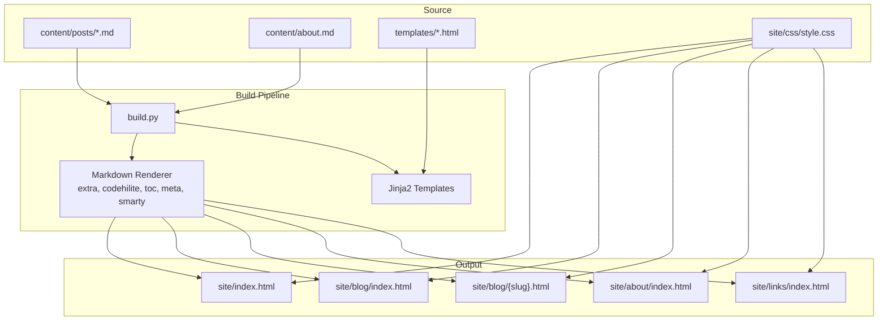
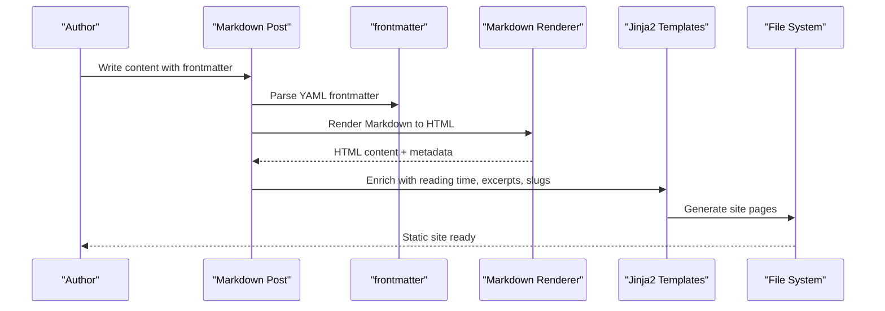
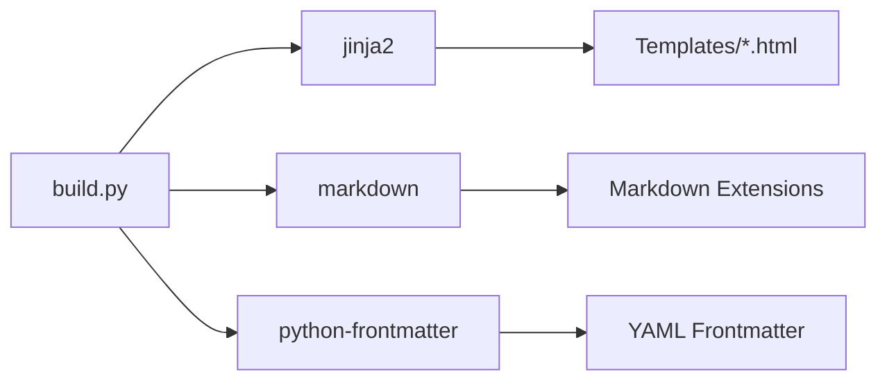

# Content Best Practices and Guidelines

<cite>
**Referenced Files in This Document**
- [build.py](file://build.py)
- [content/posts/environmental-seismology-intro.md](file://content/posts/environmental-seismology-intro.md)
- [content/posts/welcome-to-seisamuse.md](file://content/posts/welcome-to-seisamuse.md)
- [content/about.md](file://content/about.md)
- [templates/base.html](file://templates/base.html)
- [templates/post.html](file://templates/post.html)
- [templates/index.html](file://templates/index.html)
- [templates/blog.html](file://templates/blog.html)
- [templates/about.html](file://templates/about.html)
- [templates/links.html](file://templates/links.html)
- [site/css/style.css](file://site/css/style.css)
- [requirements.txt](file://requirements.txt)
</cite>

## Table of Contents
1. [Introduction](#introduction)
2. [Project Structure](#project-structure)
3. [Core Components](#core-components)
4. [Architecture Overview](#architecture-overview)
5. [Detailed Component Analysis](#detailed-component-analysis)
6. [Dependency Analysis](#dependency-analysis)
7. [Performance Considerations](#performance-considerations)
8. [Troubleshooting Guide](#troubleshooting-guide)
9. [Conclusion](#conclusion)
10. [Appendices](#appendices)

## Introduction
This document provides comprehensive content best practices for creating effective academic content with Seisamuse. It covers markdown formatting guidelines tailored to seismology and geophysics, image embedding, cross-references, and link management. It also outlines academic writing standards, structuring research-focused blog posts, accessibility and inclusive writing considerations, and troubleshooting/validation steps before site generation.

## Project Structure
Seisamuse is a static site generator that converts Markdown content into a clean academic website. The build pipeline reads Markdown posts with frontmatter, renders them to HTML, and assembles pages using Jinja2 templates. Styles are applied via a dedicated stylesheet.

**Diagram sources**
- [build.py:154-236](file://build.py#L154-L236)
- [templates/base.html:1-43](file://templates/base.html#L1-L43)
- [templates/post.html:1-30](file://templates/post.html#L1-L30)
- [site/css/style.css:1-513](file://site/css/style.css#L1-L513)

**Section sources**
- [build.py:154-236](file://build.py#L154-L236)
- [templates/base.html:1-43](file://templates/base.html#L1-L43)
- [site/css/style.css:1-513](file://site/css/style.css#L1-L513)

## Core Components
- Markdown posts with frontmatter: posts are authored in Markdown with YAML frontmatter for metadata such as title, date, tags, and excerpt.
- Template system: Jinja2 templates define layout and structure for pages.
- Rendering pipeline: Markdown is rendered with extra features (tables, code blocks, TOC), and frontmatter metadata is extracted and enriched.
- Styling: A single stylesheet defines typography, spacing, navigation, and responsive behavior.

Key capabilities for content authors:
- Headings, lists, tables, blockquotes, and code blocks are supported.
- Syntax highlighting for code blocks.
- Automatic reading time estimation.
- Automatic excerpt generation from the first paragraph when missing.

**Section sources**
- [build.py:33-44](file://build.py#L33-L44)
- [build.py:67-71](file://build.py#L67-L71)
- [build.py:93-98](file://build.py#L93-L98)
- [content/posts/environmental-seismology-intro.md:1-41](file://content/posts/environmental-seismology-intro.md#L1-L41)
- [content/posts/welcome-to-seisamuse.md:1-53](file://content/posts/welcome-to-seisamuse.md#L1-L53)
- [content/about.md:1-38](file://content/about.md#L1-L38)

## Architecture Overview
The build process transforms content into a static site with the following flow:

**Diagram sources**
- [build.py:73-112](file://build.py#L73-L112)
- [build.py:56-64](file://build.py#L56-L64)
- [build.py:154-236](file://build.py#L154-L236)

## Detailed Component Analysis

### Markdown Formatting Guidelines for Academic Writing
- Headings: Use semantic headings to organize content. The templates expect a main title and subsequent sections.
- Lists: Ordered and unordered lists are supported for structured content like methodologies and recommendations.
- Tables: Use tables for comparative data, datasets, and parameter summaries.
- Blockquotes: Use blockquotes for citations and highlighted quotes.
- Code blocks: Use fenced code blocks with language identifiers for scripts and commands.
- Smart punctuation: Smart quotes and dashes are enabled for improved typography.

Practical examples in the repository demonstrate:
- Headings and emphasis for topic framing.
- Numbered and bullet lists for process descriptions.
- Blockquote for academic citations.
- Fenced code blocks for Python examples.

**Section sources**
- [content/posts/environmental-seismology-intro.md:8-36](file://content/posts/environmental-seismology-intro.md#L8-L36)
- [content/posts/welcome-to-seisamuse.md:29-42](file://content/posts/welcome-to-seisamuse.md#L29-L42)
- [content/about.md:22-33](file://content/about.md#L22-L33)
- [build.py:33-44](file://build.py#L33-L44)

### Image Embedding Best Practices
- Images scale responsively and maintain aspect ratio.
- Use descriptive alt text for accessibility and SEO.
- Place images near relevant content and caption thoughtfully.
- Keep image sizes reasonable to optimize loading.

The stylesheet enforces:
- Max-width 100% and auto height for images.
- Rounded corners for visual appeal.

**Section sources**
- [site/css/style.css:102-106](file://site/css/style.css#L102-L106)
- [templates/index.html:7-8](file://templates/index.html#L7-L8)

### Cross-Reference Formatting and Link Management
- Internal links: Use relative paths for site pages (e.g., blog, about, links).
- External links: Use absolute URLs for external resources.
- Links are styled consistently with the theme’s accent color and hover behavior.

Examples of internal and external linking appear in:
- Welcome post for navigation to blog, links, and about.
- Links page for curated external resources.

**Section sources**
- [content/posts/welcome-to-seisamuse.md:46-48](file://content/posts/welcome-to-seisamuse.md#L46-L48)
- [templates/index.html:13-17](file://templates/index.html#L13-L17)
- [templates/links.html:10-41](file://templates/links.html#L10-L41)

### Academic Writing Standards for Seismology and Geophysics
- Clarity and precision: Use clear, jargon-appropriate language for broad audiences while maintaining scientific rigor.
- Citation formatting: Include author names, publication year, article title, journal, volume, and pagination. Use blockquotes or footnotes for citations when appropriate.
- Methodology transparency: Describe data sources, processing steps, and assumptions clearly.
- Results presentation: Use figures, tables, and concise prose. Reference visuals by number and label.
- Conclusions: Summarize key findings and implications succinctly.

These practices are reflected in the repository’s content samples and template layouts.

**Section sources**
- [content/posts/environmental-seismology-intro.md:34](file://content/posts/environmental-seismology-intro.md#L34)
- [content/about.md:22-27](file://content/about.md#L22-L27)

### Structuring Research-Focused Blog Posts
Recommended structure aligned with the existing templates and content:

1. Frontmatter
   - title: Descriptive and SEO-friendly.
   - date: ISO date string.
   - tags: List of relevant topics.
   - excerpt: Short summary for listings.

2. Introduction
   - Hook the reader with context and motivation.
   - Briefly outline the scope and goals.

3. Background and Context
   - Provide foundational knowledge and prior work.
   - Frame the problem or research question.

4. Methodology
   - Describe data sources, instruments, and processing steps.
   - Reference code blocks for reproducibility.

5. Results
   - Present findings with figures and tables.
   - Interpret results in the context of prior studies.

6. Discussion
   - Compare with previous work and highlight implications.
   - Address limitations and uncertainties.

7. Conclusion
   - Summarize key insights and future directions.
   - Include acknowledgments and citations as needed.

8. Navigation and Metadata
   - Use internal links to guide readers to related content.
   - Ensure tags and excerpts support discoverability.

**Section sources**
- [content/posts/environmental-seismology-intro.md:1-6](file://content/posts/environmental-seismology-intro.md#L1-L6)
- [content/posts/welcome-to-seisamuse.md:29-42](file://content/posts/welcome-to-seisamuse.md#L29-L42)
- [templates/post.html:7-27](file://templates/post.html#L7-L27)

### Accessibility and Inclusive Writing Practices
- Alt text for images: Provide meaningful descriptions for non-decorative images.
- Color contrast: The theme adapts to light/dark modes; ensure sufficient contrast for readability.
- Semantic headings: Use headings in order to aid screen readers and navigation.
- Clear language: Prefer active voice and inclusive phrasing.
- Captions and labels: Provide captions for figures and labels for tables.

The stylesheet includes a dark mode media query and responsive adjustments to improve accessibility.

**Section sources**
- [site/css/style.css:465-476](file://site/css/style.css#L465-L476)
- [site/css/style.css:478-513](file://site/css/style.css#L478-L513)
- [templates/index.html:7-8](file://templates/index.html#L7-L8)

### Template and Rendering Behavior
- Reading time: Estimated based on word count for a realistic reading duration.
- Excerpts: Automatically generated from the first paragraph when not provided.
- Tags: Rendered as small badges beneath post titles.
- Navigation: Consistent header navigation across pages.

**Section sources**
- [build.py:67-71](file://build.py#L67-L71)
- [build.py:93-98](file://build.py#L93-L98)
- [templates/post.html:12-17](file://templates/post.html#L12-L17)
- [templates/index.html:25-39](file://templates/index.html#L25-L39)

## Dependency Analysis
The build pipeline relies on specific libraries for rendering and templating.

**Diagram sources**
- [requirements.txt:1-4](file://requirements.txt#L1-L4)
- [build.py:18-20](file://build.py#L18-L20)

**Section sources**
- [requirements.txt:1-4](file://requirements.txt#L1-L4)
- [build.py:18-20](file://build.py#L18-L20)

## Performance Considerations
- Minimize heavy assets: Keep images appropriately sized and compressed.
- Favor lightweight Markdown: Avoid excessive embedded HTML or complex tables.
- Efficient templates: Keep templates minimal to reduce rendering overhead.
- Local preview: Use the built-in server for quick iteration during development.

[No sources needed since this section provides general guidance]

## Troubleshooting Guide
Common issues and resolutions aligned with the build pipeline:

- Missing frontmatter
  - Symptom: Post not included or metadata missing.
  - Resolution: Ensure YAML frontmatter with required keys (title, date) and optional keys (tags, excerpt).

- Incorrect date format
  - Symptom: Unexpected date sorting or display.
  - Resolution: Use ISO date strings (YYYY-MM-DD).

- Excerpt not appearing
  - Symptom: No preview text on listing pages.
  - Resolution: Add an excerpt or rely on auto-generation from the first paragraph.

- Code block not highlighted
  - Symptom: Plain code block without syntax highlighting.
  - Resolution: Ensure fenced code blocks with language identifier; the renderer includes syntax highlighting.

- Reading time not shown
  - Symptom: No estimated reading time on posts.
  - Resolution: Confirm reading time calculation is enabled and content is processed.

- Broken internal links
  - Symptom: 404 errors for internal pages.
  - Resolution: Verify relative paths match the generated site structure.

- Styling inconsistencies
  - Symptom: Misaligned typography or layout.
  - Resolution: Check the stylesheet and ensure content follows semantic markup expectations.

**Section sources**
- [build.py:73-112](file://build.py#L73-L112)
- [build.py:93-98](file://build.py#L93-L98)
- [build.py:33-44](file://build.py#L33-L44)
- [templates/post.html:11-11](file://templates/post.html#L11-L11)

## Conclusion
By following these content best practices—structured frontmatter, clear academic formatting, accessible image and link handling, and adherence to the rendering pipeline—you can produce high-quality, discoverable academic content with Seisamuse. Use the provided guidelines to craft compelling research-focused posts, maintain inclusive and accessible writing, and ensure reliable site generation.

[No sources needed since this section summarizes without analyzing specific files]

## Appendices

### A. Markdown Feature Matrix Used by the Site
- Headings: H1–H4 for content hierarchy.
- Lists: Ordered and unordered lists for procedures and items.
- Tables: For datasets and comparisons.
- Blockquotes: For citations and highlighted statements.
- Code blocks: Fenced with language identifiers for syntax highlighting.
- Smart quotes and dashes: Improved typography.

**Section sources**
- [build.py:33-44](file://build.py#L33-L44)
- [content/posts/environmental-seismology-intro.md:14-30](file://content/posts/environmental-seismology-intro.md#L14-L30)
- [content/posts/welcome-to-seisamuse.md:33-42](file://content/posts/welcome-to-seisamuse.md#L33-L42)

### B. Template Variables and Metadata
- Post metadata: title, date, tags, excerpt, slug, content, reading_time.
- Global context: root, year, active page indicator.

**Section sources**
- [build.py:103-112](file://build.py#L103-L112)
- [build.py:164-167](file://build.py#L164-L167)
- [templates/post.html:8-27](file://templates/post.html#L8-L27)