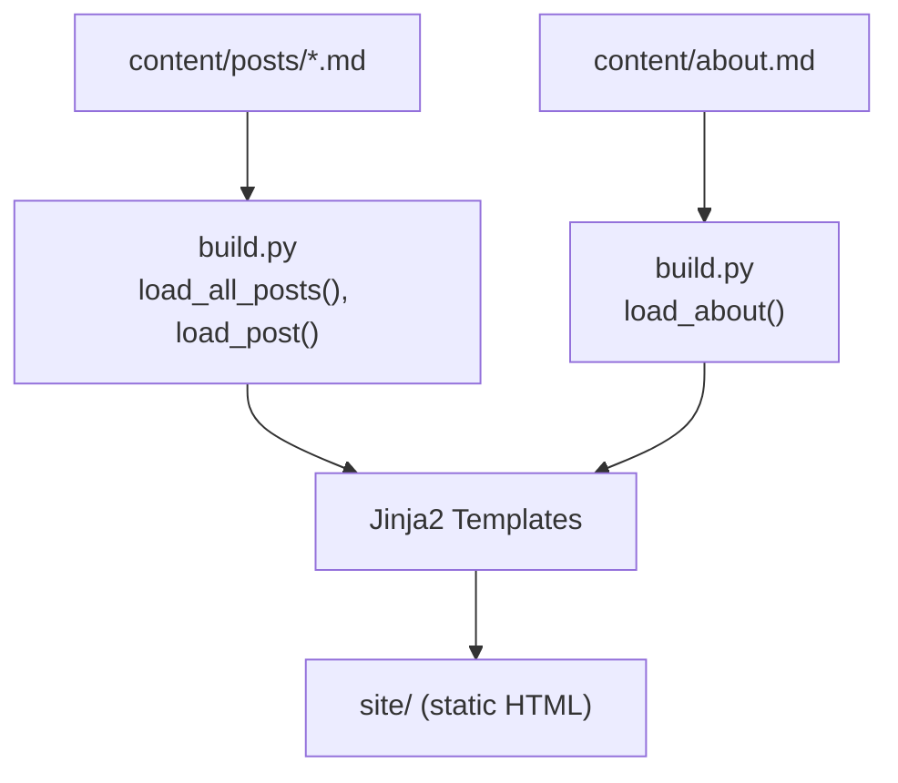
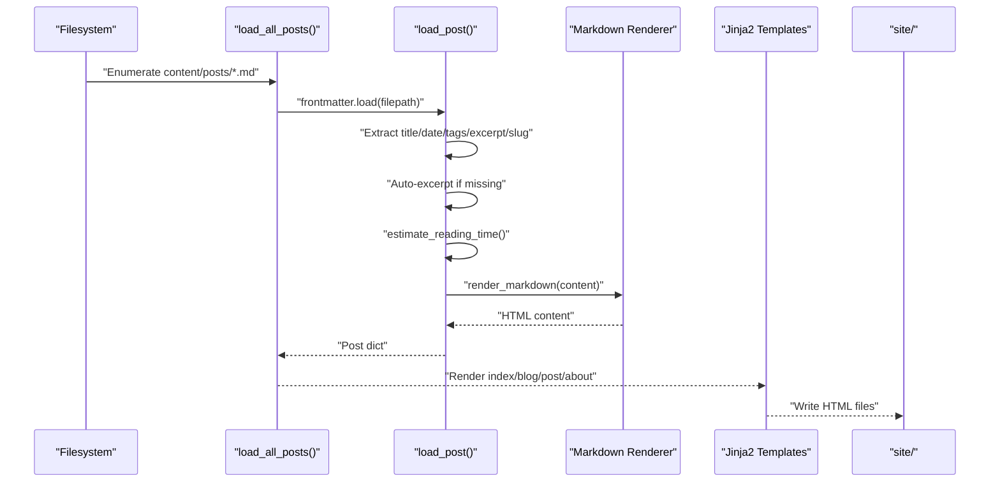
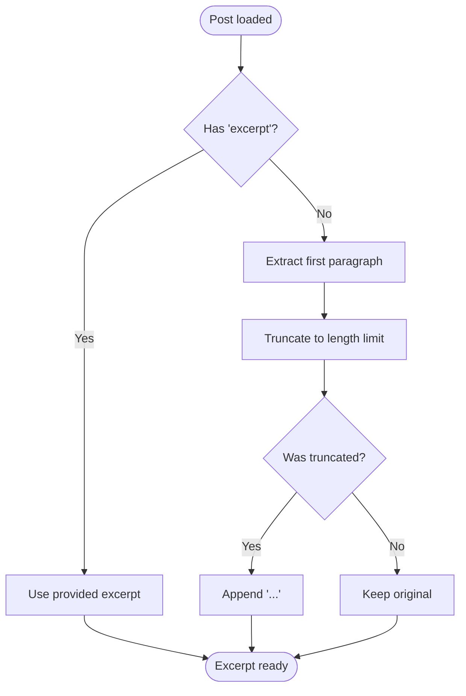
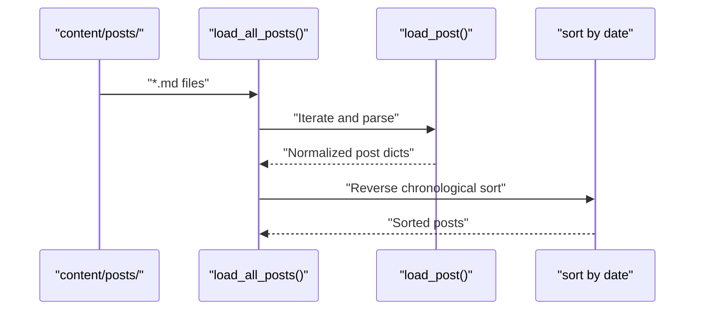
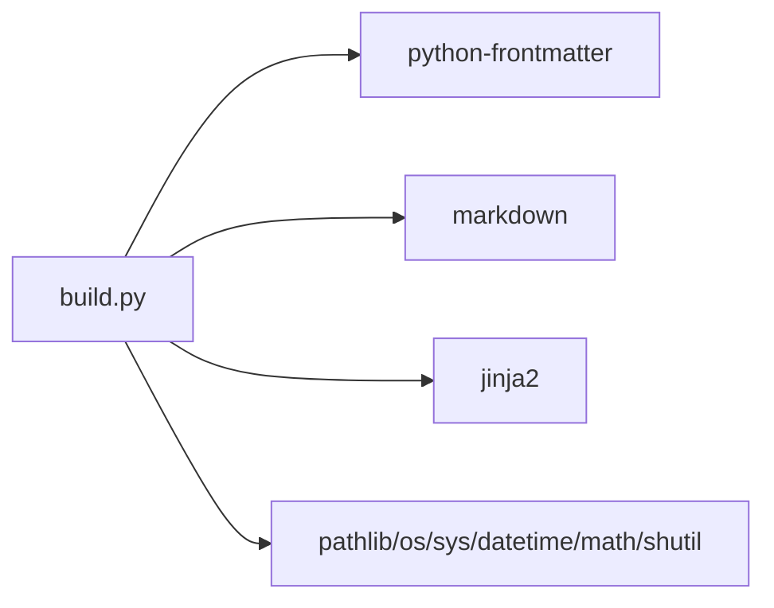

# Content Management

<cite>
**Referenced Files in This Document**
- [build.py](file://build.py)
- [content/about.md](file://content/about.md)
- [content/posts/welcome-to-seisamuse.md](file://content/posts/welcome-to-seisamuse.md)
- [content/posts/environmental-seismology-intro.md](file://content/posts/environmental-seismology-intro.md)
- [templates/index.html](file://templates/index.html)
- [templates/blog.html](file://templates/blog.html)
- [templates/post.html](file://templates/post.html)
- [templates/about.html](file://templates/about.html)
- [templates/base.html](file://templates/base.html)
- [site/css/style.css](file://site/css/style.css)
- [requirements.txt](file://requirements.txt)
</cite>

## Table of Contents
1. [Introduction](#introduction)
2. [Project Structure](#project-structure)
3. [Core Components](#core-components)
4. [Architecture Overview](#architecture-overview)
5. [Detailed Component Analysis](#detailed-component-analysis)
6. [Dependency Analysis](#dependency-analysis)
7. [Performance Considerations](#performance-considerations)
8. [Troubleshooting Guide](#troubleshooting-guide)
9. [Conclusion](#conclusion)
10. [Appendices](#appendices)

## Introduction
This document explains how to create and organize content for Seisamuse, focusing on the content directory structure, frontmatter metadata, automatic excerpt generation, reading time estimation, slug creation from filenames, and the content loading pipeline. It also provides best practices for academic writing, formatting guidelines, image embedding, cross-references, and troubleshooting common content issues.

## Project Structure
Seisamuse organizes content under a dedicated content directory and renders it into a static site using a Python build script and Jinja2 templates.

- content/
  - posts/: Markdown posts with YAML frontmatter
  - about.md: Standalone about page content
- site/: Output static site
- templates/: Jinja2 templates for rendering pages
- build.py: Static site builder
- requirements.txt: Dependencies

**Diagram sources**
- [build.py:115-140](file://build.py#L115-L140)
- [templates/index.html:1-73](file://templates/index.html#L1-L73)
- [templates/blog.html:1-27](file://templates/blog.html#L1-L27)
- [templates/post.html:1-30](file://templates/post.html#L1-L30)
- [templates/about.html:1-12](file://templates/about.html#L1-L12)

**Section sources**
- [build.py:22-28](file://build.py#L22-L28)
- [build.py:115-140](file://build.py#L115-L140)

## Core Components
- Content directory layout
  - content/posts/: Place blog posts here. Each post is a Markdown file with YAML frontmatter.
  - content/about.md: Single-page about content rendered as HTML.
- Frontmatter metadata fields
  - title: Post or page title
  - date: Publication date (YYYY-MM-DD)
  - tags: List or comma-separated tags
  - slug: URL-friendly identifier (defaults to filename stem)
  - excerpt: Manual excerpt or description fallback
- Automatic features
  - Excerpt generation: First paragraph up to a length limit
  - Reading time: Estimated minutes based on word count
  - Slug creation: Falls back to filename stem if not provided
  - Sorting: Posts sorted newest-first by date

**Section sources**
- [build.py:73-113](file://build.py#L73-L113)
- [build.py:115-130](file://build.py#L115-L130)
- [content/posts/welcome-to-seisamuse.md:1-6](file://content/posts/welcome-to-seisamuse.md#L1-L6)
- [content/posts/environmental-seismology-intro.md:1-6](file://content/posts/environmental-seismology-intro.md#L1-L6)

## Architecture Overview
The build pipeline loads content, extracts metadata, converts Markdown to HTML, estimates reading time, and renders pages using templates.

**Diagram sources**
- [build.py:115-130](file://build.py#L115-L130)
- [build.py:73-113](file://build.py#L73-L113)
- [build.py:56-64](file://build.py#L56-L64)
- [templates/index.html:178-232](file://templates/index.html#L178-L232)
- [templates/blog.html:8-21](file://templates/blog.html#L8-L21)
- [templates/post.html:6-28](file://templates/post.html#L6-L28)
- [templates/about.html:8-10](file://templates/about.html#L8-L10)

## Detailed Component Analysis

### Content Directory and File Naming
- Posts live under content/posts/ and are named with a descriptive filename. The slug defaults to the filename stem if not provided in frontmatter.
- The about page lives at content/about.md and is rendered independently.

Practical guidance:
- Use hyphen-separated filenames for readability and SEO-friendly slugs.
- Keep filenames short but descriptive.

**Section sources**
- [build.py:24-26](file://build.py#L24-L26)
- [build.py:99](file://build.py#L99)
- [content/about.md:1-36](file://content/about.md#L1-L36)

### Frontmatter Metadata Fields
Supported fields and behavior:
- title: Used as the page/post title; falls back to filename-derived title if absent.
- date: Supports datetime or string; normalized to YYYY-MM-DD; used for sorting.
- tags: Accepts a list or comma-separated string; normalized to a list.
- slug: URL-friendly identifier; defaults to filename stem if omitted.
- excerpt: Manual excerpt; if missing, auto-generated from the first paragraph up to a length limit.
- description: If excerpt is missing, description can be used as a fallback.

Validation and normalization:
- Date parsing handles both datetime objects and strings.
- Tags are normalized from a comma-separated string to a list.
- Excerpt auto-generation uses the first paragraph and truncates to a safe length.

**Section sources**
- [build.py:77-113](file://build.py#L77-L113)
- [content/posts/welcome-to-seisamuse.md:1-6](file://content/posts/welcome-to-seisamuse.md#L1-L6)
- [content/posts/environmental-seismology-intro.md:1-6](file://content/posts/environmental-seismology-intro.md#L1-L6)

### Automatic Excerpt Generation
- If excerpt is not provided, the system takes the first paragraph of content and truncates it to a fixed length, appending an ellipsis if truncated.
- This ensures consistent previews on the home and blog listings.

**Diagram sources**
- [build.py:93-98](file://build.py#L93-L98)

**Section sources**
- [build.py:93-98](file://build.py#L93-L98)

### Reading Time Estimation
- Reading time is estimated by counting words and dividing by a constant (words per minute). The result is rounded up to at least one minute.
- The computed value is included in the post context for rendering.

**Section sources**
- [build.py:67-71](file://build.py#L67-L71)
- [build.py:101](file://build.py#L101)
- [templates/post.html:10-11](file://templates/post.html#L10-L11)

### Slug Creation from Filenames
- If slug is not provided in frontmatter, it defaults to the filename stem (without extension).
- Slugs are used to construct post URLs and permalinks.

**Section sources**
- [build.py:99](file://build.py#L99)
- [templates/blog.html:12](file://templates/blog.html#L12)
- [templates/post.html:22](file://templates/post.html#L22)

### Content Loading and Sorting
- Posts are discovered by enumerating Markdown files in content/posts/.
- Each post is parsed with frontmatter extraction, metadata normalization, and HTML conversion.
- Posts are sorted newest-first by date.

**Diagram sources**
- [build.py:115-130](file://build.py#L115-L130)
- [build.py:73-113](file://build.py#L73-L113)

**Section sources**
- [build.py:115-130](file://build.py#L115-L130)

### Rendering and Template Integration
- Index page shows recent posts and links to the full blog.
- Blog listing shows all posts with excerpts and tags.
- Individual post pages show title, date, reading time, tags, and full content.
- About page renders the standalone about content.

Key template behaviors:
- Index page uses recent_posts slice to limit entries.
- Blog listing iterates posts and renders excerpts and tags.
- Post page displays reading_time and tags.
- About page injects pre-rendered HTML content.

**Section sources**
- [templates/index.html:25-39](file://templates/index.html#L25-L39)
- [templates/blog.html:8-21](file://templates/blog.html#L8-L21)
- [templates/post.html:6-28](file://templates/post.html#L6-L28)
- [templates/about.html:8-10](file://templates/about.html#L8-L10)

### Academic Writing Best Practices
Formatting guidelines:
- Headings: Use semantic heading levels (H1 for titles, H2/H3 for sections).
- Lists: Prefer ordered lists for steps, unordered for items.
- Blockquotes: Use for quotes or highlighted notes.
- Code blocks: Use fenced code blocks with language identifiers for syntax highlighting.
- Tables: Keep headers aligned and concise.
- Links: Use descriptive anchor text; external links open in new tabs.
- Images: Place images near their first mention; rely on responsive styles for sizing.

Image embedding:
- Place images alongside content and reference them with Markdown image syntax.
- The stylesheet applies responsive sizing and rounded borders.

Cross-references:
- Internal links: Use relative paths (e.g., /blog/, /about/).
- External links: Use absolute URLs with target="_blank".

Styling and accessibility:
- The stylesheet defines typography, spacing, and responsive breakpoints.
- Focus states and hover effects improve usability.

**Section sources**
- [site/css/style.css:40-127](file://site/css/style.css#L40-L127)
- [site/css/style.css:349-359](file://site/css/style.css#L349-L359)
- [site/css/style.css:479-512](file://site/css/style.css#L479-L512)
- [templates/post.html:22](file://templates/post.html#L22)

### Frontmatter Examples and Snippet Paths
Below are example frontmatter configurations with snippet paths. Replace values with your content and dates.

- Minimal post frontmatter
  - [content/posts/welcome-to-seisamuse.md:1-6](file://content/posts/welcome-to-seisamuse.md#L1-L6)
- Post with manual excerpt and tags
  - [content/posts/environmental-seismology-intro.md:1-6](file://content/posts/environmental-seismology-intro.md#L1-L6)
- About page frontmatter
  - [content/about.md:1-3](file://content/about.md#L1-L3)

Notes:
- Use double quotes for string values when necessary.
- Ensure date is in YYYY-MM-DD format.
- Tags can be a list or a comma-separated string.

**Section sources**
- [content/posts/welcome-to-seisamuse.md:1-6](file://content/posts/welcome-to-seisamuse.md#L1-L6)
- [content/posts/environmental-seismology-intro.md:1-6](file://content/posts/environmental-seismology-intro.md#L1-L6)
- [content/about.md:1-3](file://content/about.md#L1-L3)

## Dependency Analysis
The build process depends on external libraries for Markdown parsing, frontmatter extraction, and templating.

**Diagram sources**
- [build.py:10-21](file://build.py#L10-L21)
- [requirements.txt:1-4](file://requirements.txt#L1-4)

**Section sources**
- [build.py:10-21](file://build.py#L10-L21)
- [requirements.txt:1-4](file://requirements.txt#L1-4)

## Performance Considerations
- Word count reading time is O(n) with content length; negligible overhead.
- Markdown rendering is efficient for typical blog post sizes.
- Sorting posts by date is O(n log n); acceptable for small to medium sites.
- Consider caching rendered HTML for large sites if performance becomes a concern.

## Troubleshooting Guide
Common issues and resolutions:
- Missing or malformed frontmatter
  - Symptom: Title fallback to filename or date parsing errors.
  - Fix: Ensure YAML frontmatter is valid and includes required fields.
  - Reference: [build.py:77-88](file://build.py#L77-L88)
- Date format problems
  - Symptom: Unexpected sorting order or “undated” label.
  - Fix: Use ISO date format (YYYY-MM-DD).
  - Reference: [build.py:82-87](file://build.py#L82-L87)
- Tags not rendering
  - Symptom: Missing tags on listing or post pages.
  - Fix: Provide tags as a list or comma-separated string; ensure normalization.
  - Reference: [build.py:89-92](file://build.py#L89-L92)
- Excerpt not appearing
  - Symptom: No preview text on index/blog.
  - Fix: Add excerpt or ensure content has a first paragraph.
  - Reference: [build.py:93-98](file://build.py#L93-L98)
- Slug collisions
  - Symptom: Overwritten or unexpected URLs.
  - Fix: Provide unique slugs in frontmatter.
  - Reference: [build.py:99](file://build.py#L99)
- About page not updating
  - Symptom: Stale content.
  - Fix: Verify content/about.md exists and rebuild.
  - Reference: [build.py:133-139](file://build.py#L133-L139)
- Build failures
  - Symptom: Errors during rendering.
  - Fix: Check dependencies and reinstall if needed.
  - Reference: [requirements.txt:1-4](file://requirements.txt#L1-4)

**Section sources**
- [build.py:77-113](file://build.py#L77-L113)
- [build.py:133-139](file://build.py#L133-L139)
- [requirements.txt:1-4](file://requirements.txt#L1-4)

## Conclusion
Seisamuse provides a straightforward, academic-friendly content model: Markdown posts with YAML frontmatter, automatic excerpts and reading time, and deterministic slug generation. By following the directory structure and metadata conventions, you can author consistently formatted posts and about pages that render beautifully with minimal effort.

## Appendices

### Appendix A: Frontmatter Field Reference
- title: String; used as page/post title
- date: String (YYYY-MM-DD) or datetime; normalized for sorting
- tags: List or comma-separated string; normalized to list
- slug: String; URL-friendly identifier; defaults to filename stem
- excerpt: String; manual preview text; auto-generated if missing
- description: String; fallback for excerpt if excerpt is missing

**Section sources**
- [build.py:77-113](file://build.py#L77-L113)
- [content/posts/welcome-to-seisamuse.md:1-6](file://content/posts/welcome-to-seisamuse.md#L1-L6)
- [content/posts/environmental-seismology-intro.md:1-6](file://content/posts/environmental-seismology-intro.md#L1-L6)

### Appendix B: Template Variables and Usage
- Index page context
  - recent_posts: List of post dicts (limited to recent count)
  - References: [templates/index.html:178-187](file://templates/index.html#L178-L187)
- Blog listing context
  - posts: Full list of posts, sorted newest-first
  - References: [templates/blog.html:190-198](file://templates/blog.html#L190-L198)
- Post page context
  - post: Single post dict with title, date, tags, slug, excerpt, content, reading_time
  - References: [templates/post.html:200-212](file://templates/post.html#L200-L212)
- About page context
  - about_content: Pre-rendered HTML for the about page
  - References: [templates/about.html:214-222](file://templates/about.html#L214-L222)

**Section sources**
- [templates/index.html:178-187](file://templates/index.html#L178-L187)
- [templates/blog.html:190-198](file://templates/blog.html#L190-L198)
- [templates/post.html:200-212](file://templates/post.html#L200-L212)
- [templates/about.html:214-222](file://templates/about.html#L214-L222)