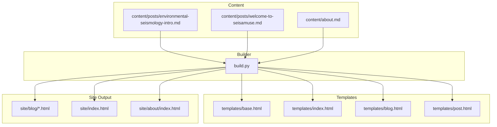
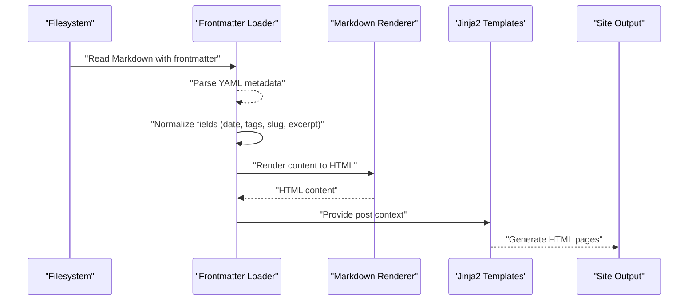
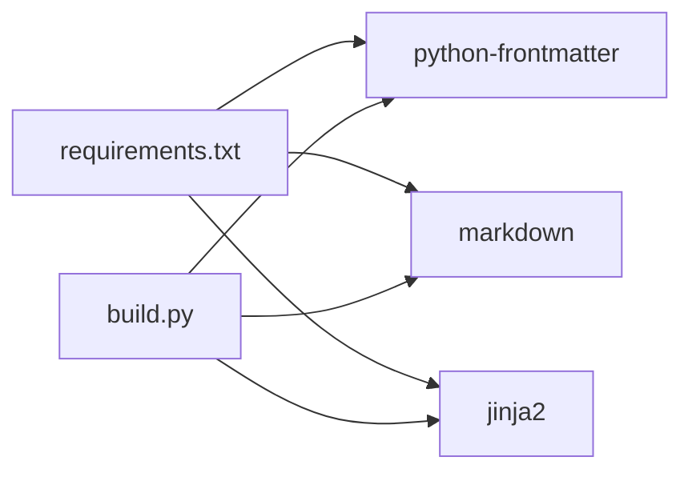

# Frontmatter Syntax and Metadata

<cite>
**Referenced Files in This Document**
- [build.py](file://build.py)
- [environmental-seismology-intro.md](file://content/posts/environmental-seismology-intro.md)
- [welcome-to-seisamuse.md](file://content/posts/welcome-to-seisamuse.md)
- [about.md](file://content/about.md)
- [post.html](file://templates/post.html)
- [blog.html](file://templates/blog.html)
- [index.html](file://templates/index.html)
- [base.html](file://templates/base.html)
- [requirements.txt](file://requirements.txt)
</cite>

## Table of Contents
1. [Introduction](#introduction)
2. [Project Structure](#project-structure)
3. [Core Components](#core-components)
4. [Architecture Overview](#architecture-overview)
5. [Detailed Component Analysis](#detailed-component-analysis)
6. [Dependency Analysis](#dependency-analysis)
7. [Performance Considerations](#performance-considerations)
8. [Troubleshooting Guide](#troubleshooting-guide)
9. [Conclusion](#conclusion)
10. [Appendices](#appendices)

## Introduction
This document explains the frontmatter syntax and metadata fields used in Seisamuse content management. It focuses on the YAML frontmatter format delimited by three dashes (---), documents supported metadata fields, shows how values are parsed and rendered across the site generation pipeline, and outlines validation rules and common pitfalls. Practical examples are linked to real content files in the repository.

## Project Structure
Seisamuse organizes content under content/, with Markdown posts in content/posts/ and a single about page at content/about.md. The static site builder reads these files, parses frontmatter, renders Markdown, and uses Jinja2 templates to produce HTML under site/.

**Diagram sources**
- [build.py:73-130](file://build.py#L73-L130)
- [index.html:1-73](file://templates/index.html#L1-L73)
- [blog.html:1-27](file://templates/blog.html#L1-L27)
- [post.html:1-30](file://templates/post.html#L1-L30)
- [base.html:1-43](file://templates/base.html#L1-L43)

**Section sources**
- [build.py:22-28](file://build.py#L22-L28)
- [requirements.txt:1-4](file://requirements.txt#L1-L4)

## Core Components
- Frontmatter parsing: The builder uses a frontmatter library to extract YAML metadata from Markdown files.
- Metadata extraction: The builder normalizes fields (e.g., tags, date, slug, excerpt) and computes derived values (e.g., reading time).
- Rendering: Markdown content is converted to HTML; Jinja2 templates assemble the final pages.
- Sorting and navigation: Posts are sorted chronologically by date for listing and display.

Key behaviors:
- Required fields: title is used as a fallback when missing; date is required for chronological ordering.
- Optional fields: tags, excerpt, slug, description.
- Automatic slug fallback: filename stem is used when slug is absent.
- Automatic excerpt fallback: first paragraph is truncated when excerpt is empty.
- Date normalization: supports both datetime and string formats; sorts by YYYY-MM-DD.

**Section sources**
- [build.py:73-112](file://build.py#L73-L112)
- [build.py:115-130](file://build.py#L115-L130)
- [post.html:2-3](file://templates/post.html#L2-L3)
- [blog.html:10-13](file://templates/blog.html#L10-L13)
- [index.html:26-35](file://templates/index.html#L26-L35)

## Architecture Overview
The frontmatter-driven pipeline transforms Markdown content into a static site:

**Diagram sources**
- [build.py:73-112](file://build.py#L73-L112)
- [build.py:154-236](file://build.py#L154-L236)
- [post.html:1-30](file://templates/post.html#L1-L30)
- [blog.html:1-27](file://templates/blog.html#L1-L27)
- [index.html:1-73](file://templates/index.html#L1-L73)

## Detailed Component Analysis

### Frontmatter Fields and Processing
Supported fields and their processing rules:
- title (required for display): Falls back to filename stem when missing.
- date (YYYY-MM-DD): Normalized from datetime or string; used for chronological sorting.
- tags (comma-separated or array): Converted to a list; supports both string and array forms.
- slug (URL-friendly): Used as the post’s HTML filename; defaults to the filename stem.
- excerpt (summary): Used in listings and meta description; auto-generated from the first paragraph if missing.
- description (meta description): Not a canonical field in Seisamuse; the theme uses excerpt for the description meta tag.

Processing logic highlights:
- Date normalization and sorting: Posts are sorted newest-first by date_sort.
- Excerpt generation: If absent, the first paragraph is truncated to approximately 160 characters.
- Slug fallback: If slug is not provided, the filename stem is used.

Validation and formatting requirements:
- Triple-dash delimiters: YAML frontmatter must be enclosed by --- at the top and bottom of the file.
- Date format: Prefer YYYY-MM-DD; the builder accepts datetime objects and string prefixes.
- Tags format: Accepts comma-separated strings or arrays; both are normalized to lists.
- Slug safety: Should be URL-safe; the builder uses the filename stem as a safe default.

Common mistakes to avoid:
- Omitting title: While not enforced, leaving it blank reduces readability in templates.
- Incorrect date format: Non-ISO dates may sort unexpectedly; use YYYY-MM-DD.
- Mixed tag formats: Do not mix commas and arrays inconsistently; pick one style.
- Missing frontmatter delimiters: Without ---, the metadata will not be parsed.

Examples from repository content:
- Proper frontmatter with required and optional fields: [environmental-seismology-intro.md:1-6](file://content/posts/environmental-seismology-intro.md#L1-L6)
- Minimal frontmatter with only title: [about.md:1-3](file://content/about.md#L1-L3)
- Additional metadata fields present in other content: [welcome-to-seisamuse.md:1-6](file://content/posts/welcome-to-seisamuse.md#L1-L6)

**Section sources**
- [build.py:73-112](file://build.py#L73-L112)
- [build.py:115-130](file://build.py#L115-L130)
- [environmental-seismology-intro.md:1-6](file://content/posts/environmental-seismology-intro.md#L1-L6)
- [welcome-to-seisamuse.md:1-6](file://content/posts/welcome-to-seisamuse.md#L1-L6)
- [about.md:1-3](file://content/about.md#L1-L3)

### Automatic Slug Generation and Filename Behavior
- Default slug: When slug is omitted, the builder uses the Markdown filename stem (without extension).
- Generated URLs: Individual posts are written to site/blog/{slug}.html.
- Legacy filenames: Some content uses dated filenames (e.g., 2006-06-11-寂寞.md), which act as slugs when no explicit slug is set.

Implications:
- Keep filenames URL-friendly; the builder does not sanitize slugs automatically.
- Prefer explicit slug entries for predictable URLs.

**Section sources**
- [build.py:99](file://build.py#L99)
- [build.py:203-211](file://build.py#L203-L211)
- [environmental-seismology-intro.md:1-6](file://content/posts/environmental-seismology-intro.md#L1-L6)
- [welcome-to-seisamuse.md:1-6](file://content/posts/welcome-to-seisamuse.md#L1-L6)

### Chronological Sorting and Date Effects
- Sorting mechanism: Posts are sorted by date_sort in descending order (newest first).
- Impact on listings: The blog listing and recent posts on the home page reflect this order.
- Fallback behavior: Posts without a valid date are marked as undated and sorted accordingly.

**Section sources**
- [build.py:128-130](file://build.py#L128-L130)
- [index.html:26-35](file://templates/index.html#L26-L35)
- [blog.html:9-21](file://templates/blog.html#L9-L21)

### Template Usage of Frontmatter Values
- Title and description: The post template sets the page title and description meta tag using the post’s title and excerpt.
- Listing pages: Blog and home page templates render post dates, titles, excerpts, and tags from the normalized post context.
- About page: The about page content is rendered without frontmatter-dependent metadata.

**Section sources**
- [post.html:2-3](file://templates/post.html#L2-L3)
- [blog.html:10-18](file://templates/blog.html#L10-L18)
- [index.html:26-35](file://templates/index.html#L26-L35)
- [base.html:6-7](file://templates/base.html#L6-L7)

### Example Frontmatter Patterns
Below are the exact locations of example frontmatters in the repository. Use these paths to inspect formatting and field combinations:

- [environmental-seismology-intro.md:1-6](file://content/posts/environmental-seismology-intro.md#L1-L6)
- [welcome-to-seisamuse.md:1-6](file://content/posts/welcome-to-seisamuse.md#L1-L6)
- [about.md:1-3](file://content/about.md#L1-L3)

Note: These links point to the frontmatter blocks; the rest of each file contains Markdown content.

**Section sources**
- [environmental-seismology-intro.md:1-6](file://content/posts/environmental-seismology-intro.md#L1-L6)
- [welcome-to-seisamuse.md:1-6](file://content/posts/welcome-to-seisamuse.md#L1-L6)
- [about.md:1-3](file://content/about.md#L1-L3)

## Dependency Analysis
The builder depends on external libraries for frontmatter parsing, Markdown rendering, and templating. These libraries interpret frontmatter and enable the documented metadata fields.

**Diagram sources**
- [requirements.txt:1-4](file://requirements.txt#L1-L4)
- [build.py:18-20](file://build.py#L18-L20)

**Section sources**
- [requirements.txt:1-4](file://requirements.txt#L1-L4)
- [build.py:18-20](file://build.py#L18-L20)

## Performance Considerations
- Reading and parsing: Each Markdown file is parsed once per build; keep frontmatter concise.
- Rendering: Markdown conversion and template rendering are lightweight; performance is dominated by IO and template complexity.
- Sorting: Sorting by date is O(n log n); typical blog sizes are small enough to be negligible.

## Troubleshooting Guide
Common issues and resolutions:
- Missing title: Title falls back to the filename stem; ensure meaningful filenames or set title explicitly.
- Invalid date: Use ISO date format (YYYY-MM-DD) to avoid unexpected sorting.
- Empty excerpt: The builder auto-generates excerpts from the first paragraph; ensure the Markdown file has a clear first paragraph.
- Slug collisions: Choose unique slugs to prevent overwritten pages.
- Tag formatting: Use consistent formats (all strings separated by commas or arrays) to avoid parsing ambiguity.

**Section sources**
- [build.py:78-98](file://build.py#L78-L98)
- [build.py:128-130](file://build.py#L128-L130)
- [post.html:2-3](file://templates/post.html#L2-L3)

## Conclusion
Seisamuse uses a straightforward YAML frontmatter model with clear defaults and robust fallbacks. By adhering to the documented field formats and validation rules, authors can reliably control post presentation, SEO metadata, and chronological ordering across the site.

## Appendices

### Field Reference Summary
- title: Required for display; fallback to filename stem when missing.
- date: YYYY-MM-DD; used for chronological sorting.
- tags: Comma-separated or array; normalized to a list.
- slug: URL-friendly; defaults to filename stem.
- excerpt: Used in listings and meta description; auto-generated if absent.
- description: Not a canonical field; meta description uses excerpt when available.

**Section sources**
- [build.py:73-112](file://build.py#L73-L112)
- [post.html:2-3](file://templates/post.html#L2-L3)
- [blog.html:10-13](file://templates/blog.html#L10-L13)
- [index.html:26-35](file://templates/index.html#L26-L35)