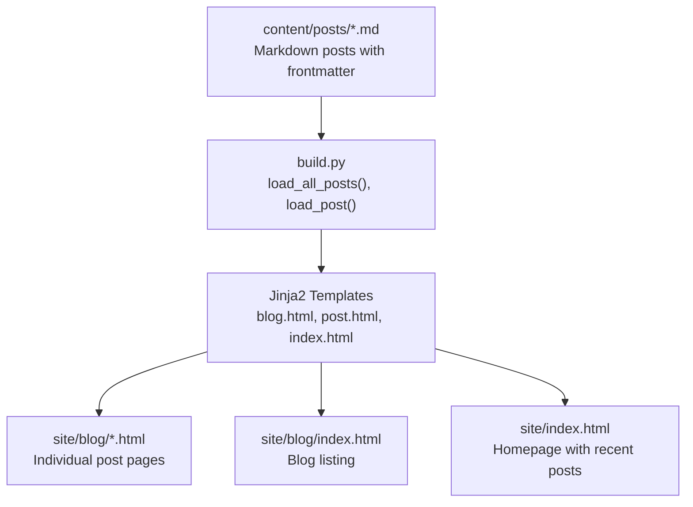
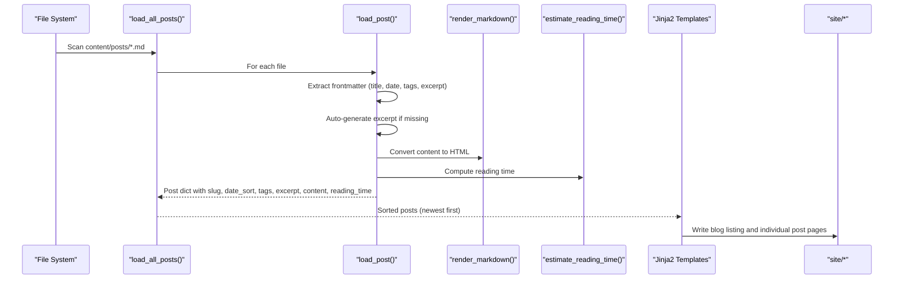
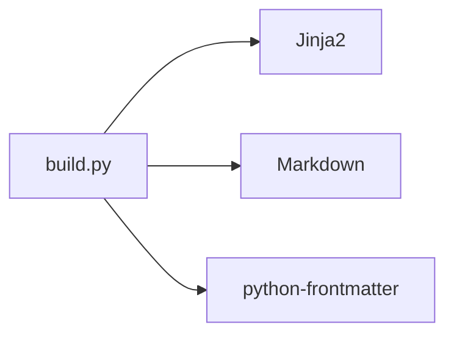

# Post Organization and Structure

<cite>
**Referenced Files in This Document**
- [build.py](file://build.py)
- [content/posts/environmental-seismology-intro.md](file://content/posts/environmental-seismology-intro.md)
- [content/posts/welcome-to-seisamuse.md](file://content/posts/welcome-to-seisamuse.md)
- [templates/blog.html](file://templates/blog.html)
- [templates/post.html](file://templates/post.html)
- [templates/index.html](file://templates/index.html)
- [templates/base.html](file://templates/base.html)
- [requirements.txt](file://requirements.txt)
</cite>

## Table of Contents
1. [Introduction](#introduction)
2. [Project Structure](#project-structure)
3. [Core Components](#core-components)
4. [Architecture Overview](#architecture-overview)
5. [Detailed Component Analysis](#detailed-component-analysis)
6. [Dependency Analysis](#dependency-analysis)
7. [Performance Considerations](#performance-considerations)
8. [Troubleshooting Guide](#troubleshooting-guide)
9. [Conclusion](#conclusion)
10. [Appendices](#appendices)

## Introduction
This document explains how blog posts are organized and structured in Seisamuse. It covers the content/posts directory layout, filename requirements for automatic slug generation, chronological sorting based on date metadata, and how posts appear on the homepage and blog listing pages. It also documents automatic excerpt generation, reading time calculation, and best practices for organizing multiple posts, archives, and maintaining chronological order during updates.

## Project Structure
Posts are stored under the content/posts directory and rendered into static HTML pages under site/blog. The build pipeline loads Markdown posts with frontmatter, converts them to HTML, computes derived metadata (excerpt, slug, reading time), sorts posts by date, and renders templates for the blog listing and individual post pages.

**Diagram sources**
- [build.py:115-130](file://build.py#L115-L130)
- [build.py:200-211](file://build.py#L200-L211)
- [templates/blog.html:1-27](file://templates/blog.html#L1-L27)
- [templates/post.html:1-30](file://templates/post.html#L1-L30)
- [templates/index.html:1-73](file://templates/index.html#L1-L73)

**Section sources**
- [build.py:22-28](file://build.py#L22-L28)
- [build.py:115-130](file://build.py#L115-L130)
- [build.py:200-211](file://build.py#L200-L211)

## Core Components
- Content loading and parsing: Posts are loaded via frontmatter, with metadata extracted and normalized.
- Rendering pipeline: Markdown content is converted to HTML; templates render pages.
- Sorting and pagination: Posts are sorted newest-first; homepage shows recent posts; blog listing shows all posts.
- Derived metadata: Excerpts are either provided or auto-generated; reading time is computed from word count.

Key behaviors:
- Directory: content/posts
- Filename requirement for slug: The slug is taken from the filename stem unless overridden by frontmatter.
- Date sorting: Posts are sorted by date_sort in descending order.
- Homepage and blog listing: Both use the same posts list; homepage limits to recent posts.

**Section sources**
- [build.py:73-112](file://build.py#L73-L112)
- [build.py:115-130](file://build.py#L115-L130)
- [build.py:178-198](file://build.py#L178-L198)
- [templates/index.html:25-38](file://templates/index.html#L25-L38)
- [templates/blog.html:8-21](file://templates/blog.html#L8-L21)

## Architecture Overview
The build process follows a predictable flow: load posts, compute derived metadata, sort, and render templates.

**Diagram sources**
- [build.py:115-130](file://build.py#L115-L130)
- [build.py:73-112](file://build.py#L73-L112)
- [build.py:56-64](file://build.py#L56-L64)
- [build.py:67-71](file://build.py#L67-L71)
- [build.py:189-211](file://build.py#L189-L211)

## Detailed Component Analysis

### Post Metadata and Slug Generation
- Frontmatter keys used: title, date, tags, excerpt, slug.
- Automatic slug: If slug is not provided, the filename stem is used.
- Title fallback: If title is not provided, the filename stem is normalized to title case.
- Date normalization: If date is a datetime object, it is formatted to YYYY-MM-DD; if a string, the first 10 characters are used; otherwise treated as undated.
- Tags: If provided as a string, split by comma and stripped.

Best practices:
- Always include a date in YYYY-MM-DD format for reliable sorting.
- Provide a slug if the filename is not URL-friendly.
- Provide a concise excerpt for better listing previews.

**Section sources**
- [build.py:73-112](file://build.py#L73-L112)
- [content/posts/environmental-seismology-intro.md:1-6](file://content/posts/environmental-seismology-intro.md#L1-L6)
- [content/posts/welcome-to-seisamuse.md:1-6](file://content/posts/welcome-to-seisamuse.md#L1-L6)

### Chronological Sorting and Presentation
- Sorting key: date_sort is set to the normalized date string.
- Order: Newest posts first (reverse sort).
- Homepage: Renders recent_posts (default limit is five).
- Blog listing: Renders all posts in chronological order.

Implications:
- Updating a post’s date will reposition it in listings.
- Posts without dates are grouped last or sorted as “undated.”

**Section sources**
- [build.py:106](file://build.py#L106)
- [build.py:129](file://build.py#L129)
- [build.py:185](file://build.py#L185)
- [templates/index.html:25-38](file://templates/index.html#L25-L38)
- [templates/blog.html:8-21](file://templates/blog.html#L8-L21)

### Automatic Excerpt Generation
- Priority order: excerpt frontmatter > description frontmatter > auto-generated.
- Auto-generation: First paragraph up to 160 characters, with an ellipsis if truncated.

Usage:
- Blog listing displays excerpts when present.
- Post pages show the full content; excerpts can be used for SEO meta descriptions.

**Section sources**
- [build.py:93-98](file://build.py#L93-L98)
- [templates/blog.html:13](file://templates/blog.html#L13)

### Reading Time Calculation
- Method: Word count divided by 200 words per minute, rounded up to at least 1 minute.
- Presentation: Shown on post pages when available.

Impact:
- Helps readers gauge effort and plan reading.
- Can influence perceived content depth on listings.

**Section sources**
- [build.py:67-71](file://build.py#L67-L71)
- [templates/post.html:11](file://templates/post.html#L11)

### Template Rendering and Output
- Blog listing: Iterates over posts, prints date, title, excerpt, and tags.
- Post page: Displays title, date, reading time, tags, and full content.
- Homepage: Shows recent posts with excerpts and tags.

URLs:
- Individual posts are written to site/blog/{slug}.html.
- Blog listing is site/blog/index.html.
- Homepage is site/index.html.

**Section sources**
- [templates/blog.html:8-21](file://templates/blog.html#L8-L21)
- [templates/post.html:7-23](file://templates/post.html#L7-L23)
- [templates/index.html:25-38](file://templates/index.html#L25-L38)
- [build.py:203-211](file://build.py#L203-L211)
- [build.py:190-198](file://build.py#L190-L198)

### Example Post Files
Two example posts demonstrate the frontmatter structure and content format used by the system.

**Section sources**
- [content/posts/environmental-seismology-intro.md:1-6](file://content/posts/environmental-seismology-intro.md#L1-L6)
- [content/posts/welcome-to-seisamuse.md:1-6](file://content/posts/welcome-to-seisamuse.md#L1-L6)

## Dependency Analysis
The build pipeline depends on external libraries for templating, Markdown rendering, and frontmatter parsing.

**Diagram sources**
- [requirements.txt:1-4](file://requirements.txt#L1-L4)
- [build.py:18-20](file://build.py#L18-L20)

**Section sources**
- [requirements.txt:1-4](file://requirements.txt#L1-L4)
- [build.py:18-20](file://build.py#L18-L20)

## Performance Considerations
- Reading time computation is O(n) in content length and negligible overhead.
- Sorting is O(n log n) on the number of posts; acceptable for typical blog sizes.
- Excerpt generation scans the first paragraph; keep content well-structured for predictable truncation.
- Consider caching or incremental builds if scaling to hundreds of posts.

## Troubleshooting Guide
Common issues and resolutions:
- Missing date: Posts without a valid date are treated as “undated” and may sort unexpectedly. Always include a date in YYYY-MM-DD format.
- Slug collisions: Ensure unique slugs across posts. If two posts share the same slug, only one page will be generated.
- Excerpt too long: If excerpts are not appearing as expected, verify the first paragraph meets expectations; adjust content or provide explicit excerpt frontmatter.
- Tag formatting: If tags are provided as a string, ensure comma separation without extra spaces; the loader splits and strips entries.
- Template rendering errors: Verify that all required frontmatter keys are present and correctly formatted.

**Section sources**
- [build.py:82-88](file://build.py#L82-L88)
- [build.py:93-98](file://build.py#L93-L98)
- [build.py:90-92](file://build.py#L90-L92)
- [build.py:121-130](file://build.py#L121-L130)

## Conclusion
Seisamuse organizes posts in content/posts with flexible frontmatter-driven metadata. Automatic slug generation uses filenames by default, while excerpts and reading time enhance presentation. Posts are sorted chronologically with newest-first ordering, and both the homepage and blog listing reflect this order. Following the best practices outlined here ensures consistent, readable, and well-organized blog content.

## Appendices

### Best Practices for Post Organization
- Naming conventions:
  - Use descriptive, hyphen-separated filenames (e.g., 2026-04-16-welcome-to-seisamuse.md).
  - Include a date prefix to simplify chronological sorting.
- File placement:
  - Place all posts under content/posts.
- Frontmatter:
  - Provide title, date (YYYY-MM-DD), tags (comma-separated), and excerpt when desired.
  - Add slug only if the filename is not URL-friendly.
- Content structure:
  - Keep the first paragraph concise for predictable excerpt generation.
  - Use clear headings and bullet lists for readability.
- Archive organization:
  - Maintain chronological order by updating dates; older posts can remain unchanged.
  - Use consistent tagging to improve discoverability.
- Updates:
  - Re-running the build regenerates all pages with latest metadata and content.
  - If changing slugs, update internal links and consider redirects externally if needed.

[No sources needed since this section provides general guidance]