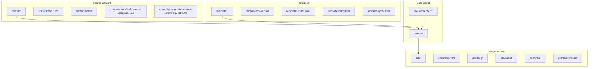
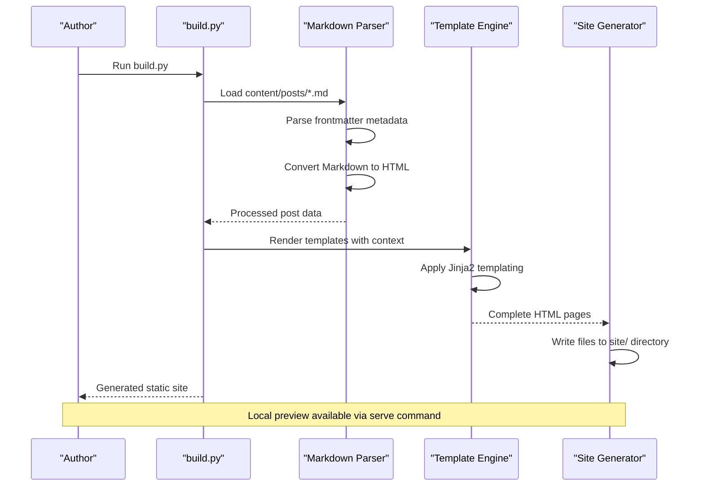
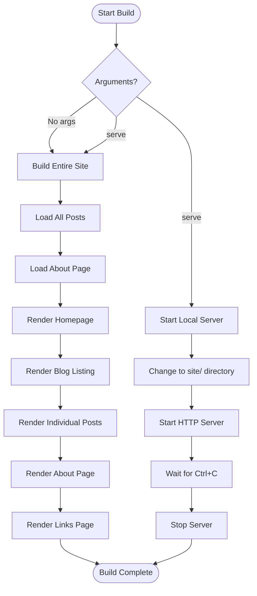
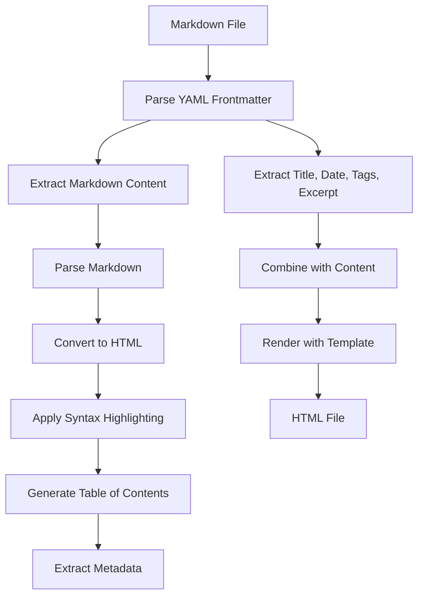
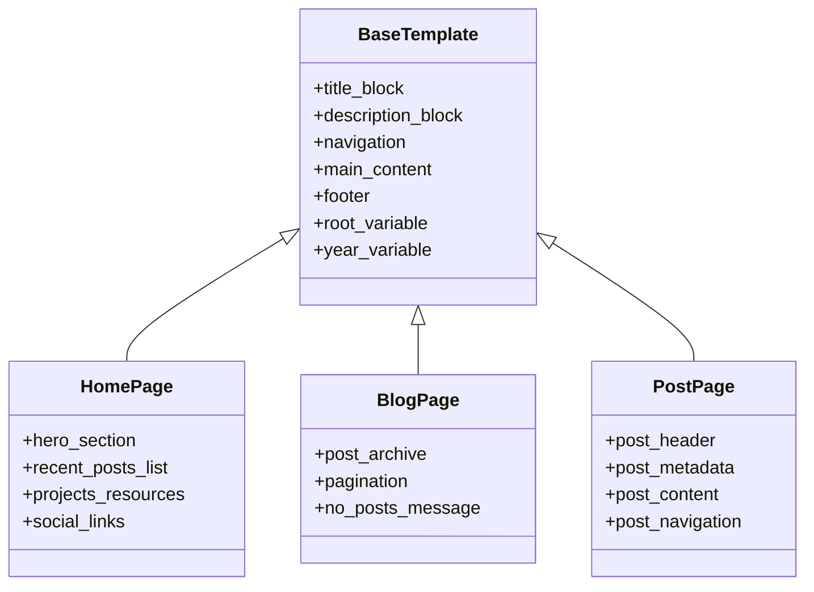
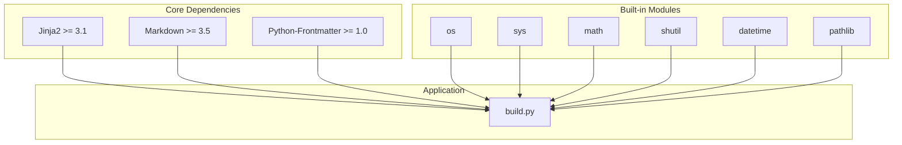

# Getting Started

<cite>
**Referenced Files in This Document**
- [build.py](file://build.py)
- [requirements.txt](file://requirements.txt)
- [content/about.md](file://content/about.md)
- [content/posts/welcome-to-seisamuse.md](file://content/posts/welcome-to-seisamuse.md)
- [content/posts/environmental-seismology-intro.md](file://content/posts/environmental-seismology-intro.md)
- [templates/base.html](file://templates/base.html)
- [templates/index.html](file://templates/index.html)
- [templates/blog.html](file://templates/blog.html)
- [templates/post.html](file://templates/post.html)
- [site/css/style.css](file://site/css/style.css)
</cite>

## Table of Contents
1. [Introduction](#introduction)
2. [Project Structure](#project-structure)
3. [Core Components](#core-components)
4. [Architecture Overview](#architecture-overview)
5. [Detailed Component Analysis](#detailed-component-analysis)
6. [Dependency Analysis](#dependency-analysis)
7. [Performance Considerations](#performance-considerations)
8. [Troubleshooting Guide](#troubleshooting-guide)
9. [Conclusion](#conclusion)
10. [Appendices](#appendices)

## Introduction
Seisamuse is a specialized static site generator designed for academic researchers. It converts Markdown content into a clean, professional academic website using a simple command-line interface. The tool focuses on research blogs, personal websites, and portfolio-style sites for scientists and scholars who want to publish their work and ideas online without dealing with complex CMS setups.

Key benefits for researchers:
- Zero-cost hosting on GitHub Pages, Netlify, or any static host
- Clean, readable typography optimized for academic content
- Automatic blog post generation with metadata parsing
- Semantic HTML and responsive design
- Easy deployment to popular static hosts

## Project Structure
The Seisamuse project follows a clear separation of concerns with distinct directories for content, templates, and generated output.

**Diagram sources**
- [build.py:22-27](file://build.py#L22-L27)
- [content/about.md:1-36](file://content/about.md#L1-L36)
- [templates/base.html:1-43](file://templates/base.html#L1-L43)

**Section sources**
- [build.py:22-27](file://build.py#L22-L27)
- [content/about.md:1-36](file://content/about.md#L1-L36)
- [templates/base.html:1-43](file://templates/base.html#L1-L43)

## Core Components
Seisamuse consists of four primary components that work together to transform Markdown content into a professional academic website.

### Build Engine (build.py)
The central engine that orchestrates the entire build process. It handles content loading, template rendering, and static site generation.

Key responsibilities:
- Loads and parses Markdown files with frontmatter metadata
- Renders Jinja2 templates with processed content
- Generates HTML pages for homepage, blog listings, individual posts, and static pages
- Provides a local development server for preview

### Content Management
Structured content stored in the `content/` directory with a simple folder-based organization:
- `content/about.md`: Personal biography and contact information
- `content/posts/`: Individual blog posts organized by date and slug
- Each post uses YAML frontmatter for metadata (title, date, tags, excerpt)

### Template System
Jinja2-powered templates that define the site's structure and styling:
- `templates/base.html`: Master template with navigation and layout
- `templates/index.html`: Homepage with hero section and recent posts
- `templates/blog.html`: Archive of all blog posts
- `templates/post.html`: Individual post display with metadata

### Asset Pipeline
Static assets automatically copied during build:
- CSS stylesheets for responsive design
- Placeholder avatar images
- Favicon support

**Section sources**
- [build.py:154-236](file://build.py#L154-L236)
- [content/about.md:1-36](file://content/about.md#L1-L36)
- [templates/base.html:1-43](file://templates/base.html#L1-L43)

## Architecture Overview
The Seisamuse architecture follows a straightforward pipeline from content to publication-ready HTML.

**Diagram sources**
- [build.py:154-236](file://build.py#L154-L236)
- [build.py:239-253](file://build.py#L239-L253)

The build process follows these steps:
1. **Content Discovery**: Scans the content directory for Markdown files
2. **Metadata Extraction**: Parses YAML frontmatter for each post
3. **HTML Generation**: Converts Markdown to HTML with syntax highlighting
4. **Template Rendering**: Applies Jinja2 templates to structure content
5. **File Writing**: Outputs static HTML files to the site directory

**Section sources**
- [build.py:154-236](file://build.py#L154-L236)
- [build.py:239-253](file://build.py#L239-L253)

## Detailed Component Analysis

### Build Script Workflow
The build.py script provides two primary modes of operation: standard site building and development preview.

**Diagram sources**
- [build.py:255-260](file://build.py#L255-L260)
- [build.py:239-253](file://build.py#L239-L253)

### Content Processing Pipeline
Each Markdown file undergoes a standardized transformation process:

**Diagram sources**
- [build.py:73-112](file://build.py#L73-L112)
- [build.py:56-64](file://build.py#L56-L64)

**Section sources**
- [build.py:154-236](file://build.py#L154-L236)
- [build.py:73-112](file://build.py#L73-L112)

### Template System Architecture
The template system uses Jinja2 inheritance to create a flexible and maintainable design structure.

**Diagram sources**
- [templates/base.html:1-43](file://templates/base.html#L1-L43)
- [templates/index.html:1-73](file://templates/index.html#L1-L73)
- [templates/blog.html:1-27](file://templates/blog.html#L1-L27)
- [templates/post.html:1-30](file://templates/post.html#L1-L30)

**Section sources**
- [templates/base.html:1-43](file://templates/base.html#L1-L43)
- [templates/index.html:1-73](file://templates/index.html#L1-L73)
- [templates/blog.html:1-27](file://templates/blog.html#L1-L27)
- [templates/post.html:1-30](file://templates/post.html#L1-L30)

## Dependency Analysis
Seisamuse has minimal external dependencies that focus on essential functionality for academic publishing.

**Diagram sources**
- [requirements.txt:1-4](file://requirements.txt#L1-L4)
- [build.py:11-20](file://build.py#L11-L20)

**Section sources**
- [requirements.txt:1-4](file://requirements.txt#L1-L4)
- [build.py:11-20](file://build.py#L11-L20)

## Performance Considerations
Seisamuse is designed for simplicity and speed, with several built-in optimizations:

- **Minimal Processing**: Each build runs in linear time relative to content size
- **Efficient Parsing**: Uses optimized Markdown and frontmatter libraries
- **Static Output**: No server-side processing required after generation
- **Responsive Design**: CSS is optimized for fast loading on mobile devices
- **Lazy Loading**: Images use graceful fallbacks for missing avatars

Best practices for optimal performance:
- Keep images optimized and sized appropriately
- Limit excessive code blocks in posts
- Use descriptive but concise titles and excerpts
- Organize posts with meaningful dates for chronological sorting

## Troubleshooting Guide

### Common Issues and Solutions

**Issue: Python version compatibility**
- Problem: Running with Python 2.x or incompatible Python 3.x versions
- Solution: Ensure Python 3.6+ is installed and available as `python3`

**Issue: Missing dependencies**
- Problem: ImportError when running build.py
- Solution: Install dependencies using `pip install -r requirements.txt`

**Issue: Build fails silently**
- Problem: Script exits without error messages
- Solution: Run with verbose output and check file permissions

**Issue: Template rendering errors**
- Problem: Jinja2 template syntax errors
- Solution: Verify template syntax and variable names match expected context

**Issue: Missing content in generated site**
- Problem: Posts not appearing on blog page
- Solution: Check Markdown file naming convention and frontmatter format

**Section sources**
- [build.py:125-127](file://build.py#L125-L127)
- [requirements.txt:1-4](file://requirements.txt#L1-L4)

## Conclusion
Seisamuse provides researchers with a streamlined solution for creating professional academic websites without the complexity of traditional content management systems. Its minimalist approach ensures fast builds, easy deployment, and maintainable code that can be customized for specific research needs.

The combination of Markdown authoring, structured metadata, and semantic HTML output makes it ideal for academic publishing while maintaining the flexibility to adapt to various research communication needs.

## Appendices

### Installation Prerequisites
- Python 3.6 or higher
- pip package manager
- Virtual environment (recommended)

### Basic Workflow Steps
1. **Setup Environment**: Create and activate virtual environment
2. **Install Dependencies**: `pip install -r requirements.txt`
3. **Create Content**: Add Markdown files to `content/` directory
4. **Run Build**: `python build.py`
5. **Preview Site**: `python build.py serve`
6. **Deploy**: Upload `site/` directory to chosen hosting platform

### First-Time User Example
The simplest possible usage involves:
1. Running the build script to generate a complete site
2. Opening `site/index.html` in a browser
3. Adding your own content to `content/about.md` and `content/posts/`
4. Re-running the build to regenerate the site

### Template Variables Reference
Common template variables available in all pages:
- `root`: Relative path to site root for asset linking
- `year`: Current year for copyright notices
- `active`: Active navigation state for styling
- `posts`: List of blog posts for archive pages
- `post`: Individual post data for post pages
- `recent_posts`: Subset of latest posts for homepage