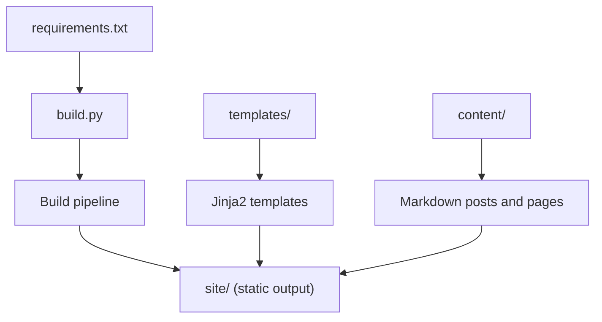
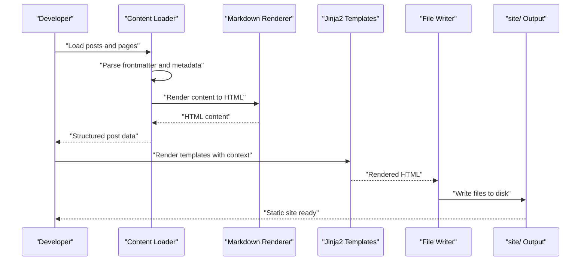
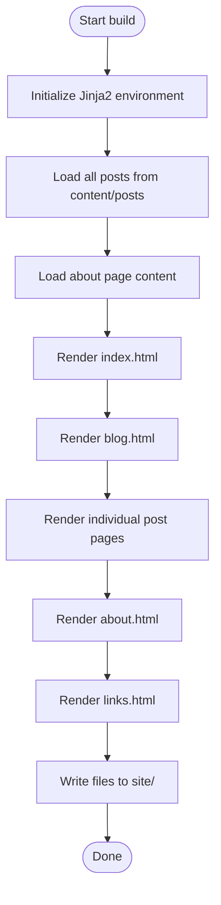
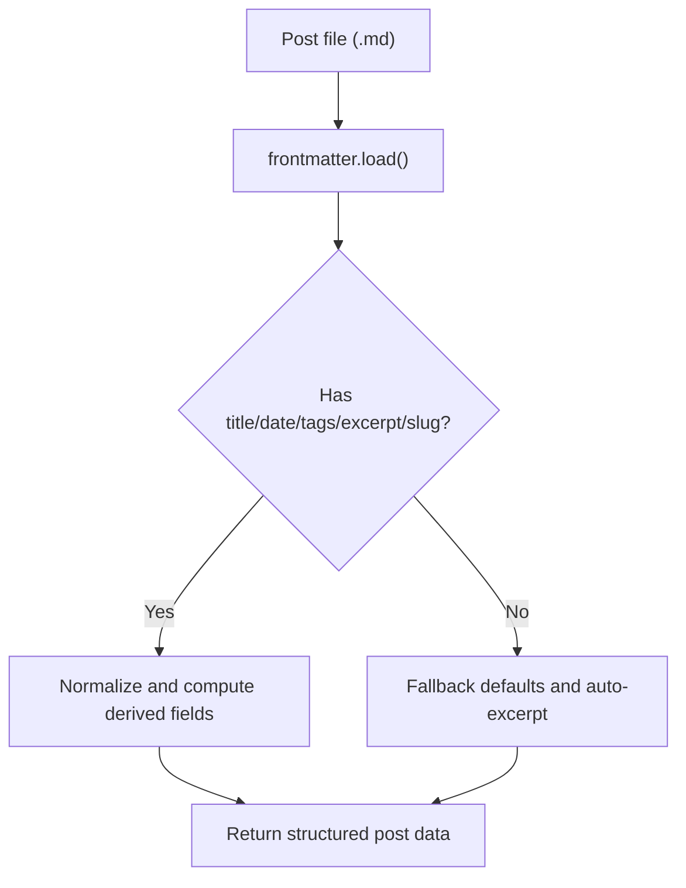
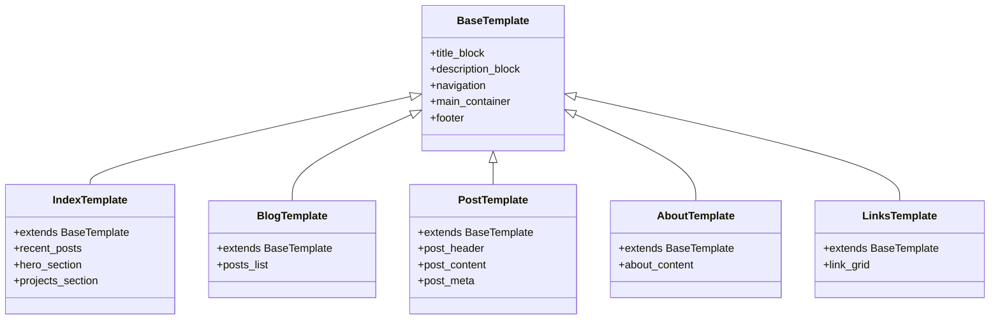
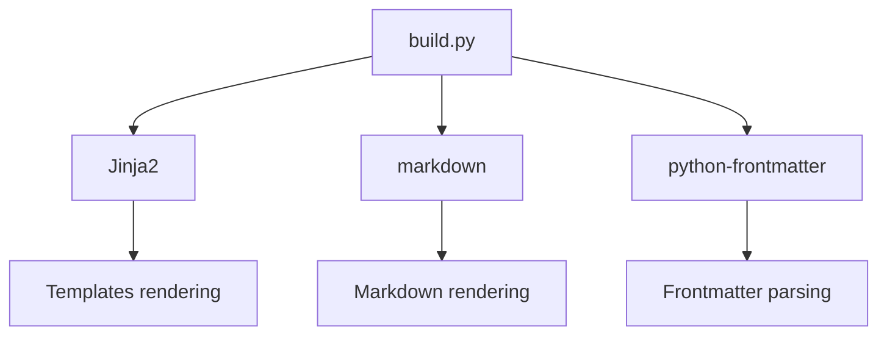

# Project Overview

<cite>
**Referenced Files in This Document**
- [build.py](file://build.py)
- [requirements.txt](file://requirements.txt)
- [content/about.md](file://content/about.md)
- [content/posts/welcome-to-seisamuse.md](file://content/posts/welcome-to-seisamuse.md)
- [content/posts/environmental-seismology-intro.md](file://content/posts/environmental-seismology-intro.md)
- [templates/base.html](file://templates/base.html)
- [templates/index.html](file://templates/index.html)
- [templates/blog.html](file://templates/blog.html)
- [templates/post.html](file://templates/post.html)
- [templates/about.html](file://templates/about.html)
- [templates/links.html](file://templates/links.html)
- [site/css/style.css](file://site/css/style.css)
</cite>

## Table of Contents
1. [Introduction](#introduction)
2. [Project Structure](#project-structure)
3. [Core Components](#core-components)
4. [Architecture Overview](#architecture-overview)
5. [Detailed Component Analysis](#detailed-component-analysis)
6. [Dependency Analysis](#dependency-analysis)
7. [Performance Considerations](#performance-considerations)
8. [Troubleshooting Guide](#troubleshooting-guide)
9. [Conclusion](#conclusion)

## Introduction
Seisamuse is a lightweight, academic-focused static site generator tailored for researchers and scientists. Its purpose is to convert Markdown content into a clean, readable academic website with minimal setup and strong support for scientific writing. The project emphasizes clarity, reproducibility, and ease of maintenance—core values for academic professionals who need reliable, portable websites for personal blogs, research portfolios, and professional profiles.

Unlike general-purpose static site generators, Seisamuse prioritizes:
- Straightforward Markdown authoring with frontmatter metadata
- Academic-friendly typography and readability
- Minimal JavaScript and heavy reliance on Python tooling
- Clear separation between content, templates, and output

Target audience:
- Academic researchers and geoscience professionals
- Scientists maintaining personal websites or research portfolios
- Researchers who prefer Markdown-first workflows and static hosting

Key use cases:
- Personal academic websites
- Research portfolios showcasing projects and resources
- Academic blogging focused on scientific topics

## Project Structure
The repository follows a simple, content-driven layout:
- content/: Plain Markdown files for pages and posts
- templates/: Jinja2 templates for page layouts and rendering
- site/: Generated static output (HTML, CSS, assets)
- build.py: The build script orchestrating the pipeline
- requirements.txt: Python dependencies

**Diagram sources**
- [build.py:154-236](file://build.py#L154-L236)
- [requirements.txt:1-4](file://requirements.txt#L1-L4)

**Section sources**
- [build.py:22-28](file://build.py#L22-L28)

## Core Components
- Content loader: Reads Markdown files and extracts frontmatter metadata
- Markdown renderer: Converts Markdown to HTML with academic-friendly extensions
- Template engine: Renders Jinja2 templates with computed context
- Static site writer: Writes final HTML files to the output directory
- Local preview server: Serves the built site during development

How it works:
- Markdown content is parsed with frontmatter metadata and rendered to HTML
- Templates define reusable layouts and page-specific blocks
- The build process aggregates posts, computes excerpts and reading time, and renders pages
- Output is written to the site directory for deployment

**Section sources**
- [build.py:73-112](file://build.py#L73-L112)
- [build.py:154-236](file://build.py#L154-L236)
- [requirements.txt:1-4](file://requirements.txt#L1-L4)

## Architecture Overview
The build pipeline transforms content into a static website through a deterministic, repeatable process. The following diagram maps the actual components and their interactions:

**Diagram sources**
- [build.py:154-236](file://build.py#L154-L236)
- [build.py:47-53](file://build.py#L47-L53)
- [build.py:56-64](file://build.py#L56-L64)

## Detailed Component Analysis

### Build Pipeline
The build pipeline coordinates loading, rendering, and writing:
- Initializes Jinja2 environment and loads content
- Computes excerpts and reading time for posts
- Renders index, blog listing, individual posts, about, and links pages
- Writes output files to the site directory

**Diagram sources**
- [build.py:154-236](file://build.py#L154-L236)

**Section sources**
- [build.py:154-236](file://build.py#L154-L236)

### Content Processing and Frontmatter Extraction
- Posts are loaded via frontmatter parsing, extracting title, date, tags, excerpt, and slug
- Dates are normalized to ISO-like strings; tags are normalized to lists
- Excerpts are either provided or auto-generated from the first paragraph
- Reading time is estimated based on word count

**Diagram sources**
- [build.py:73-112](file://build.py#L73-L112)

**Section sources**
- [build.py:73-112](file://build.py#L73-L112)

### Template System and Rendering
- Base template defines navigation, meta tags, and layout scaffolding
- Page-specific templates extend the base and inject content blocks
- Context includes common metadata (e.g., active page, year) and computed data (e.g., recent posts, about content)

**Diagram sources**
- [templates/base.html:1-43](file://templates/base.html#L1-L43)
- [templates/index.html:1-73](file://templates/index.html#L1-L73)
- [templates/blog.html:1-27](file://templates/blog.html#L1-L27)
- [templates/post.html:1-30](file://templates/post.html#L1-L30)
- [templates/about.html:1-12](file://templates/about.html#L1-L12)
- [templates/links.html:1-48](file://templates/links.html#L1-L48)

**Section sources**
- [templates/base.html:1-43](file://templates/base.html#L1-L43)
- [templates/index.html:1-73](file://templates/index.html#L1-L73)
- [templates/blog.html:1-27](file://templates/blog.html#L1-L27)
- [templates/post.html:1-30](file://templates/post.html#L1-L30)
- [templates/about.html:1-12](file://templates/about.html#L1-L12)
- [templates/links.html:1-48](file://templates/links.html#L1-L48)

### Content Management Approach
- Content is authored in Markdown with YAML frontmatter
- Posts live under content/posts with standardized frontmatter keys
- The about page is a single Markdown file under content/about.md
- Generated pages mirror the content structure conceptually, with slugs used for post URLs

Examples of frontmatter usage:
- Title normalization and fallbacks
- Date normalization and sorting
- Tag normalization and display
- Excerpt provision or auto-generation
- Slug selection for URL generation

**Section sources**
- [content/posts/welcome-to-seisamuse.md:1-6](file://content/posts/welcome-to-seisamuse.md#L1-L6)
- [content/posts/environmental-seismology-intro.md:1-6](file://content/posts/environmental-seismology-intro.md#L1-L6)
- [content/about.md:1-3](file://content/about.md#L1-L3)

### Academic-Focused Design Philosophy
- Typography and spacing emphasize readability for long-form academic content
- Minimal color palette and subtle accents reduce distraction
- Dark mode support for extended reading comfort
- Responsive design for mobile and desktop
- Semantic markup and accessible navigation

**Section sources**
- [site/css/style.css:13-23](file://site/css/style.css#L13-L23)
- [site/css/style.css:465-476](file://site/css/style.css#L465-L476)
- [site/css/style.css:479-512](file://site/css/style.css#L479-L512)

## Dependency Analysis
The build depends on three core libraries:
- Jinja2: Templating engine for page rendering
- markdown: Markdown-to-HTML conversion with academic-friendly extensions
- python-frontmatter: Frontmatter parsing for metadata extraction

**Diagram sources**
- [requirements.txt:1-4](file://requirements.txt#L1-L4)
- [build.py:18-20](file://build.py#L18-L20)

**Section sources**
- [requirements.txt:1-4](file://requirements.txt#L1-L4)
- [build.py:18-20](file://build.py#L18-L20)

## Performance Considerations
- Minimal runtime overhead: Python-based build with straightforward file I/O
- Efficient Markdown rendering: Extensions configured for academic content
- Static output: No server-side processing required post-build
- Scalability: The current implementation focuses on small to medium-sized academic sites; larger sites may benefit from incremental builds or caching strategies

## Troubleshooting Guide
Common issues and resolutions:
- Missing dependencies: Install required packages using the provided requirements file
- Incorrect frontmatter format: Ensure YAML frontmatter is valid and keys match expectations
- Template rendering errors: Verify template blocks and context variables
- Build failures: Check for malformed Markdown or missing content files

**Section sources**
- [requirements.txt:1-4](file://requirements.txt#L1-L4)
- [build.py:121-127](file://build.py#L121-L127)

## Conclusion
Seisamuse delivers a focused, academic-first static site generation workflow. By combining Markdown authoring, frontmatter metadata, Jinja2 templating, and a clean CSS foundation, it enables researchers and scientists to publish personal websites, research portfolios, and academic blogs with minimal friction. Its simplicity and clarity make it an ideal choice for academics who value reproducibility, portability, and readability over complex feature sets.