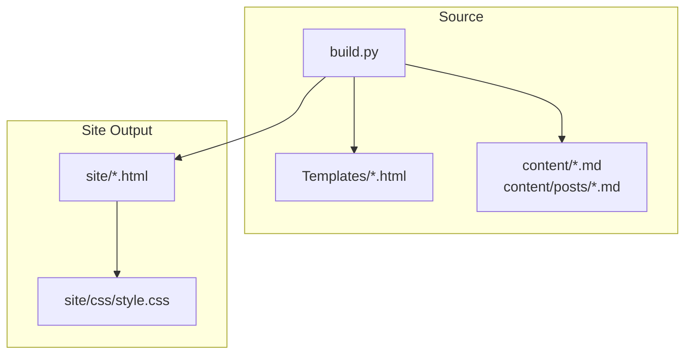
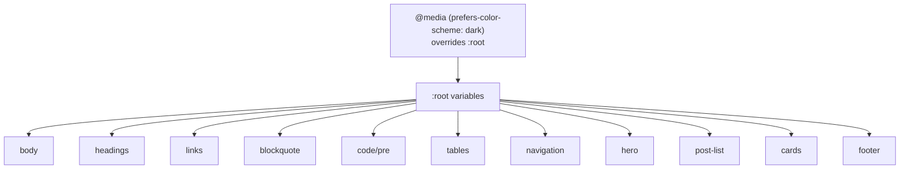
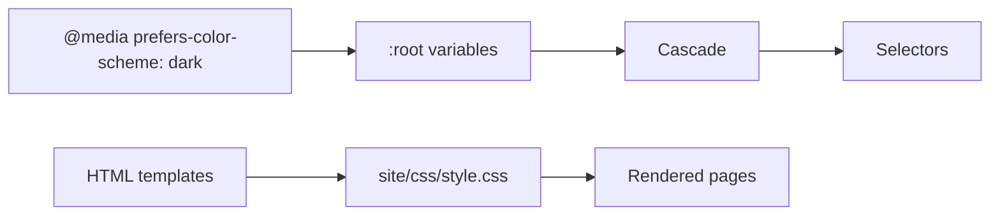

# CSS Architecture and Variables

<cite>
**Referenced Files in This Document**
- [style.css](file://site/css/style.css)
- [base.html](file://templates/base.html)
- [index.html](file://templates/index.html)
- [blog.html](file://templates/blog.html)
- [build.py](file://build.py)
- [requirements.txt](file://requirements.txt)
- [welcome-to-seisamuse.md](file://content/posts/welcome-to-seisamuse.md)
- [about.md](file://content/about.md)
</cite>

## Table of Contents
1. [Introduction](#introduction)
2. [Project Structure](#project-structure)
3. [Core Components](#core-components)
4. [Architecture Overview](#architecture-overview)
5. [Detailed Component Analysis](#detailed-component-analysis)
6. [Dependency Analysis](#dependency-analysis)
7. [Performance Considerations](#performance-considerations)
8. [Troubleshooting Guide](#troubleshooting-guide)
9. [Conclusion](#conclusion)
10. [Appendices](#appendices)

## Introduction
This document explains the CSS architecture and custom property system of Seisamuse, a minimalist academic personal website. It focuses on how CSS custom properties defined in :root enable theme customization, how the stylesheet is organized into resets, base styles, typography, layout, components, and responsive breakpoints, and how the cascade propagates variables across the stylesheet. It also provides practical guidance for adjusting color schemes while maintaining design consistency across light and dark modes.

## Project Structure
Seisamuse is a static site generated by a Python script. The CSS is centralized in a single stylesheet and referenced by HTML templates. The build process compiles Markdown content into HTML pages using Jinja2 templates.

**Diagram sources**
- [build.py:154-236](file://build.py#L154-L236)
- [base.html:8](file://templates/base.html#L8)

**Section sources**
- [build.py:154-236](file://build.py#L154-L236)
- [base.html:8](file://templates/base.html#L8)

## Core Components
Seisamuse’s CSS is organized into distinct layers that progressively define resets, base styles, typography, layout, components, and responsive behavior. The central mechanism enabling theme customization is a set of CSS custom properties declared in :root. These variables are consumed throughout the stylesheet and overridden in a media query for dark mode.

Key layers:
- Resets and base: normalize margins/paddings and establish global defaults.
- Typography: headings, body text, lists, tables, code blocks.
- Layout: container sizing, main content area, and page structure.
- Components: navigation, hero header, post listings, cards, footer.
- Responsive: breakpoint-driven adjustments for mobile and smaller screens.
- Dark mode: a media-query-based override of :root variables.

Practical customization:
- Modify :root variables to change the entire palette.
- Override specific variables inside components for targeted tweaks.
- Extend the dark mode media query to refine contrast or accent colors.

**Section sources**
- [style.css:6-11](file://site/css/style.css#L6-L11)
- [style.css:13-23](file://site/css/style.css#L13-L23)
- [style.css:25-38](file://site/css/style.css#L25-L38)
- [style.css:40-127](file://site/css/style.css#L40-L127)
- [style.css:128-139](file://site/css/style.css#L128-L139)
- [style.css:141-261](file://site/css/style.css#L141-L261)
- [style.css:464-476](file://site/css/style.css#L464-L476)
- [style.css:478-512](file://site/css/style.css#L478-L512)

## Architecture Overview
The CSS architecture follows a layered cascade:
- Resets and base styles apply global defaults and normalize browser differences.
- :root defines a compact set of semantic variables for text, backgrounds, accents, borders, and layout constraints.
- Component selectors consume these variables to maintain consistent theming.
- A media query at the end of the stylesheet overrides :root variables for dark mode, leveraging the cascade to propagate changes automatically.

**Diagram sources**
- [style.css:13-23](file://site/css/style.css#L13-L23)
- [style.css:464-476](file://site/css/style.css#L464-L476)

## Detailed Component Analysis

### CSS Custom Properties (:root)
The :root block defines a small set of semantic variables that drive the entire theme:
- Text and backgrounds: --text, --bg
- Accent and muted colors: --accent, --muted
- Borders and surfaces: --border, --card-bg, --nav-bg, --code-bg
- Layout constraint: --max-w

These variables are consumed across typography, components, and interactive states. The dark mode media query redefines these variables to invert the palette for reduced brightness and improved readability in low-light environments.

Practical examples:
- Change the primary accent color by updating --accent; hover states and borders will reflect the new value automatically.
- Adjust background contrast by changing --bg and --card-bg; ensure sufficient contrast against --text and --muted.
- Tighten or widen the content area by adjusting --max-w; containers and hero content will scale accordingly.

**Section sources**
- [style.css:13-23](file://site/css/style.css#L13-L23)
- [style.css:464-476](file://site/css/style.css#L464-L476)

### Resets and Base Styles
The reset layer normalizes margins and paddings and sets box-sizing globally. The base layer establishes:
- html font-size for scalable typography.
- body font stack, color, background, line-height, and vertical layout using flexbox.
- Minimum viewport height and column direction for consistent page structure.

These defaults ensure predictable rendering and a consistent foundation for subsequent layers.

**Section sources**
- [style.css:6-11](file://site/css/style.css#L6-L11)
- [style.css:25-38](file://site/css/style.css#L25-L38)

### Typography
Typography is designed for readability and academic tone:
- Headings (h1–h4) use Georgia and Times New Roman for a classic serif feel, with tight line heights and consistent spacing.
- Body text uses Palatino Linotype, Palatino, Georgia, Times New Roman for a warm, readable serif stack.
- Links receive a subtle accent underline with a smooth transition.
- Blockquotes adopt the accent color for left border, muted color for text, and card background.
- Code and preformatted blocks use a monospace stack with a dedicated code background and rounded corners.
- Tables use a muted border and clear header emphasis.

Spacing and rhythm:
- Line heights and margins are tuned for dense academic content while remaining comfortable to read.

**Section sources**
- [style.css:40-127](file://site/css/style.css#L40-L127)

### Layout
Layout primitives focus on content width and alignment:
- .container constrains content width using --max-w, centers horizontally, and adds horizontal padding.
- main applies vertical spacing and flex-based growth to push the footer to the bottom.
- Sticky navigation with backdrop blur and border separates content while remaining accessible.

Responsive layout:
- At the mobile breakpoint, navigation switches to a stacked layout, and the hero avatar and typography scale down.

**Section sources**
- [style.css:128-139](file://site/css/style.css#L128-L139)
- [style.css:141-199](file://site/css/style.css#L141-L199)
- [style.css:478-512](file://site/css/style.css#L478-L512)

### Components
Components are built around the shared variable system:
- Navigation: background, border, and accent-driven hover states.
- Hero: centered layout with avatar border, subtitle, affiliation, bio, and social links.
- Section headers: bottom border and subtle accent for emphasis.
- Post listings: dates, titles, excerpts, and tag badges using muted and code backgrounds.
- Link cards: hover transitions with accent borders and subtle shadows.
- Buttons: accent background with white text and hover opacity.
- Footer: muted text and accent hover states.

These components consistently reference --text, --accent, --muted, --border, --card-bg, --nav-bg, and --code-bg, ensuring cohesive theming.

**Section sources**
- [style.css:141-261](file://site/css/style.css#L141-L261)
- [style.css:331-360](file://site/css/style.css#L331-L360)
- [style.css:361-399](file://site/css/style.css#L361-L399)
- [style.css:400-455](file://site/css/style.css#L400-L455)

### Responsive Breakpoints
The stylesheet defines a single breakpoint at 640px:
- Reduces html font-size slightly for smaller screens.
- Stacks navigation links vertically and reveals a mobile toggle button.
- Switches link cards to a single-column grid.
- Adjusts hero avatar size and typography scaling.

This breakpoint ensures legibility and usability on phones while keeping the design minimal and focused.

**Section sources**
- [style.css:478-512](file://site/css/style.css#L478-L512)

### Dark Mode
Dark mode is implemented as a media query appended at the end of the stylesheet:
- Overrides :root variables to invert the palette for reduced brightness and improved contrast.
- Uses a slightly desaturated accent in dark mode to maintain visual comfort.

Because the cascade places the dark-mode rules after the base rules, the media query effectively replaces the original variables for the duration of the match, propagating the new values to all components that rely on them.

**Section sources**
- [style.css:464-476](file://site/css/style.css#L464-L476)

## Dependency Analysis
The CSS depends on:
- Semantic variables in :root to unify color and layout decisions.
- The cascade to propagate variable changes across selectors.
- Media queries to conditionally override variables for dark mode.
- Template integration to load the stylesheet and render content.

**Diagram sources**
- [style.css:13-23](file://site/css/style.css#L13-L23)
- [style.css:464-476](file://site/css/style.css#L464-L476)
- [base.html:8](file://templates/base.html#L8)

**Section sources**
- [base.html:8](file://templates/base.html#L8)
- [build.py:154-236](file://build.py#L154-L236)

## Performance Considerations
- Single stylesheet reduces HTTP requests and simplifies caching.
- Minimal selectors and shallow specificity keep rendering fast.
- CSS variables avoid repeated color declarations and reduce maintenance overhead.
- Media queries are scoped to a single breakpoint, minimizing recalculations.

## Troubleshooting Guide
Common issues and resolutions:
- Colors not updating in dark mode:
  - Verify the media query appears after the base :root definitions.
  - Confirm the device/system preference matches the intended mode.
- Contrast problems:
  - Adjust --text, --bg, and --accent to improve accessibility.
  - Test both light and dark modes to ensure readability.
- Content overflow:
  - Increase --max-w to accommodate wider content.
  - Ensure .container remains the primary constraint for readability.
- Mobile navigation not toggling:
  - Confirm the nav toggle button exists and JavaScript is not required for basic functionality.
  - Check that .nav-links.open is applied and visible on click.

**Section sources**
- [style.css:464-476](file://site/css/style.css#L464-L476)
- [style.css:478-512](file://site/css/style.css#L478-L512)
- [base.html:17](file://templates/base.html#L17)

## Conclusion
Seisamuse’s CSS architecture centers on a small set of semantic variables defined in :root, enabling consistent theming across typography, layout, and components. The cascade ensures that changes propagate automatically, while a media query provides a seamless dark mode experience. The single breakpoint keeps the design responsive without complexity. By focusing on these variables and the cascade, designers and developers can quickly adjust the color scheme and maintain visual coherence across light and dark modes.

## Appendices

### How the Site Loads CSS
The base template links to the stylesheet, which is served statically by the local preview server during development.

**Section sources**
- [base.html:8](file://templates/base.html#L8)
- [build.py:239-259](file://build.py#L239-L259)

### Academic Design Principles
- Color choices:
  - Warm, earthy tones for text and accents support long reading sessions.
  - Muted grays provide neutral contrast for secondary text and borders.
- Typography:
  - Serif fonts for headings and body text convey scholarly authority and readability.
  - Monospace for code preserves legibility of technical content.
- Spacing:
  - Generous line heights and margins balance density with readability.
  - Grid-based cards and lists create clear visual hierarchy.

**Section sources**
- [style.css:13-23](file://site/css/style.css#L13-L23)
- [style.css:30-38](file://site/css/style.css#L30-L38)
- [style.css:40-127](file://site/css/style.css#L40-L127)

### Practical Examples: Modifying the Theme
- Change the primary accent:
  - Update --accent in :root to a new hue; hover states and borders will reflect the change.
- Shift to a cooler palette:
  - Replace --accent with a blue-based tone; adjust --text and --bg for contrast.
- Tighten the content width:
  - Reduce --max-w to create a more columnar layout for dense text.
- Customize dark mode:
  - Add or refine the media query to tweak --accent, --border, and surface colors for better contrast.

**Section sources**
- [style.css:13-23](file://site/css/style.css#L13-L23)
- [style.css:464-476](file://site/css/style.css#L464-L476)