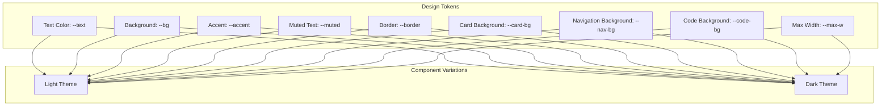
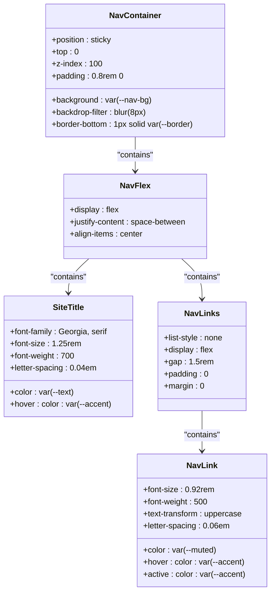
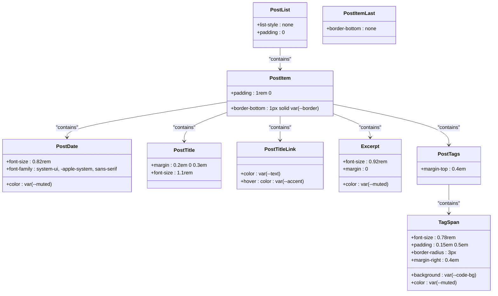
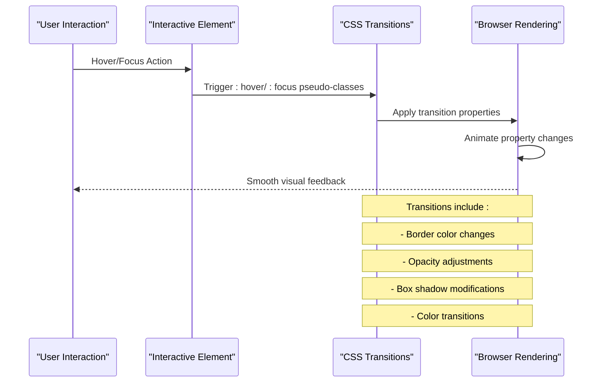
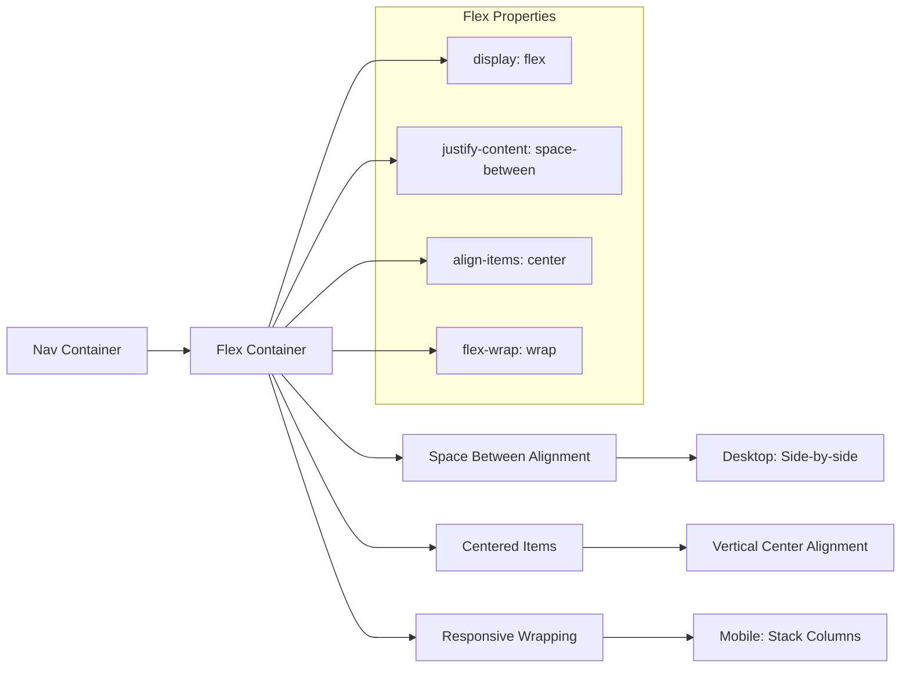
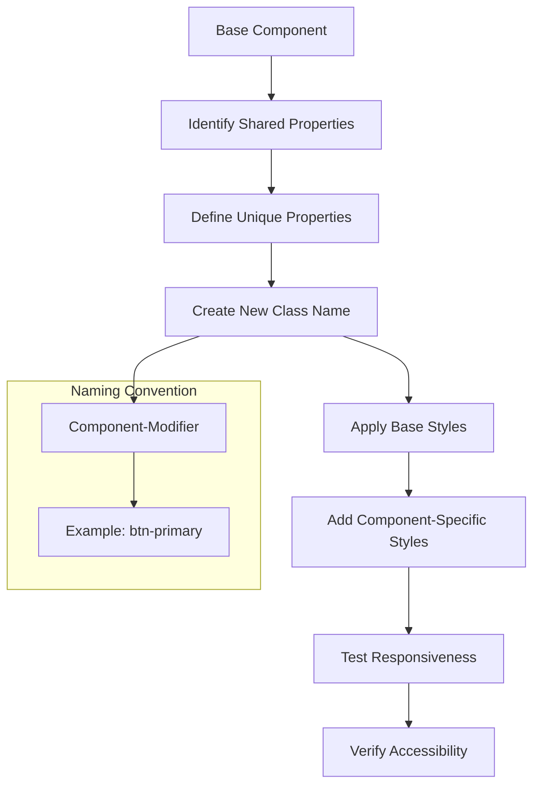
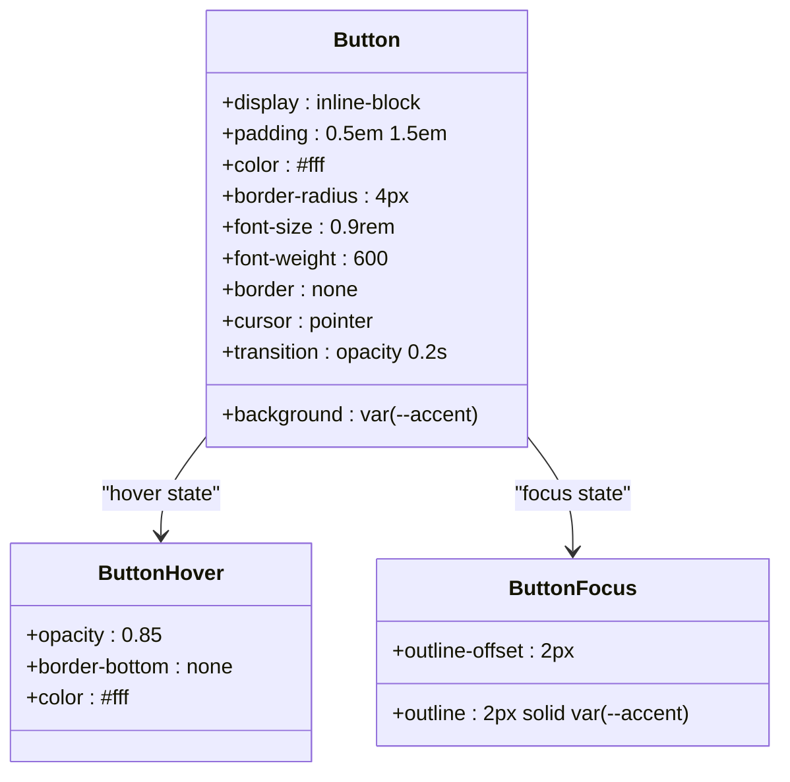
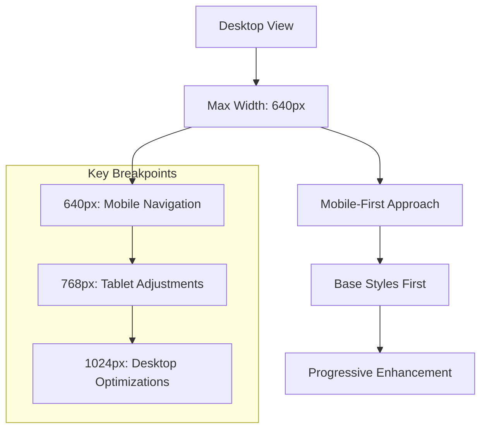

# Component Styling Guide

<cite>
**Referenced Files in This Document**
- [style.css](file://site/css/style.css)
- [base.html](file://templates/base.html)
- [index.html](file://templates/index.html)
- [blog.html](file://templates/blog.html)
- [post.html](file://templates/post.html)
- [links.html](file://templates/links.html)
- [about.html](file://templates/about.html)
- [build.py](file://build.py)
- [about.md](file://content/about.md)
- [welcome-to-seisamuse.md](file://content/posts/welcome-to-seisamuse.md)
</cite>

## Table of Contents
1. [Introduction](#introduction)
2. [Design System Overview](#design-system-overview)
3. [Container System](#container-system)
4. [Navigation Components](#navigation-components)
5. [Hero Section](#hero-section)
6. [Blog Post Components](#blog-post-components)
7. [Link Card System](#link-card-system)
8. [Interactive States and Transitions](#interactive-states-and-transitions)
9. [Layout Patterns](#layout-patterns)
10. [Component Customization Guide](#component-customization-guide)
11. [Form Elements and Buttons](#form-elements-and-buttons)
12. [Content Areas](#content-content-areas)
13. [Responsive Design](#responsive-design)
14. [Dark Mode Implementation](#dark-mode-implementation)
15. [Best Practices](#best-practices)

## Introduction

Seisamuse is a minimalist academic personal website designed for seismologists and geophysicists. The styling system follows a clean, typography-driven approach with a focus on readability and scientific presentation. This guide documents the complete component styling architecture, covering navigation, content sections, interactive states, and responsive behavior.

The design system centers around a carefully chosen color palette with warm earth tones, clean typography, and subtle animations that enhance user experience without overwhelming the academic content.

## Design System Overview

The styling foundation is built on CSS custom properties (variables) that enable consistent theming and easy customization:



**Diagram sources**
- [style.css:13-23](file://site/css/style.css#L13-L23)
- [style.css:465-476](file://site/css/style.css#L465-L476)

**Section sources**
- [style.css:13-23](file://site/css/style.css#L13-L23)
- [style.css:465-476](file://site/css/style.css#L465-L476)

## Container System

The `.container` class provides the primary layout constraint for the entire website, establishing consistent spacing and maximum content width:

```mermaid
flowchart TD
A[Container Element] --> B[Max Width: var(--max-w)]
A --> C[Horizontal Padding: 1.5rem]
A --> D[Centered Layout: margin: 0 auto]
A --> E[Full Width: 100%]
B --> F[Default: 720px]
F --> G[Responsive Adjustments]
```

**Diagram sources**
- [style.css:129-134](file://site/css/style.css#L129-L134)

The container system ensures optimal readability by limiting content width while maintaining flexibility across different screen sizes. It serves as the foundation for all major layout components.

**Section sources**
- [style.css:129-134](file://site/css/style.css#L129-L134)
- [base.html:28-31](file://templates/base.html#L28-L31)

## Navigation Components

The navigation system consists of two primary components: the site title and the navigation links, both integrated within a sticky navigation bar.

### Navigation Bar Structure



**Diagram sources**
- [style.css:142-198](file://site/css/style.css#L142-L198)
- [base.html:14-25](file://templates/base.html#L14-L25)

### Mobile Navigation Toggle

The navigation includes a sophisticated mobile-responsive toggle system that transforms the horizontal navigation into a collapsible menu on smaller screens.

**Section sources**
- [style.css:142-198](file://site/css/style.css#L142-L198)
- [base.html:14-25](file://templates/base.html#L14-L25)

## Hero Section

The hero section serves as the primary content area on the homepage, featuring the author's avatar, professional title, affiliation, bio, and social links.

### Hero Layout Structure

```mermaid
graph TB
subgraph "Hero Container"
A[.hero]
A --> B[Avatar Image]
A --> C[Name Heading]
A --> D[Subtitle]
A --> E[Affiliation]
A --> F[Bio Paragraph]
A --> G[Social Links Grid]
end
subgraph "Avatar Styling"
B --> B1[Width: 120px]
B --> B2[Height: 120px]
B --> B3[Border Radius: 50%]
B --> B4[Object Fit: Cover]
B --> B5[Border: 3px solid var(--border)]
end
subgraph "Typography"
C --> C1[Font Size: 2rem]
C --> C2[Margin Top: 0.3em]
C --> C3[Margin Bottom: 0.2em]
D --> D1[Color: var(--muted)]
D --> D2[Font Size: 1rem]
E --> E1[Color: var(--muted)]
E --> E2[Font Size: 0.9rem]
F --> F1[Font Size: 1rem]
F --> F2[Max Width: 540px]
F --> F3[Font Style: Italic]
F --> F4[Color: var(--muted)]
end
subgraph "Social Links"
G --> G1[Display: Flex]
G --> G2[Justify Content: Center]
G --> G3[Gap: 1rem]
G --> G4[Wrap: Flex Wrap]
G --> H[Individual Links]
H --> H1[Font Size: 0.88rem]
H --> H2[Paddings: 0.35em 0.8em]
H --> H3[Border: 1px solid var(--border)]
H --> H4[Border Radius: 4px]
H --> H5[Hover Effects: Border Color + Color Change]
end
```

**Diagram sources**
- [style.css:201-261](file://site/css/style.css#L201-L261)
- [index.html:6-18](file://templates/index.html#L6-L18)

### Hero Content Integration

The hero section integrates seamlessly with the Jinja2 templating system, pulling content from the content directory and rendering it with appropriate semantic markup.

**Section sources**
- [style.css:201-261](file://site/css/style.css#L201-L261)
- [index.html:6-18](file://templates/index.html#L6-L18)

## Blog Post Components

The blog system utilizes a card-based layout for displaying posts, with individual items containing metadata, titles, excerpts, and tags.

### Post List Structure



**Diagram sources**
- [style.css:282-330](file://site/css/style.css#L282-L330)
- [blog.html:8-21](file://templates/blog.html#L8-L21)

### Individual Post Styling

Single post pages utilize a more extensive content area with dedicated header, meta information, and navigation elements.

**Section sources**
- [style.css:282-330](file://site/css/style.css#L282-L330)
- [blog.html:8-21](file://templates/blog.html#L8-L21)
- [post.html:6-28](file://templates/post.html#L6-L28)

## Link Card System

The link card system provides a flexible grid layout for displaying external resources and projects, utilizing CSS Grid for responsive behavior.

### Link Card Architecture

```mermaid
graph TB
subgraph "Grid Container"
A[.link-grid]
A --> B[Display: Grid]
A --> C[Template Columns: repeat(auto-fill, minmax(280px, 1fr))]
A --> D[Gap: 1.2rem]
A --> E[Margin Top: 1rem]
end
subgraph "Card Styling"
F[.link-card]
F --> G[Background: var(--card-bg)]
F --> H[Border: 1px solid var(--border)]
F --> I[Border Radius: 6px]
F --> J[Padding: 1.2rem 1.4rem]
F --> K[Transition: border-color 0.2s, box-shadow 0.2s]
F --> L[Hover State]
L --> M[Border Color: var(--accent)]
L --> N[Box Shadow: 0 2px 8px rgba(0,0,0,0.06)]
end
subgraph "Card Content"
O[Card Heading]
O --> P[Font Size: 1.05rem]
O --> Q[Margin: 0 0 0.4em]
R[Card Description]
R --> S[Font Size: 0.88rem]
R --> T[Color: var(--muted)]
R --> U[Margin: 0]
V[Card Link]
V --> W[Color: var(--text)]
V --> X[Display: Block]
V --> Y[Hover: No Underline]
end
```

**Diagram sources**
- [style.css:362-399](file://site/css/style.css#L362-L399)
- [links.html:10-41](file://templates/links.html#L10-L41)

### Grid Responsiveness

The link grid automatically adjusts column count based on available space, ensuring optimal viewing on all device sizes.

**Section sources**
- [style.css:362-399](file://site/css/style.css#L362-L399)
- [links.html:10-41](file://templates/links.html#L10-L41)

## Interactive States and Transitions

The styling system implements consistent hover and active states across all interactive elements, following established UX patterns for web interfaces.

### Transition Patterns



**Diagram sources**
- [style.css:56-64](file://site/css/style.css#L56-L64)
- [style.css:422-438](file://site/css/style.css#L422-L438)

### Hover State Implementation

The hover states follow a consistent pattern of color transitions and border modifications, with special handling for different element types:

- **Text Links**: Underline animation with accent color
- **Navigation Links**: Color change from muted to accent
- **Buttons**: Opacity reduction with color preservation
- **Cards**: Border accent with subtle shadow enhancement

**Section sources**
- [style.css:56-64](file://site/css/style.css#L56-L64)
- [style.css:178-188](file://site/css/style.css#L178-L188)
- [style.css:422-438](file://site/css/style.css#L422-L438)

## Layout Patterns

Seisamuse employs modern CSS layout techniques including Flexbox and CSS Grid to create responsive and maintainable designs.

### Flexbox Implementation

The navigation system demonstrates advanced Flexbox usage with alignment, wrapping, and responsive behavior:



**Diagram sources**
- [style.css:152-156](file://site/css/style.css#L152-L156)
- [style.css:485-487](file://site/css/style.css#L485-L487)

### CSS Grid Usage

The link card system showcases CSS Grid capabilities for creating responsive masonry layouts:

**Section sources**
- [style.css:152-156](file://site/css/style.css#L152-L156)
- [style.css:362-367](file://site/css/style.css#L362-L367)

## Component Customization Guide

The modular styling architecture allows for easy customization while maintaining design consistency through shared design tokens and patterns.

### Customizing Existing Components

To customize existing components, follow these approaches:

1. **Variable Overrides**: Modify CSS custom properties in the `:root` selector
2. **Component-Specific Styles**: Add targeted styles beneath existing component selectors
3. **New Variants**: Create additional classes that extend base component styles

### Creating New Component Variations



### Maintaining Design Consistency

- Use established color tokens consistently
- Follow existing typography scales
- Maintain consistent spacing patterns
- Preserve transition timing and easing
- Ensure adequate contrast ratios for accessibility

**Section sources**
- [style.css:13-23](file://site/css/style.css#L13-L23)

## Form Elements and Buttons

The button system provides a consistent interaction pattern across the website, with hover states and accessibility considerations.

### Button Component Architecture



**Diagram sources**
- [style.css:422-438](file://site/css/style.css#L422-L438)

### Form Integration

While the current implementation focuses on buttons, the styling patterns can be extended to form elements following the same design principles.

**Section sources**
- [style.css:422-438](file://site/css/style.css#L422-L438)

## Content Areas

The content styling system emphasizes readability and academic presentation through careful typography and spacing choices.

### Typography Hierarchy

```mermaid
graph TB
subgraph "Headings"
A[h1: 1.8rem, 1.6em top, 0.6em bottom]
B[h2: 1.4rem, 1.6em top, 0.6em bottom]
C[h3: 1.15rem, 1.6em top, 0.6em bottom]
D[h4: 1rem, 1.6em top, 0.6em bottom]
end
subgraph "Body Text"
E[p: 1em bottom margin]
F[line-height: 1.75]
G[font-family: Georgia, serif]
end
subgraph "Code Elements"
H[code: 0.88em font-size]
I[monospace font-family]
J[background: var(--code-bg)]
K[padding: 0.15em 0.4em]
L[border-radius: 3px]
end
subgraph "Blockquotes"
M[border-left: 3px solid var(--accent)]
N[padding: 0.5em 1em]
O[color: var(--muted)]
P[font-style: italic]
end
```

**Diagram sources**
- [style.css:41-52](file://site/css/style.css#L41-L52)
- [style.css:75-94](file://site/css/style.css#L75-L94)
- [style.css:66-73](file://site/css/style.css#L66-L73)

### Content Spacing and Readability

The content areas utilize generous spacing to enhance readability, particularly important for academic and technical content.

**Section sources**
- [style.css:41-52](file://site/css/style.css#L41-L52)
- [style.css:75-94](file://site/css/style.css#L75-L94)
- [style.css:66-73](file://site/css/style.css#L66-L73)

## Responsive Design

Seisamuse implements a comprehensive responsive design strategy that adapts the interface for various screen sizes and devices.

### Breakpoint Strategy



**Diagram sources**
- [style.css:479-512](file://site/css/style.css#L479-L512)

### Mobile Navigation Transformation

The navigation system undergoes a complete transformation on mobile devices, switching from a horizontal layout to a collapsible menu system.

**Section sources**
- [style.css:479-512](file://site/css/style.css#L479-L512)
- [base.html:17](file://templates/base.html#L17)

## Dark Mode Implementation

The website includes a sophisticated dark mode implementation that automatically adapts the color scheme based on user preferences.

### Dark Mode Architecture

```mermaid
graph TB
subgraph "System Detection"
A[@media (prefers-color-scheme: dark)]
A --> B[Automatic Theme Switching]
end
subgraph "Color Variable Updates"
C[--text: #e0e0e0]
D[--bg: #1a1a2e]
E[--accent: #e8a87c]
F[--muted: #9ca3af]
G[--border: #374151]
H[--card-bg: #22223b]
I[--nav-bg: #1a1a2ecc]
J[--code-bg: #2a2a3e]
end
subgraph "Visual Impact"
K[Enhanced Contrast]
L[Different Accent Palette]
M[Reduced Brightness]
end
A --> C
A --> D
A --> E
A --> F
A --> G
A --> H
A --> I
A --> J
C --> K
D --> K
E --> L
F --> K
G --> K
H --> K
I --> K
J --> K
```

**Diagram sources**
- [style.css:465-476](file://site/css/style.css#L465-L476)

### Dark Mode Benefits

The dark mode implementation provides enhanced visual comfort in low-light environments while maintaining excellent readability and contrast ratios essential for academic content consumption.

**Section sources**
- [style.css:465-476](file://site/css/style.css#L465-L476)

## Best Practices

### Styling Guidelines

1. **Consistent Spacing**: Maintain uniform margins and padding using established patterns
2. **Color Accessibility**: Ensure sufficient contrast ratios for text and interactive elements
3. **Typography Hierarchy**: Follow the established heading scale for content organization
4. **Responsive Testing**: Verify all components across target viewport sizes
5. **Performance Considerations**: Minimize CSS complexity and leverage CSS custom properties

### Extension Strategies

When extending the styling system:

- Reference existing component patterns and naming conventions
- Utilize CSS custom properties for theme consistency
- Implement progressive enhancement for improved user experience
- Test across different browsers and devices
- Document customizations for future maintenance

### Maintenance Recommendations

- Regularly audit color contrast ratios
- Monitor performance impact of new styles
- Keep CSS organized and documented
- Test responsive behavior across device categories
- Validate accessibility compliance