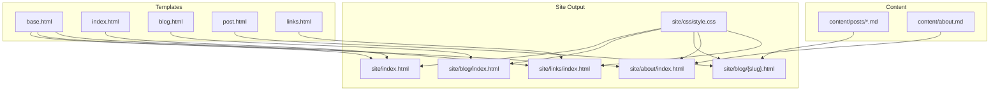
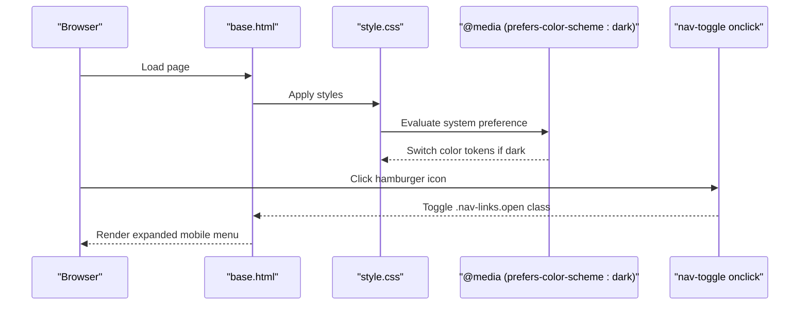
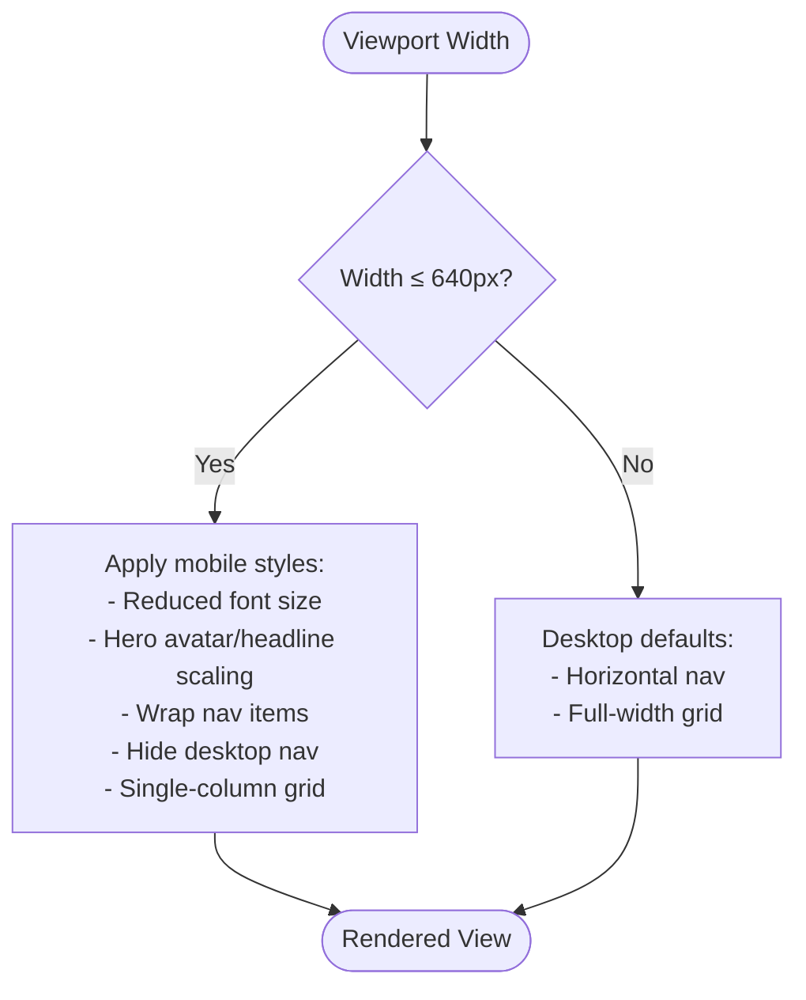
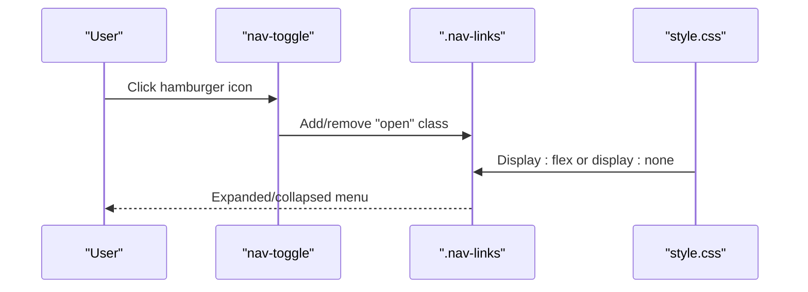
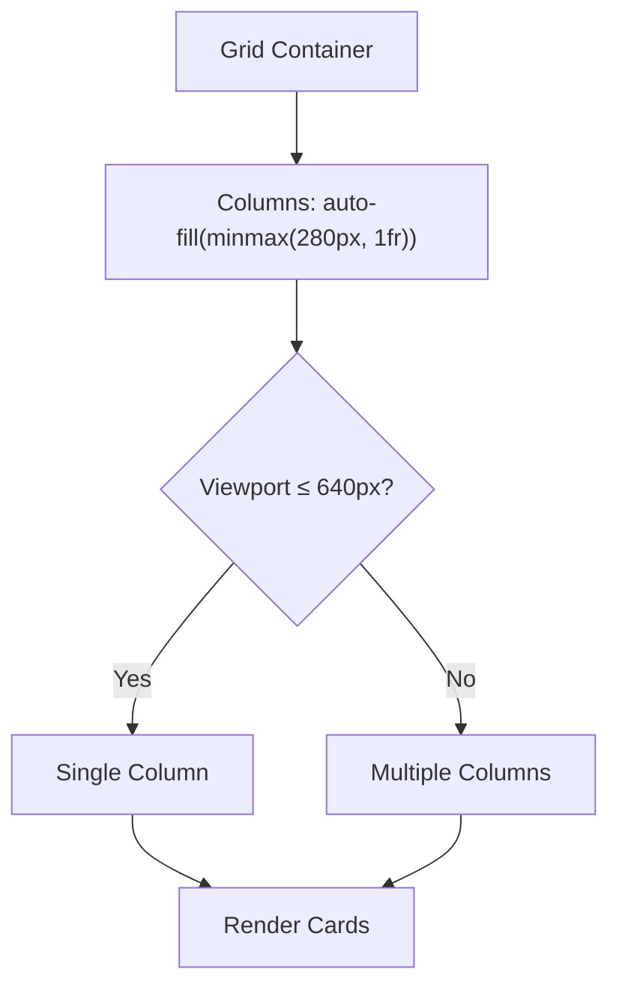
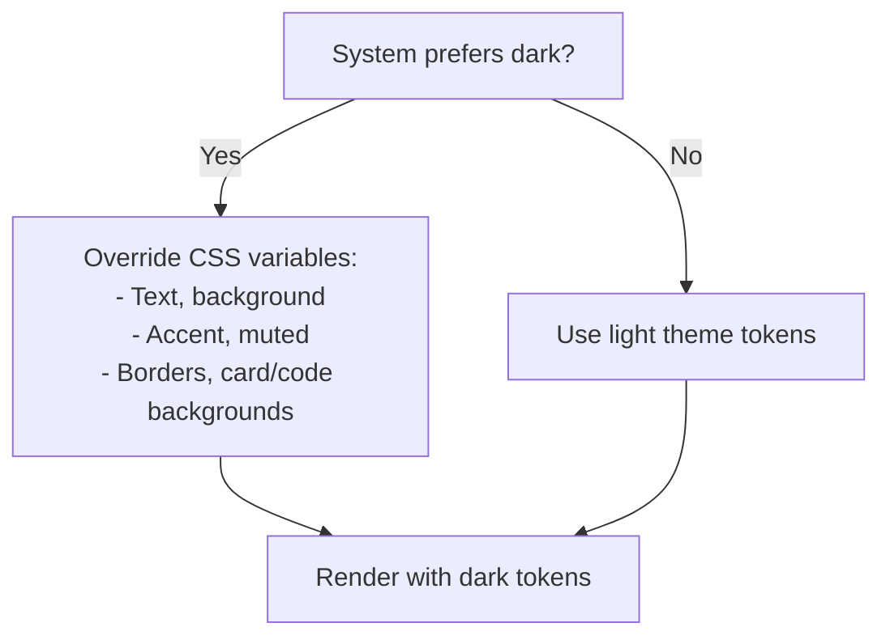
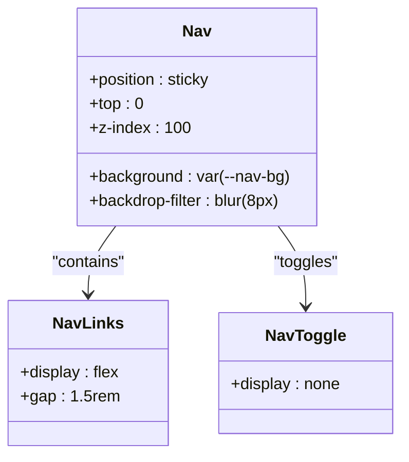
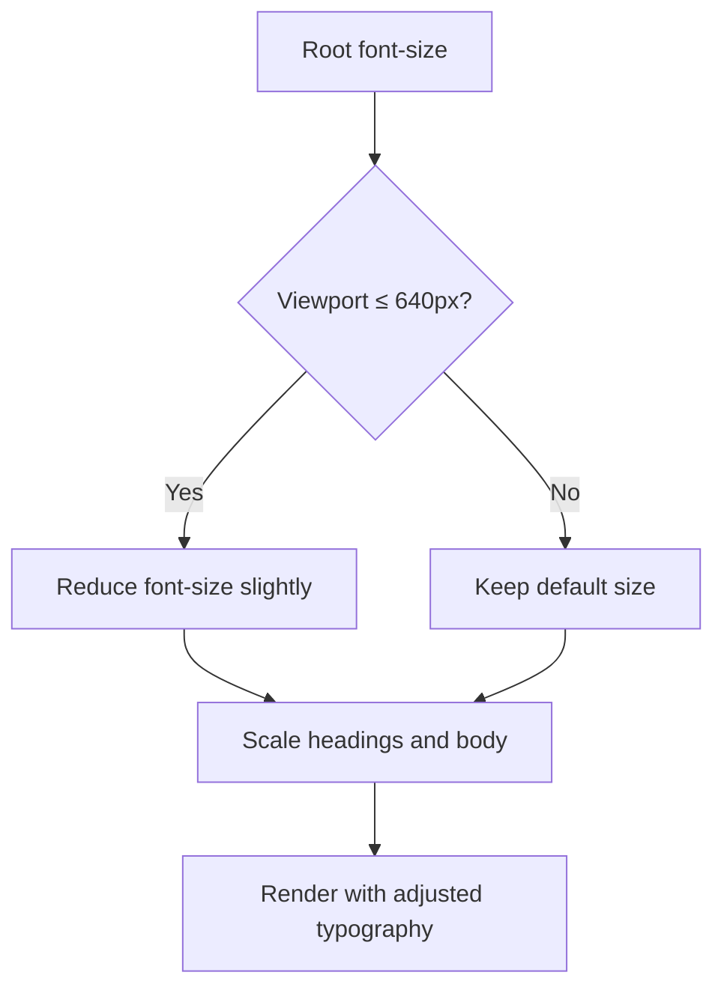
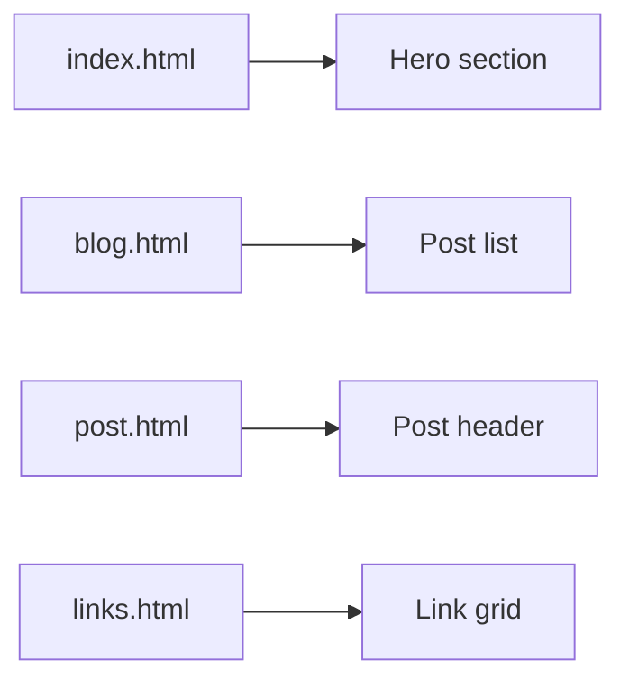
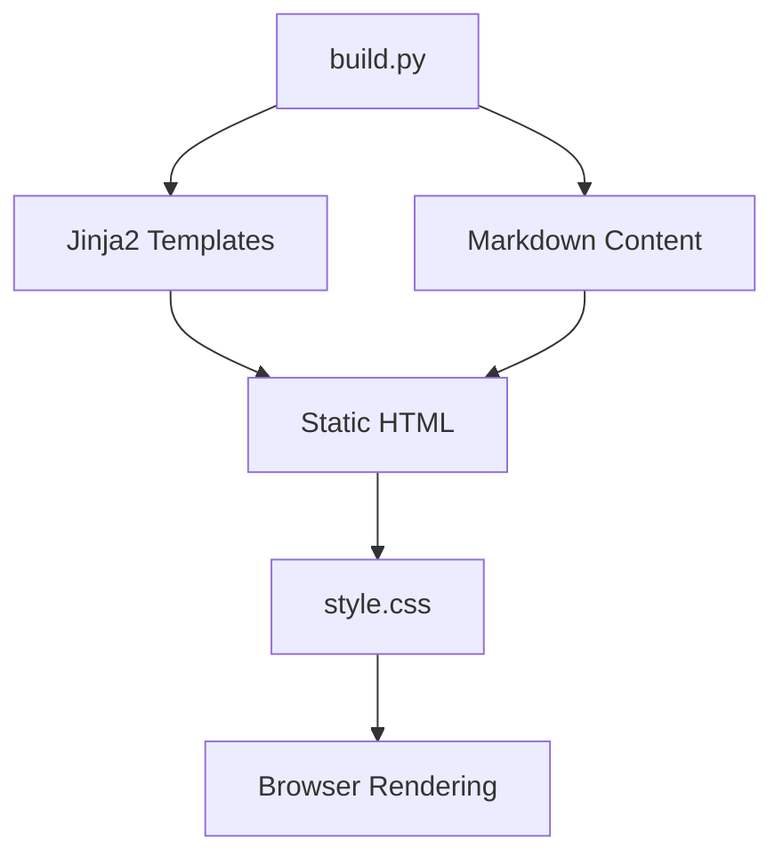

# Responsive Design and Dark Mode

<cite>
**Referenced Files in This Document**
- [style.css](file://site/css/style.css)
- [base.html](file://templates/base.html)
- [index.html](file://templates/index.html)
- [blog.html](file://templates/blog.html)
- [post.html](file://templates/post.html)
- [links.html](file://templates/links.html)
- [build.py](file://build.py)
</cite>

## Table of Contents
1. [Introduction](#introduction)
2. [Project Structure](#project-structure)
3. [Core Components](#core-components)
4. [Architecture Overview](#architecture-overview)
5. [Detailed Component Analysis](#detailed-component-analysis)
6. [Dependency Analysis](#dependency-analysis)
7. [Performance Considerations](#performance-considerations)
8. [Troubleshooting Guide](#troubleshooting-guide)
9. [Conclusion](#conclusion)
10. [Appendices](#appendices)

## Introduction
This document explains Seisamuse’s responsive design and dark mode implementation. The site follows a mobile-first approach with a breakpoint at 640 pixels, ensuring optimal readability and usability across devices. Navigation adapts via a collapsible hamburger menu on small screens, while larger screens display a horizontal navigation bar. Dark mode is automatically enabled when the user’s system prefers dark appearance, switching color variables to reduce eye strain and improve battery life on OLED displays. Additional responsive features include a flexible grid layout for cards, sticky navigation with backdrop blur, and scalable typography.

## Project Structure
The site is a static site generated from Markdown content and Jinja2 templates. Styles are centralized in a single stylesheet, and the base template defines the navigation and layout structure used across pages.

**Diagram sources**
- [base.html](file://templates/base.html)
- [index.html](file://templates/index.html)
- [blog.html](file://templates/blog.html)
- [post.html](file://templates/post.html)
- [links.html](file://templates/links.html)
- [style.css](file://site/css/style.css)
- [build.py](file://build.py)

**Section sources**
- [base.html](file://templates/base.html)
- [style.css](file://site/css/style.css)
- [build.py](file://build.py)

## Core Components
- Global color tokens and typography scale defined in the stylesheet root, enabling easy theme customization.
- Sticky navigation with backdrop blur and a mobile hamburger menu toggled via JavaScript in the base template.
- Responsive breakpoint at 640 pixels that adjusts font sizes, hero visuals, navigation layout, and card grid.
- Automatic dark mode using a media query that switches color tokens when the system prefers dark appearance.
- Flexible grid layout for link cards using CSS Grid with automatic column sizing.

**Section sources**
- [style.css](file://site/css/style.css)
- [base.html](file://templates/base.html)

## Architecture Overview
The responsive design and dark mode are implemented purely with CSS and minimal client-side JavaScript. The build process compiles templates and content into static HTML, embedding the stylesheet for runtime responsiveness.

**Diagram sources**
- [base.html](file://templates/base.html)
- [style.css](file://site/css/style.css)

## Detailed Component Analysis

### Responsive Breakpoint at 640px
- The breakpoint targets a common mobile threshold, optimizing spacing and readability for smaller screens.
- Adjustments include reducing the root font size, resizing hero avatar and headline, wrapping navigation items, hiding desktop navigation, and switching the link grid to a single column.

**Diagram sources**
- [style.css](file://site/css/style.css)

**Section sources**
- [style.css](file://site/css/style.css)

### Navigation System and Hamburger Menu
- The navigation is sticky and uses a translucent background with backdrop blur for depth and readability.
- On small screens, the desktop navigation list is hidden and replaced by a button that toggles visibility via a class on the navigation links container.
- The base template includes the toggle button and links, while the stylesheet controls layout and visibility.

**Diagram sources**
- [base.html](file://templates/base.html)
- [style.css](file://site/css/style.css)

**Section sources**
- [base.html](file://templates/base.html)
- [style.css](file://site/css/style.css)

### Responsive Grid Layouts
- The link grid uses CSS Grid with an automatic column sizing policy that creates responsive cards without fixed breakpoints.
- At the 640px breakpoint, the grid switches to a single column to improve readability on small screens.

**Diagram sources**
- [style.css](file://site/css/style.css)
- [links.html](file://templates/links.html)

**Section sources**
- [style.css](file://site/css/style.css)
- [links.html](file://templates/links.html)

### Dark Mode Implementation
- Dark mode is activated automatically when the user’s system prefers dark appearance using a media query.
- The media query overrides global color tokens to lighter text on darker backgrounds, adjusting accent colors and subtle borders for contrast and comfort.

**Diagram sources**
- [style.css](file://site/css/style.css)

**Section sources**
- [style.css](file://site/css/style.css)

### Backdrop Filter and Sticky Positioning
- The navigation uses a semi-transparent background with a backdrop blur effect to visually integrate with page content while maintaining readability.
- Sticky positioning ensures the navigation remains at the top during scrolling, improving navigation continuity.

**Diagram sources**
- [style.css](file://site/css/style.css)
- [base.html](file://templates/base.html)

**Section sources**
- [style.css](file://site/css/style.css)
- [base.html](file://templates/base.html)

### Responsive Typography Scaling
- Root font size scales down on small screens to improve legibility and reduce zooming on mobile devices.
- Headlines and body copy adjust proportionally to maintain visual hierarchy across breakpoints.

**Diagram sources**
- [style.css](file://site/css/style.css)

**Section sources**
- [style.css](file://site/css/style.css)

### Page-Specific Layouts
- Home page includes a hero section with avatar, headline, subtitle, affiliation, bio, and social links, all responsive to screen size.
- Blog and post pages use lists and cards styled with consistent spacing and typography.
- Links page showcases a responsive grid of project cards.

**Diagram sources**
- [index.html](file://templates/index.html)
- [blog.html](file://templates/blog.html)
- [post.html](file://templates/post.html)
- [links.html](file://templates/links.html)

**Section sources**
- [index.html](file://templates/index.html)
- [blog.html](file://templates/blog.html)
- [post.html](file://templates/post.html)
- [links.html](file://templates/links.html)

## Dependency Analysis
- The base template depends on the stylesheet for responsive behavior and dark mode.
- The build script compiles templates and content into static HTML, embedding the stylesheet and ensuring consistent rendering across pages.

**Diagram sources**
- [build.py](file://build.py)
- [style.css](file://site/css/style.css)

**Section sources**
- [build.py](file://build.py)
- [style.css](file://site/css/style.css)

## Performance Considerations
- CSS variables enable efficient theme switching without recalculating styles.
- Backdrop filter enhances visual depth with minimal performance cost on modern browsers.
- Sticky navigation reduces repeated layout thrashing by keeping the element in the visual viewport.
- Grid-based layouts minimize JavaScript dependencies and rely on native browser capabilities.

[No sources needed since this section provides general guidance]

## Troubleshooting Guide
- If the mobile menu does not appear:
  - Verify the hamburger button exists and toggles the “open” class on the navigation links container.
  - Confirm the stylesheet applies the mobile breakpoint and that the toggle button is visible below the breakpoint.
- If dark mode does not activate:
  - Ensure the media query for dark preferences is present and not overridden by higher specificity rules.
  - Test with the system preference set to dark and confirm the color tokens switch accordingly.
- If navigation overlaps content:
  - Check the sticky positioning and z-index values to ensure the navigation stays above other content.
- If grid layout appears broken:
  - Confirm the grid container uses the correct class and that the breakpoint rules apply at 640px.

**Section sources**
- [base.html](file://templates/base.html)
- [style.css](file://site/css/style.css)

## Conclusion
Seisamuse’s responsive design centers on a mobile-first approach with a 640px breakpoint, a flexible navigation system with a hamburger menu, and a robust grid layout. Dark mode is seamlessly integrated via a media query that switches color tokens based on user preference. Together, these features deliver a readable, accessible, and visually consistent experience across devices.

[No sources needed since this section summarizes without analyzing specific files]

## Appendices

### Practical Testing Examples
- Resize the browser window to 640px or less to verify:
  - Reduced font size and scaled hero elements
  - Hidden desktop navigation and visible hamburger menu
  - Collapsed navigation menu when toggled
  - Single-column link grid
- Change the system appearance to dark and confirm:
  - Color tokens switch to dark variants
  - Navigation retains readability with backdrop blur
- Use the local preview server to test:
  - Run the build script with the serve option to preview changes locally.

**Section sources**
- [build.py](file://build.py)
- [style.css](file://site/css/style.css)
- [base.html](file://templates/base.html)

### Customizing Breakpoints
- To adjust the breakpoint:
  - Modify the media query condition in the stylesheet to a different pixel value.
  - Update related adjustments (font sizes, grid columns, navigation layout) consistently around the new breakpoint.
- To customize the mobile menu behavior:
  - Adjust the toggle button’s visibility and the navigation links’ display property in the stylesheet.
  - Ensure the base template’s toggle logic remains functional.

**Section sources**
- [style.css](file://site/css/style.css)
- [base.html](file://templates/base.html)