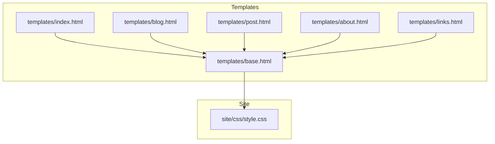
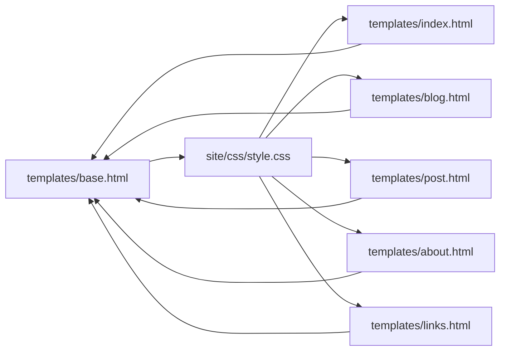

# Styling and Theming

<cite>
**Referenced Files in This Document**
- [style.css](file://site/css/style.css)
- [base.html](file://templates/base.html)
- [index.html](file://templates/index.html)
- [blog.html](file://templates/blog.html)
- [post.html](file://templates/post.html)
- [about.html](file://templates/about.html)
- [links.html](file://templates/links.html)
- [build.py](file://build.py)
- [requirements.txt](file://requirements.txt)
</cite>

## Table of Contents
1. [Introduction](#introduction)
2. [Project Structure](#project-structure)
3. [Core Components](#core-components)
4. [Architecture Overview](#architecture-overview)
5. [Detailed Component Analysis](#detailed-component-analysis)
6. [Dependency Analysis](#dependency-analysis)
7. [Performance Considerations](#performance-considerations)
8. [Troubleshooting Guide](#troubleshooting-guide)
9. [Conclusion](#conclusion)
10. [Appendices](#appendices)

## Introduction
This document explains Seisamuse’s CSS architecture and theming system with a focus on academic design principles, typography, and customization. It covers the CSS custom properties model, responsive design (mobile-first), dark mode support, class naming conventions, and best practices for building accessible, performant themes. Practical examples show how to adjust colors, spacing, typography, and layout elements safely.

## Project Structure
Seisamuse is a static site generator that renders Jinja2 templates and serves a single CSS file. Styling is centralized in a single stylesheet and consumed by all pages via the base template.



**Diagram sources**
- [base.html](file://templates/base.html)
- [index.html](file://templates/index.html)
- [blog.html](file://templates/blog.html)
- [post.html](file://templates/post.html)
- [about.html](file://templates/about.html)
- [links.html](file://templates/links.html)
- [style.css](file://site/css/style.css)

**Section sources**
- [base.html](file://templates/base.html)
- [style.css](file://site/css/style.css)

## Core Components
- CSS custom properties system: Centralized color and layout tokens defined in the root scope and consumed throughout selectors.
- Typography: Serif-based headings and body fonts aligned with academic readability; consistent heading scale and line heights.
- Layout primitives: Container, main, and sticky navigation with a constrained max-width.
- Components: Hero, section headers, post cards, link cards, buttons, and footer.
- Responsive behavior: Mobile-first breakpoints and navigation toggling.
- Dark mode: Automatic light/dark palette switching via media query.

**Section sources**
- [style.css](file://site/css/style.css)

## Architecture Overview
The site’s styling pipeline is minimal and predictable:
- The base template imports the stylesheet globally.
- Templates apply semantic class names to structure content.
- CSS uses custom properties for theme tokens and media queries for responsiveness.

```mermaid
sequenceDiagram
participant Browser as "Browser"
participant Base as "base.html"
participant CSS as "style.css"
participant Index as "index.html"
participant Blog as "blog.html"
participant Post as "post.html"
participant About as "about.html"
participant Links as "links.html"
Browser->>Base : Request /
Base-->>Browser : HTML with <link rel="stylesheet" href="...">
Browser->>CSS : Fetch style.css
CSS-->>Browser : Apply custom properties and styles
Browser->>Index : Render homepage
Browser->>Blog : Render blog listing
Browser->>Post : Render single post
Browser->>About : Render about page
Browser->>Links : Render links page
```

**Diagram sources**
- [base.html](file://templates/base.html)
- [style.css](file://site/css/style.css)
- [index.html](file://templates/index.html)
- [blog.html](file://templates/blog.html)
- [post.html](file://templates/post.html)
- [about.html](file://templates/about.html)
- [links.html](file://templates/links.html)

## Detailed Component Analysis

### CSS Custom Properties System
Seisamuse defines a compact set of theme tokens in the root scope. These tokens unify color, spacing, and layout across components.

Key tokens:
- Text and backgrounds: text, bg
- Accent and muted tones: accent, muted
- Borders and surfaces: border, card-bg, nav-bg, code-bg
- Layout: max-w

Usage patterns:
- Tokens are referenced via var() in selectors to keep styles DRY and themeable.
- Tokens are updated inside a prefers-color-scheme media query to switch palettes automatically.

Practical customization tips:
- Change accent color by updating the accent token to match your brand.
- Adjust contrast by tweaking text and muted tokens.
- Modify spacing by editing tokens like max-w and padding/gap values in components.

**Section sources**
- [style.css](file://site/css/style.css)

### Typography and Academic Design Principles
Typography choices reflect academic readability:
- Headings use serif fonts with bold weights and tight line heights for emphasis.
- Body text uses a serif stack for readability and a generous line height.
- Monospace fonts are reserved for code blocks and preformatted content.

Design principles:
- High contrast between text and background for readability.
- Consistent heading scale to establish a clear visual hierarchy.
- Subtle borders and muted accents to de-emphasize non-critical elements.

Customization examples:
- Swap the serif stack for a modern academic font family by updating the body font stack.
- Adjust heading sizes and line heights by editing the heading rules and line-height on the body.

**Section sources**
- [style.css](file://site/css/style.css)

### Layout and Grid Components
Layout primitives:
- Container constrains content width using the max-w token.
- Sticky navigation provides persistent access with a subtle backdrop blur.
- Flexbox-based main area ensures content grows to fill available space.

Grid-based components:
- Link cards use CSS Grid with automatic column sizing and gaps.
- On small screens, the grid collapses to a single column.

Responsive adjustments:
- A single breakpoint at 640px adapts typography, navigation, and grid layout.

**Section sources**
- [style.css](file://site/css/style.css)

### Dark Mode Support
Dark mode is implemented via a media query that redefines tokens for a darker palette. This approach:
- Requires no JavaScript.
- Respects user preference.
- Keeps all color logic in CSS.

Customization tips:
- Adjust the dark-mode tokens to fine-tune contrast or saturation.
- Add additional tokens (e.g., shadows or gradients) inside the media query for richer dark variants.

**Section sources**
- [style.css](file://site/css/style.css)

### Class Naming Conventions and Best Practices
Naming conventions observed:
- Atomic/modular classes (e.g., container, hero, section-header, post-list, link-grid).
- Descriptive component names (e.g., nav-links, link-card).
- Utility-like modifiers (e.g., active on nav links).

Best practices:
- Prefer reusable component classes over ad-hoc inline styles.
- Keep selectors shallow to minimize specificity conflicts.
- Use tokens consistently to preserve theme coherence.

**Section sources**
- [style.css](file://site/css/style.css)
- [index.html](file://templates/index.html)
- [blog.html](file://templates/blog.html)
- [links.html](file://templates/links.html)

### Responsive Design and Mobile-First Approach
Mobile-first strategy:
- Base styles assume small screens.
- Media queries add enhancements for larger viewports.
- Navigation toggles become visible below the breakpoint and reveal a stacked menu.

Breakpoint handling:
- A single breakpoint at 640px adjusts font sizes, avatar sizes, navigation stacking, and grid behavior.

Accessibility considerations:
- Ensure sufficient color contrast in both light and dark modes.
- Test keyboard navigation and focus indicators across breakpoints.

**Section sources**
- [style.css](file://site/css/style.css)

### Practical Customization Examples
Below are concrete, safe ways to customize the theme without breaking existing styles. Replace the indicated token values in the root scope and/or component rules.

- Change accent color
  - Update the accent token in the root scope.
  - Verify hover states and interactive elements adapt automatically.

- Adjust typography
  - Modify the body font stack and heading font stacks.
  - Tune line-height and heading sizes for your preferred rhythm.

- Modify layout width
  - Increase or decrease the max-w token to expand or compress content width.

- Customize spacing
  - Edit padding and gap values in containers, cards, and lists.
  - Adjust margins on headings and paragraphs for breathing room.

- Tailor dark mode palette
  - Update the dark-mode tokens to shift hues or contrast.
  - Confirm code blocks and borders remain readable.

- Enhance navigation
  - Adjust the sticky navigation background and blur effect.
  - Reorder or hide navigation items as needed.

- Improve link cards
  - Change hover effects and shadows for a bolder interaction.
  - Adjust grid column sizing and gaps for different screen densities.

**Section sources**
- [style.css](file://site/css/style.css)

## Dependency Analysis
The styling system depends on:
- The base template to import the stylesheet.
- Templates to apply class names consistently.
- The CSS custom properties model to propagate tokens across components.



**Diagram sources**
- [base.html](file://templates/base.html)
- [style.css](file://site/css/style.css)
- [index.html](file://templates/index.html)
- [blog.html](file://templates/blog.html)
- [post.html](file://templates/post.html)
- [about.html](file://templates/about.html)
- [links.html](file://templates/links.html)

**Section sources**
- [base.html](file://templates/base.html)
- [style.css](file://site/css/style.css)

## Performance Considerations
- Single stylesheet: Reduces HTTP requests and simplifies caching.
- Minimal selectors: Keeps render costs low.
- Efficient media queries: Only one breakpoint reduces complexity.
- Avoid heavy animations: Keep transitions subtle to prevent jank on older devices.
- Font loading: Serif stacks are widely available; consider preload hints if adding custom fonts.

[No sources needed since this section provides general guidance]

## Troubleshooting Guide
Common issues and resolutions:
- Colors not updating in dark mode
  - Ensure the prefers-color-scheme media query is intact and tokens are defined inside it.
  - Confirm the media query runs on your device/browser.

- Links or buttons not inheriting accent color
  - Verify var(--accent) is used in hover and active states.
  - Check for overriding inline styles or higher specificity selectors.

- Navigation not collapsing on small screens
  - Confirm the breakpoint media query applies and the toggle button toggles the open class on nav-links.

- Content overflowing or too wide
  - Adjust the max-w token and container padding to fit your content density.

- Accessibility concerns
  - Validate contrast ratios with tools.
  - Test keyboard navigation and focus visibility across breakpoints.

**Section sources**
- [style.css](file://site/css/style.css)
- [base.html](file://templates/base.html)

## Conclusion
Seisamuse’s styling system is intentionally minimal and highly customizable. By leveraging CSS custom properties, a mobile-first responsive approach, and a robust dark mode implementation, it offers a strong foundation for academic personal websites. Following the naming conventions and best practices outlined here ensures consistent, accessible, and performant themes.

[No sources needed since this section summarizes without analyzing specific files]

## Appendices

### Appendix A: How the Site Builds and Serves Styles
- The build script compiles templates and writes static HTML to the site directory.
- The base template includes the stylesheet via a relative link.
- No preprocessing or bundling steps are required; the stylesheet is served as-is.

**Section sources**
- [build.py](file://build.py)
- [base.html](file://templates/base.html)
- [requirements.txt](file://requirements.txt)