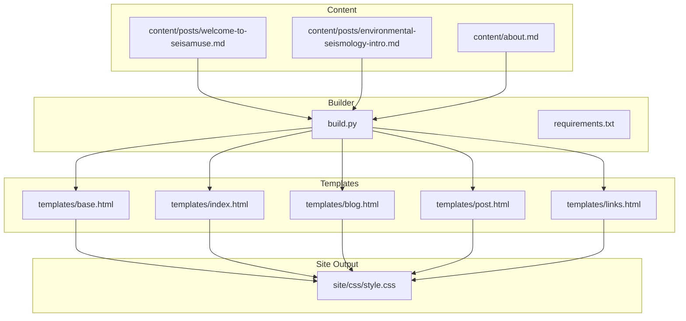
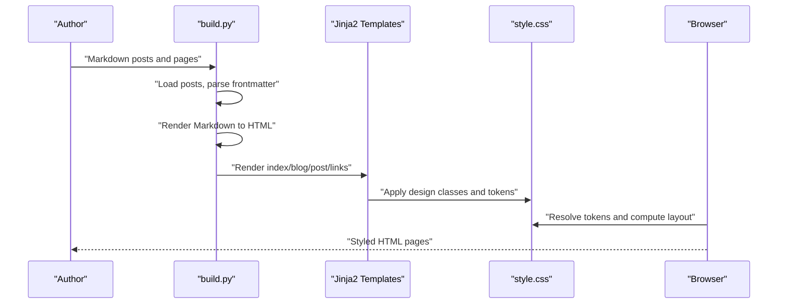
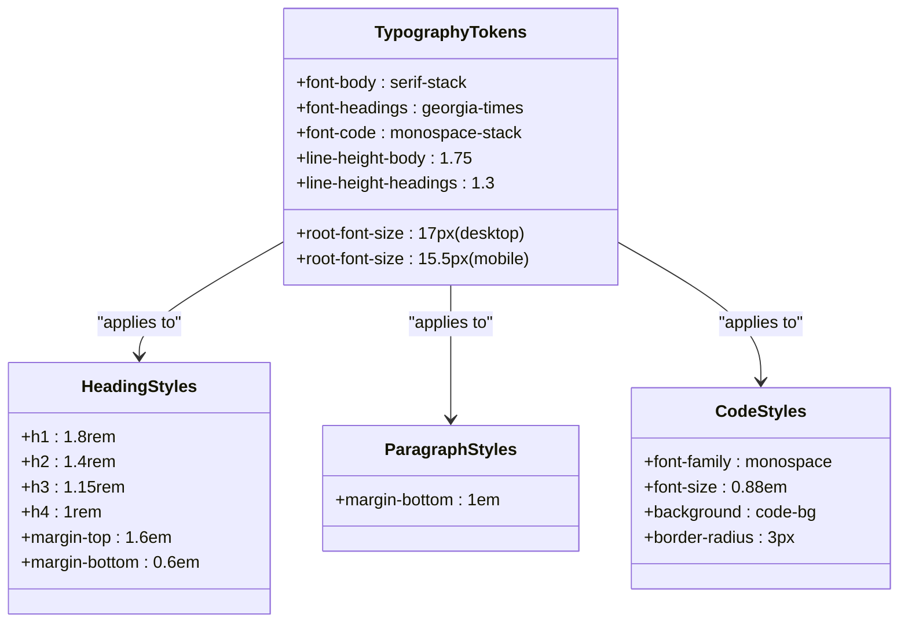
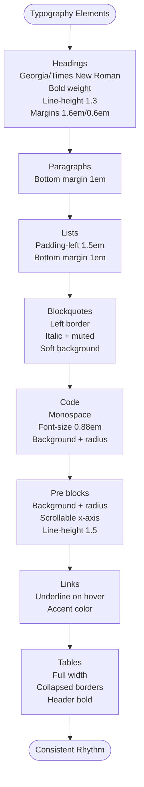
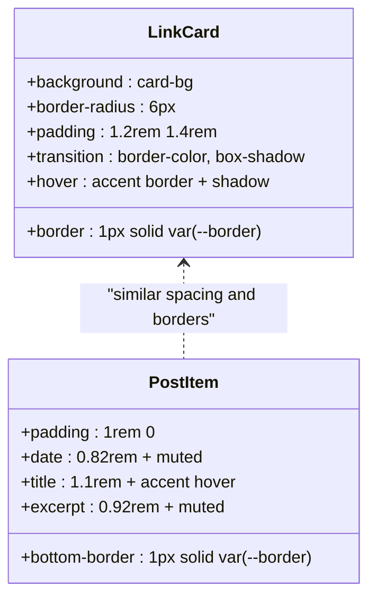
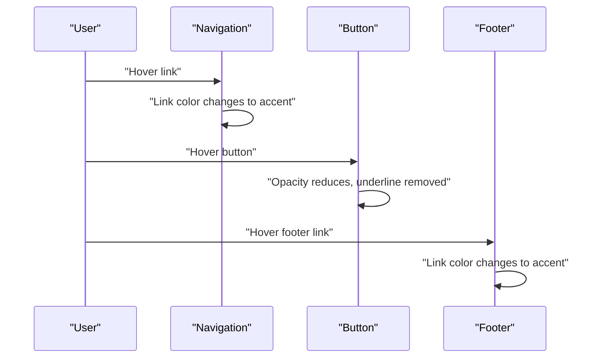
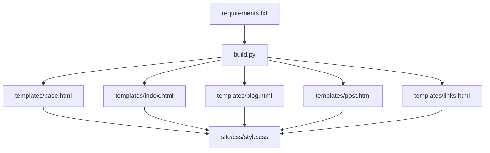

# Typography and Visual Design

<cite>
**Referenced Files in This Document**
- [style.css](file://site/css/style.css)
- [base.html](file://templates/base.html)
- [index.html](file://templates/index.html)
- [blog.html](file://templates/blog.html)
- [post.html](file://templates/post.html)
- [links.html](file://templates/links.html)
- [welcome-to-seisamuse.md](file://content/posts/welcome-to-seisamuse.md)
- [environmental-seismology-intro.md](file://content/posts/environmental-seismology-intro.md)
- [about.md](file://content/about.md)
- [build.py](file://build.py)
- [requirements.txt](file://requirements.txt)
</cite>

## Table of Contents
1. [Introduction](#introduction)
2. [Project Structure](#project-structure)
3. [Core Components](#core-components)
4. [Architecture Overview](#architecture-overview)
5. [Detailed Component Analysis](#detailed-component-analysis)
6. [Dependency Analysis](#dependency-analysis)
7. [Performance Considerations](#performance-considerations)
8. [Troubleshooting Guide](#troubleshooting-guide)
9. [Conclusion](#conclusion)

## Introduction
This document describes Seisamuse’s typography system and visual design with a focus on academic presentation standards. It explains the serif-based typographic hierarchy for headings and body text, monospace treatment for code, font sizing scales, line heights, and spacing ratios. It also documents the design system including accent colors, muted tones, borders, backgrounds, card-based layouts, navigation styling, and interactive elements. Practical examples demonstrate how typography contributes to readability and scholarly communication.

## Project Structure
The site is a static site built with Python and Jinja2 templates, rendering Markdown content into HTML. The visual design is centralized in a single stylesheet that defines typography, layout, and theme tokens. Templates extend a base layout and inject content blocks, while the builder converts Markdown posts and pages into HTML.



**Diagram sources**
- [build.py:154-236](file://build.py#L154-L236)
- [style.css:1-513](file://site/css/style.css#L1-L513)

**Section sources**
- [build.py:154-236](file://build.py#L154-L236)
- [requirements.txt:1-4](file://requirements.txt#L1-L4)

## Core Components
- Typography foundation
  - Body text: serif stack for readability and academic tone.
  - Headings: Georgia/Times New Roman for hierarchy and weight.
  - Code: monospace stack for syntax-highlighted and inline code.
- Font sizing scale and rhythm
  - Root font size adjusts per viewport for legibility.
  - Headings scale from h1 down to h4 with consistent spacing.
  - Paragraphs and lists receive uniform bottom margins.
- Color system and theme tokens
  - Text, background, accent, muted, border, card background, navigation background, and code background.
  - Dark mode variant adapts tokens for contrast and mood.
- Layout and spacing
  - Container with constrained max-width and responsive padding.
  - Consistent vertical rhythm via margins and line-heights.
- Interactive elements
  - Underline-on-hover for links, subtle transitions.
  - Buttons with hover effects and rounded corners.
- Card-based design
  - Link cards with borders, rounded corners, hover elevation.
  - Post cards with subtle borders and spacing.
- Navigation
  - Sticky header with blurred background, light border, and uppercase, tracked links.

**Section sources**
- [style.css:13-23](file://site/css/style.css#L13-L23)
- [style.css:25-38](file://site/css/style.css#L25-L38)
- [style.css:40-54](file://site/css/style.css#L40-L54)
- [style.css:75-94](file://site/css/style.css#L75-L94)
- [style.css:128-139](file://site/css/style.css#L128-L139)
- [style.css:141-189](file://site/css/style.css#L141-L189)
- [style.css:281-330](file://site/css/style.css#L281-L330)
- [style.css:361-399](file://site/css/style.css#L361-L399)

## Architecture Overview
The typography and design pipeline follows a clear separation of concerns:
- Content authors write Markdown with frontmatter and structured headings.
- The builder loads posts, renders Markdown to HTML, and estimates reading time.
- Templates assemble content into pages, applying design classes and styles.
- The stylesheet defines global tokens, typography, layout, and component styles.



**Diagram sources**
- [build.py:73-112](file://build.py#L73-L112)
- [build.py:178-232](file://build.py#L178-L232)
- [style.css:13-23](file://site/css/style.css#L13-L23)
- [style.css:128-139](file://site/css/style.css#L128-L139)

## Detailed Component Analysis

### Typography System
- Font families
  - Body: a serif stack for readability and academic feel.
  - Headings: Georgia/Times New Roman for strong hierarchy and weight.
  - Code: monospace stack for syntax-highlighted and inline code.
- Sizing scale and rhythm
  - Root font size adjusts per breakpoint for optimal legibility.
  - Headings scale from h1 down to h4 with decreasing sizes and consistent vertical rhythm.
  - Paragraphs and lists receive bottom margins to separate blocks.
- Line heights and spacing
  - Body line-height balances readability with density.
  - Headings use a tighter line-height for visual impact and compactness.
  - Margins above headings establish clear hierarchy and breathing room.



**Diagram sources**
- [style.css:25-38](file://site/css/style.css#L25-L38)
- [style.css:40-54](file://site/css/style.css#L40-L54)
- [style.css:75-94](file://site/css/style.css#L75-L94)

**Section sources**
- [style.css:25-38](file://site/css/style.css#L25-L38)
- [style.css:40-54](file://site/css/style.css#L40-L54)
- [style.css:75-94](file://site/css/style.css#L75-L94)

### Visual Hierarchy and Element Treatments
- Headings (h1–h4)
  - Serif headings with bold weight and tight line-height.
  - Consistent top/bottom margins create a strong visual rhythm.
- Paragraphs
  - Bottom margin separates blocks and improves scannability.
- Lists
  - Indented lists with controlled spacing and bottom margins.
- Blockquotes
  - Left border, italicized text, muted color, and soft background for emphasis.
- Code and preformatted text
  - Monospace for syntax-highlighted code and pre blocks.
  - Subtle background and rounded corners for readability and visual separation.
- Links
  - Underline-on-hover with accent color for clear affordance.
- Tables
  - Full-width, collapsed borders, and bottom borders on cells for clarity.



**Diagram sources**
- [style.css:40-54](file://site/css/style.css#L40-L54)
- [style.css:66-73](file://site/css/style.css#L66-L73)
- [style.css:75-94](file://site/css/style.css#L75-L94)
- [style.css:108-126](file://site/css/style.css#L108-L126)
- [style.css:56-64](file://site/css/style.css#L56-L64)
- [style.css:113-126](file://site/css/style.css#L113-L126)

**Section sources**
- [style.css:40-54](file://site/css/style.css#L40-L54)
- [style.css:66-73](file://site/css/style.css#L66-L73)
- [style.css:75-94](file://site/css/style.css#L75-L94)
- [style.css:108-126](file://site/css/style.css#L108-L126)

### Design Tokens and Theme
- Token definitions
  - Text, background, accent, muted, border, card background, navigation background, code background, and max-width container.
- Dark mode
  - Tokens adapt for contrast and mood, including lighter text and deeper backgrounds.
- Responsive adjustments
  - Root font size decreases on smaller screens to preserve readability.

```mermaid
classDiagram
class DesignTokens {
+text : #1a1a2e
+bg : #f5f5f0
+accent : #b85c38
+muted : #6b7280
+border : #d1d5db
+card-bg : #ffffff
+nav-bg : #ffffffcc
+code-bg : #f0ede6
+max-w : 720px
}
class DarkModeTokens {
+text : #e0e0e0
+bg : #1a1a2e
+accent : #e8a87c
+muted : #9ca3af
+border : #374151
+card-bg : #22223b
+nav-bg : #1a1a2ecc
+code-bg : #2a2a3e
}
DesignTokens <.. DarkModeTokens : "prefers-color-scheme : dark"
```

**Diagram sources**
- [style.css:13-23](file://site/css/style.css#L13-L23)
- [style.css:464-476](file://site/css/style.css#L464-L476)

**Section sources**
- [style.css:13-23](file://site/css/style.css#L13-L23)
- [style.css:464-476](file://site/css/style.css#L464-L476)

### Card-Based Design Approach
- Link cards
  - Soft borders, rounded corners, and hover elevation with accent border and subtle shadow.
  - Typography inside cards uses smaller sizes for titles and muted descriptions.
- Post cards
  - List items with bottom borders and spacing; excerpts use muted color and reduced size.
- Grid layout
  - Responsive grid adjusts columns based on available width.



**Diagram sources**
- [style.css:361-399](file://site/css/style.css#L361-L399)
- [style.css:281-330](file://site/css/style.css#L281-L330)

**Section sources**
- [style.css:361-399](file://site/css/style.css#L361-L399)
- [style.css:281-330](file://site/css/style.css#L281-L330)

### Navigation Styling and Interactive Elements
- Navigation
  - Sticky header with blurred background and light border.
  - Site title uses serif with uppercase subtitle; links are uppercase with tracking and muted color.
  - Active and hover states use accent color.
- Buttons
  - Prominent accent background, white text, rounded corners, and hover opacity change.
- Footer
  - Muted small text with accent hover on links.



**Diagram sources**
- [style.css:141-189](file://site/css/style.css#L141-L189)
- [style.css:422-438](file://site/css/style.css#L422-L438)
- [style.css:440-454](file://site/css/style.css#L440-L454)

**Section sources**
- [style.css:141-189](file://site/css/style.css#L141-L189)
- [style.css:422-438](file://site/css/style.css#L422-L438)
- [style.css:440-454](file://site/css/style.css#L440-L454)

### Academic Typography in Practice
- Headings and body
  - Serif headings with bold weights and tight line-heights create a strong hierarchy suitable for academic writing.
  - Body serif text with generous line-height enhances readability for long-form content.
- Code blocks
  - Monospace fonts with subtle background and rounded corners improve scanning and reduce eye strain for code samples.
- Lists and quotations
  - Indented lists and blockquotes with soft borders and muted colors help organize dense academic content and highlight citations or summaries.
- Reading experience
  - Consistent margins, line-heights, and font sizes support sustained reading and comprehension.

Examples from content:
- Headings and paragraphs in posts demonstrate the serif hierarchy and spacing.
- Code fences in posts render with monospace styling and background.
- Blockquotes present academic citations or summaries with accent border and muted color.

**Section sources**
- [welcome-to-seisamuse.md:8-42](file://content/posts/welcome-to-seisamuse.md#L8-L42)
- [environmental-seismology-intro.md:8-36](file://content/posts/environmental-seismology-intro.md#L8-L36)
- [style.css:40-54](file://site/css/style.css#L40-L54)
- [style.css:75-94](file://site/css/style.css#L75-L94)
- [style.css:66-73](file://site/css/style.css#L66-L73)

## Dependency Analysis
- Template dependencies
  - All pages extend the base layout and inherit typography and design tokens.
- Builder and content
  - The builder renders Markdown posts and populates templates with content and metadata.
- External libraries
  - Jinja2 for templating, Markdown for rendering, and frontmatter for metadata parsing.



**Diagram sources**
- [base.html:14-25](file://templates/base.html#L14-L25)
- [index.html:5-39](file://templates/index.html#L5-L39)
- [blog.html:5-21](file://templates/blog.html#L5-L21)
- [post.html:5-28](file://templates/post.html#L5-L28)
- [links.html:5-41](file://templates/links.html#L5-L41)
- [build.py:178-232](file://build.py#L178-L232)
- [requirements.txt:1-4](file://requirements.txt#L1-L4)

**Section sources**
- [base.html:14-25](file://templates/base.html#L14-L25)
- [build.py:178-232](file://build.py#L178-L232)
- [requirements.txt:1-4](file://requirements.txt#L1-L4)

## Performance Considerations
- Font loading
  - Prefer system fonts and locally available serif families to minimize font requests.
- CSS delivery
  - Keep styles centralized to reduce HTTP requests and enable efficient caching.
- Rendering
  - Avoid heavy shadows or transforms on frequently hovered elements to maintain smooth interactions.
- Responsiveness
  - Adjust root font size at breakpoints to preserve readability without excessive reflows.

## Troubleshooting Guide
- Typography appears too large or small
  - Verify root font-size adjustments at breakpoints and ensure media queries are applied.
- Headings overlap or feel cramped
  - Confirm margins and line-heights for headings and adjust if necessary.
- Code blocks lack contrast
  - Check dark mode tokens and ensure code background contrasts appropriately with text.
- Links do not underline on hover
  - Confirm hover states for links and transitions are defined.
- Cards do not elevate on hover
  - Verify hover transitions and shadow declarations for cards.

**Section sources**
- [style.css:479-512](file://site/css/style.css#L479-L512)
- [style.css:40-54](file://site/css/style.css#L40-L54)
- [style.css:56-64](file://site/css/style.css#L56-L64)
- [style.css:361-399](file://site/css/style.css#L361-L399)

## Conclusion
Seisamuse’s design system emphasizes academic typography with a serif-based hierarchy, careful line-heights and spacing, and a cohesive color palette. The monospace treatment for code, card-based layouts, and subtle interactive states reinforce readability and usability. By centralizing design tokens and applying consistent styles across templates, the site achieves a polished, scholarly presentation that supports long-form reading and clear information hierarchy.