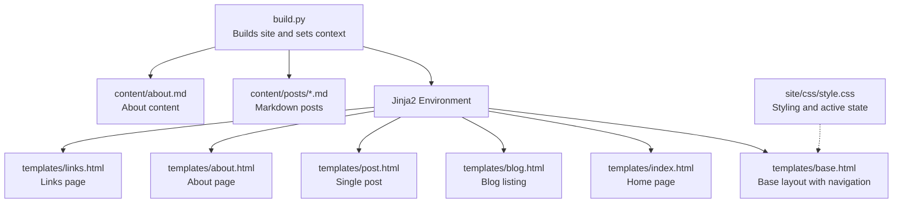
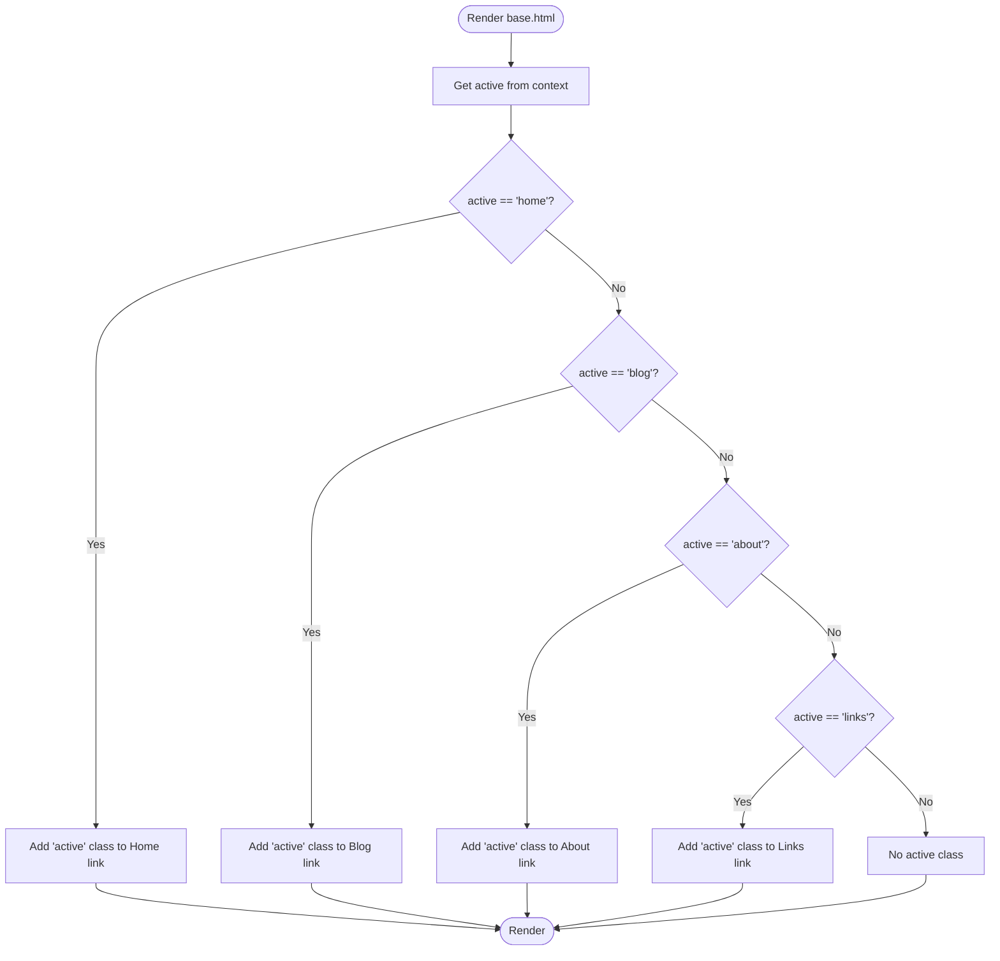
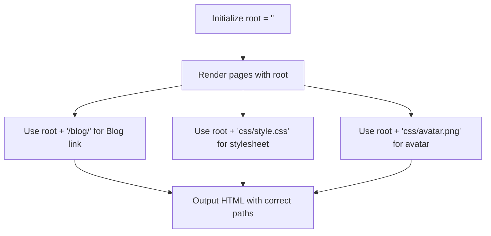
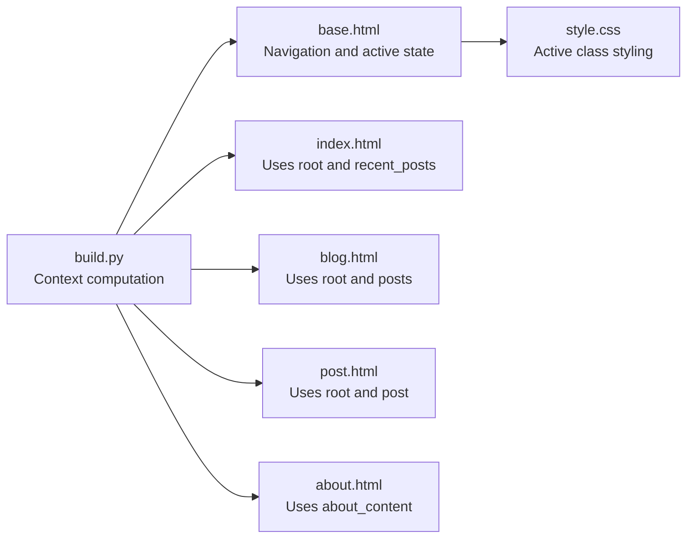

# Navigation and Context Variables

<cite>
**Referenced Files in This Document**
- [build.py](file://build.py)
- [base.html](file://templates/base.html)
- [index.html](file://templates/index.html)
- [blog.html](file://templates/blog.html)
- [post.html](file://templates/post.html)
- [about.html](file://templates/about.html)
- [links.html](file://templates/links.html)
- [style.css](file://site/css/style.css)
- [welcome-to-seisamuse.md](file://content/posts/welcome-to-seisamuse.md)
- [environmental-seismology-intro.md](file://content/posts/environmental-seismology-intro.md)
- [about.md](file://content/about.md)
</cite>

## Table of Contents
1. [Introduction](#introduction)
2. [Project Structure](#project-structure)
3. [Core Components](#core-components)
4. [Architecture Overview](#architecture-overview)
5. [Detailed Component Analysis](#detailed-component-analysis)
6. [Dependency Analysis](#dependency-analysis)
7. [Performance Considerations](#performance-considerations)
8. [Troubleshooting Guide](#troubleshooting-guide)
9. [Conclusion](#conclusion)

## Introduction
This document explains the navigation system and context variables used in Seisamuse templates. It focuses on:
- Active navigation state management via the active context variable and how it controls menu highlighting
- The root context variable for URL path resolution and maintaining relative links
- The year context variable for copyright information and automatic population
- The template context structure, including available content data, metadata variables, and utility functions
- Conditional logic usage for navigation items and how templates handle different content types
- Examples of context variable usage and common patterns for dynamic content rendering

## Project Structure
The site is a static site generated from Markdown content using Jinja2 templates. The build process loads content, computes derived data, and renders pages with a shared base template that defines navigation and context variables.



**Diagram sources**
- [build.py:154-236](file://build.py#L154-L236)
- [base.html:14-25](file://templates/base.html#L14-L25)
- [style.css:185-188](file://site/css/style.css#L185-L188)

**Section sources**
- [build.py:154-236](file://build.py#L154-L236)
- [base.html:14-25](file://templates/base.html#L14-L25)
- [style.css:185-188](file://site/css/style.css#L185-L188)

## Core Components
This section documents the context variables and their roles in the navigation system and template rendering.

- active
  - Purpose: Controls which navigation item appears highlighted.
  - Scope: Passed per-page during rendering.
  - Usage: Compared against navigation keys (e.g., home, blog, about, links) to apply the active class.
  - Example locations:
    - Navigation links compare active to keys to set the active class.
    - The build script passes active for each page type.

- root
  - Purpose: Provides a base URL prefix for all internal links to ensure correct relative paths across pages.
  - Scope: Defined once in the common context and reused across templates.
  - Behavior: Empty string for top-level pages; templates append trailing slash for subdirectories.
  - Example locations:
    - Base template uses root for stylesheets and navigation links.
    - Index and blog templates use root for internal links and images.

- year
  - Purpose: Populates the current year in the footer.
  - Scope: Computed once at build time and injected into the common context.
  - Example locations:
    - Footer prints the year alongside author and links.

- Content and metadata context
  - Posts: Loaded from Markdown files with frontmatter and rendered HTML. Each post includes title, date, slug, excerpt, tags, and content.
  - About page: Loaded from a single Markdown file and rendered to HTML.
  - Recent posts: A subset of posts passed to the home page for “Recent Posts.”

- Utility functions
  - Reading time estimation: Derived from post content length.
  - Excerpt generation: Auto-generated from the first paragraph if missing.

**Section sources**
- [build.py:164-167](file://build.py#L164-L167)
- [build.py:182-232](file://build.py#L182-L232)
- [base.html:19-22](file://templates/base.html#L19-L22)
- [base.html:35](file://templates/base.html#L35)
- [index.html:7, 29](file://templates/index.html#L7-L7, L29-L29)
- [blog.html:12](file://templates/blog.html#L12)
- [post.html:22](file://templates/post.html#L22)
- [about.html:9](file://templates/about.html#L9)
- [build.py:73-112](file://build.py#L73-L112)
- [build.py:133-139](file://build.py#L133-L139)
- [build.py:160-167](file://build.py#L160-L167)

## Architecture Overview
The build pipeline prepares context variables and content, then renders templates with a shared base layout. The base template defines navigation and applies active state based on the active context variable. The root context variable ensures correct relative URLs across pages.

```mermaid
sequenceDiagram
participant Build as "build.py"
participant Env as "Jinja2 Environment"
participant Base as "base.html"
participant Home as "index.html"
participant Blog as "blog.html"
participant Post as "post.html"
participant About as "about.html"
participant Links as "links.html"
Build->>Env : get_jinja_env()
Build->>Build : compute year and common context {root, year}
Build->>Env : load templates
Build->>Home : render(active="home", recent_posts)
Build->>Blog : render(active="blog", posts)
Build->>Post : render(active="blog", post)
Build->>About : render(active="about", about_content)
Build->>Links : render(active="links")
Env->>Base : render with active/root/year
Base->>Base : apply active class to matching nav item
Base-->>Build : HTML output
```

**Diagram sources**
- [build.py:160-232](file://build.py#L160-L232)
- [base.html:19-22](file://templates/base.html#L19-L22)

## Detailed Component Analysis

### Navigation Highlighting with active
- How it works
  - The base template compares the active context variable to navigation keys (home, blog, about, links).
  - When the comparison matches, the active class is added to the corresponding navigation link.
  - The CSS defines the visual appearance of the active state.

- Where it is defined and used
  - Navigation items in the base template use conditional logic to add the active class.
  - The build script sets active per page when rendering templates.

- Visual effect
  - The active class changes the color of the selected navigation item.



**Diagram sources**
- [base.html:19-22](file://templates/base.html#L19-L22)
- [style.css:185-188](file://site/css/style.css#L185-L188)

**Section sources**
- [base.html:19-22](file://templates/base.html#L19-L22)
- [style.css:185-188](file://site/css/style.css#L185-L188)
- [build.py:182-232](file://build.py#L182-L232)

### URL Resolution with root
- Purpose
  - Ensures internal links resolve correctly regardless of the current page’s depth in the site structure.
  - Prevents broken links when navigating from subdirectories.

- How it is used
  - The base template uses root for stylesheets and navigation links.
  - Templates for index and blog prepend root to internal links and images.
  - The build script initializes root to an empty string for top-level pages.

- Best practices
  - Always prefix internal links with root.
  - Use root consistently across templates for images, assets, and navigation.



**Diagram sources**
- [build.py:164-167](file://build.py#L164-L167)
- [base.html:8](file://templates/base.html#L8)
- [base.html:16](file://templates/base.html#L16)
- [index.html:7, 29](file://templates/index.html#L7-L7, L29-L29)
- [blog.html:12](file://templates/blog.html#L12)

**Section sources**
- [build.py:164-167](file://build.py#L164-L167)
- [base.html:8](file://templates/base.html#L8)
- [base.html:16](file://templates/base.html#L16)
- [index.html:7, 29](file://templates/index.html#L7-L7, L29-L29)
- [blog.html:12](file://templates/blog.html#L12)

### Copyright Year with year
- Purpose
  - Automatically populate the current year in the footer without manual updates.

- How it is computed and injected
  - The build script computes the current year and injects it into the common context.
  - The base template reads the year variable and displays it in the footer.

- Maintenance
  - No manual updates required; the year updates automatically each build.

**Section sources**
- [build.py:160-167](file://build.py#L160-L167)
- [base.html:35](file://templates/base.html#L35)

### Template Context Structure
- Common context (passed to all pages)
  - root: Base URL prefix for relative links
  - year: Current year for the footer

- Page-specific contexts
  - Home page (index.html)
    - recent_posts: Subset of posts for the “Recent Posts” section
  - Blog listing (blog.html)
    - posts: Full list of posts
  - Single post (post.html)
    - post: Individual post object with title, date, slug, excerpt, tags, content, reading_time
  - About page (about.html)
    - about_content: Rendered HTML of the about page content
  - Links page (links.html)
    - No additional content variables beyond the base layout

- Content and metadata
  - Posts loaded from Markdown with frontmatter support:
    - title, date, slug, tags, excerpt
    - content rendered to HTML
    - reading_time estimated from word count
  - About page loaded from a single Markdown file and rendered to HTML

- Utility functions
  - Reading time estimation: derived from post content length
  - Excerpt generation: auto-generated from the first paragraph if missing

**Section sources**
- [build.py:164-167](file://build.py#L164-L167)
- [build.py:182-232](file://build.py#L182-L232)
- [build.py:73-112](file://build.py#L73-L112)
- [build.py:133-139](file://build.py#L133-L139)

### Conditional Logic in Navigation Items
- Pattern
  - The base template uses Jinja2 conditional logic to compare the active context variable to navigation keys.
  - When the condition is true, the active class is added to the anchor element.

- Examples
  - Home link: condition checks active == 'home'
  - Blog link: condition checks active == 'blog'
  - About link: condition checks active == 'about'
  - Links link: condition checks active == 'links'

- Styling
  - The CSS defines the active class to visually highlight the current page in the navigation.

**Section sources**
- [base.html:19-22](file://templates/base.html#L19-L22)
- [style.css:185-188](file://site/css/style.css#L185-L188)

### Handling Different Content Types
- Home page
  - Renders hero content and a list of recent posts.
  - Uses root for internal links and images.
  - Uses post metadata (title, date, slug, excerpt, tags) for rendering.

- Blog listing
  - Iterates over posts to render a list with dates, titles, excerpts, and tags.
  - Uses root for post permalinks.

- Single post
  - Renders post header with title, date, reading time, and tags.
  - Renders post content as raw HTML.
  - Uses root for navigation back to the blog.

- About page
  - Renders pre-rendered about content as HTML.

- Links page
  - Renders curated project cards with external links.

**Section sources**
- [index.html:6-39](file://templates/index.html#L6-L39)
- [blog.html:8-21](file://templates/blog.html#L8-L21)
- [post.html:6-28](file://templates/post.html#L6-L28)
- [about.html:8-11](file://templates/about.html#L8-L11)
- [links.html:10-41](file://templates/links.html#L10-L41)

### Examples of Context Variable Usage and Patterns
- Using active for navigation highlighting
  - Pattern: Compare active to navigation keys and conditionally add the active class.
  - Reference: [base.html:19-22](file://templates/base.html#L19-L22)

- Using root for internal links and assets
  - Pattern: Prefix all internal links and asset paths with root.
  - References:
    - Stylesheet: [base.html:8](file://templates/base.html#L8)
    - Navigation links: [base.html:16](file://templates/base.html#L16)
    - Image: [index.html:7](file://templates/index.html#L7)
    - Post permalink: [index.html:29](file://templates/index.html#L29-L29)
    - Post permalink: [blog.html:12](file://templates/blog.html#L12)

- Using year in the footer
  - Pattern: Inject year into the common context and render it in the base template.
  - References:
    - Compute year: [build.py:160-167](file://build.py#L160-L167)
    - Render year: [base.html:35](file://templates/base.html#L35)

- Rendering post metadata
  - Pattern: Iterate over posts and render title, date, slug, excerpt, tags.
  - References:
    - Home page: [index.html:26-38](file://templates/index.html#L26-L38)
    - Blog listing: [blog.html:9-21](file://templates/blog.html#L9-L21)

- Rendering single post content
  - Pattern: Render post.title, post.date, post.reading_time, post.tags, and post.content.
  - Reference: [post.html:7-23](file://templates/post.html#L7-L23)

- Rendering about content
  - Pattern: Render pre-rendered about_content.
  - Reference: [about.html:9](file://templates/about.html#L9)

## Dependency Analysis
The navigation system depends on:
- The base template for defining navigation and applying active state
- The build script for computing and injecting context variables
- The CSS for styling the active state



**Diagram sources**
- [build.py:160-232](file://build.py#L160-L232)
- [base.html:14-25](file://templates/base.html#L14-L25)
- [style.css:185-188](file://site/css/style.css#L185-L188)

**Section sources**
- [build.py:160-232](file://build.py#L160-L232)
- [base.html:14-25](file://templates/base.html#L14-L25)
- [style.css:185-188](file://site/css/style.css#L185-L188)

## Performance Considerations
- Minimize repeated computations: year is computed once and reused across pages.
- Efficient iteration: posts are sorted once and reused for both blog listing and recent posts.
- Avoid unnecessary re-renders: pass only required context variables to each template.

## Troubleshooting Guide
- Navigation item not highlighted
  - Ensure the active context variable is set correctly when rendering the page.
  - Verify the comparison logic in the base template matches the active value.
  - Confirm the CSS class name for active state is defined.

- Broken internal links
  - Ensure root is included at the beginning of all internal links and asset paths.
  - Confirm root is initialized appropriately for the current page context.

- Incorrect year in footer
  - Verify the year is computed and injected into the common context.
  - Check that the base template renders the year variable.

- Missing post metadata
  - Confirm frontmatter is present in Markdown files.
  - Ensure post loading and rendering logic extracts and passes required fields.

**Section sources**
- [build.py:160-167](file://build.py#L160-L167)
- [base.html:19-22](file://templates/base.html#L19-L22)
- [base.html:8](file://templates/base.html#L8)
- [base.html:16](file://templates/base.html#L16)
- [base.html:35](file://templates/base.html#L35)
- [build.py:73-112](file://build.py#L73-L112)

## Conclusion
Seisamuse’s navigation system relies on three core context variables:
- active: drives the active state in the navigation bar
- root: ensures correct relative URLs across pages
- year: automatically populates the current year in the footer

These variables, combined with Jinja2 conditional logic and a shared base template, provide a consistent, maintainable, and scalable navigation experience. The build script centralizes context computation and content loading, while templates focus on presentation and conditional rendering.