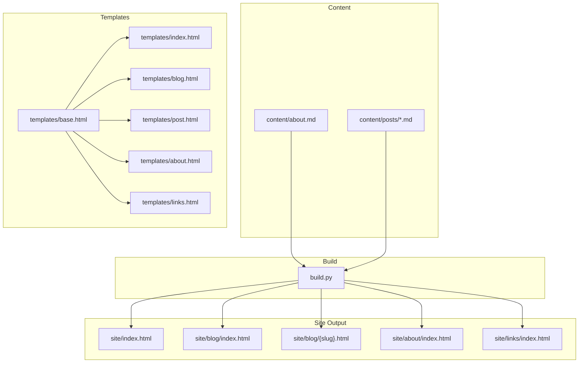
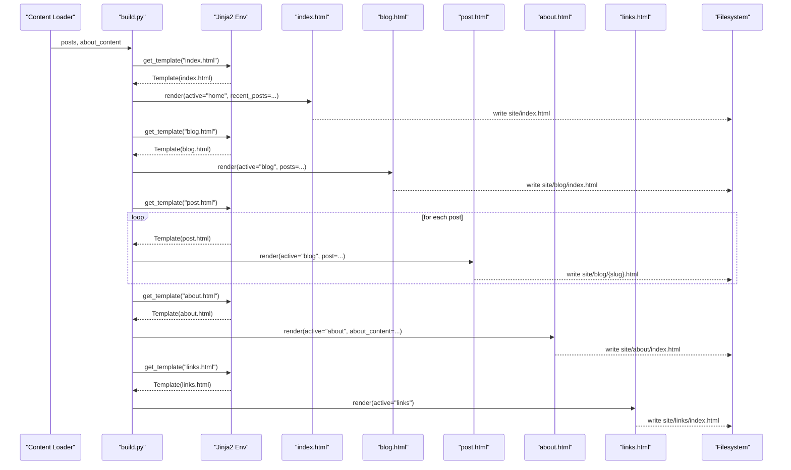
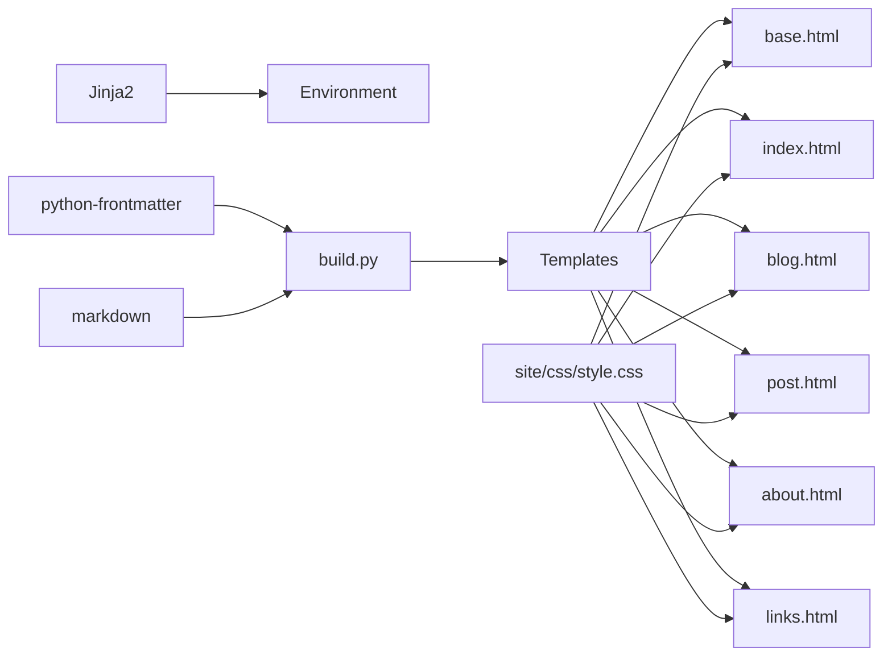

# Page-Specific Templates

<cite>
**Referenced Files in This Document**
- [base.html](file://templates/base.html)
- [index.html](file://templates/index.html)
- [blog.html](file://templates/blog.html)
- [post.html](file://templates/post.html)
- [about.html](file://templates/about.html)
- [links.html](file://templates/links.html)
- [build.py](file://build.py)
- [style.css](file://site/css/style.css)
- [requirements.txt](file://requirements.txt)
- [about.md](file://content/about.md)
- [welcome-to-seisamuse.md](file://content/posts/welcome-to-seisamuse.md)
- [environmental-seismology-intro.md](file://content/posts/environmental-seismology-intro.md)
</cite>

## Table of Contents
1. [Introduction](#introduction)
2. [Project Structure](#project-structure)
3. [Core Components](#core-components)
4. [Architecture Overview](#architecture-overview)
5. [Detailed Component Analysis](#detailed-component-analysis)
6. [Dependency Analysis](#dependency-analysis)
7. [Performance Considerations](#performance-considerations)
8. [Troubleshooting Guide](#troubleshooting-guide)
9. [Conclusion](#conclusion)
10. [Appendices](#appendices)

## Introduction
This document explains Seisamuse’s page-specific templates and their unique purposes. It covers how each template renders content, the context variables available to each page type, and how they integrate with the base template. It also documents the template rendering process, conditional logic, and common customization patterns for each page.

## Project Structure
The site is a static site built from Markdown content and Jinja2 templates. The build script loads content, converts Markdown to HTML, computes derived data (like reading time), and renders templates into the output directory.

**Diagram sources**
- [build.py:154-236](file://build.py#L154-L236)
- [index.html:1-73](file://templates/index.html#L1-L73)
- [blog.html:1-27](file://templates/blog.html#L1-L27)
- [post.html:1-30](file://templates/post.html#L1-L30)
- [about.html:1-12](file://templates/about.html#L1-L12)
- [links.html:1-48](file://templates/links.html#L1-L48)

**Section sources**
- [build.py:154-236](file://build.py#L154-L236)
- [requirements.txt:1-4](file://requirements.txt#L1-L4)

## Core Components
- Base template defines the shared layout, navigation, and blocks that child templates extend.
- Index template renders the homepage with recent posts and curated links.
- Blog template lists all posts with excerpts and tags.
- Post template renders a single blog post with metadata and content.
- About template renders the about page content loaded from Markdown.
- Links template lists curated projects and resources.

Key context variables used across templates:
- root: Relative path prefix for links.
- year: Current year for the footer.
- active: Active navigation state (home, blog, about, links).
- recent_posts: List of recent posts for the homepage.
- posts: Full list of posts for the blog listing.
- post: Single post object for the post page.
- about_content: Rendered HTML for the about page.

**Section sources**
- [base.html:14-25](file://templates/base.html#L14-L25)
- [index.html:184-187](file://templates/index.html#L184-L187)
- [blog.html:194-198](file://templates/blog.html#L194-L198)
- [post.html:206-211](file://templates/post.html#L206-L211)
- [about.html:218-222](file://templates/about.html#L218-L222)
- [links.html:228-232](file://templates/links.html#L228-L232)

## Architecture Overview
The build pipeline loads content, converts Markdown to HTML, computes derived data, and renders templates. Each page type receives a tailored context and extends the base template.

**Diagram sources**
- [build.py:154-236](file://build.py#L154-L236)
- [index.html:179-187](file://templates/index.html#L179-L187)
- [blog.html:190-198](file://templates/blog.html#L190-L198)
- [post.html:202-211](file://templates/post.html#L202-L211)
- [about.html:214-222](file://templates/about.html#L214-L222)
- [links.html:225-232](file://templates/links.html#L225-L232)

## Detailed Component Analysis

### Base Template
Purpose:
- Provides the shared HTML shell, meta tags, navigation, and content block for child templates.
- Uses the active context variable to highlight the current page in the navigation.

Key features:
- Navigation links conditionally apply an active class based on active.
- Content block placeholder for child templates to fill.
- Footer with dynamic year.

Styling integration:
- Uses CSS variables and responsive styles for navigation, typography, and layout.

**Section sources**
- [base.html:14-25](file://templates/base.html#L14-L25)
- [base.html:29](file://templates/base.html#L29)
- [style.css:141-200](file://site/css/style.css#L141-L200)

### Index Template (Homepage)
Purpose:
- Renders the homepage with hero content, recent posts, and curated links.

Context variables:
- recent_posts: First N posts for display.
- active: home to activate the Home link in navigation.

Template logic:
- Iterates over recent_posts to show dates, titles, excerpts, and tags.
- Conditional rendering for excerpts and tags.
- Hardcoded curated links for external resources.

Rendering process:
- Extends base.html and fills the content block.
- Uses root for internal and external links.

Customization patterns:
- Adjust RECENT_POSTS_COUNT to change how many posts appear.
- Modify the curated link cards to add or remove resources.
- Replace avatar image path if needed.

**Section sources**
- [index.html:1-73](file://templates/index.html#L1-L73)
- [build.py:179-187](file://build.py#L179-L187)
- [build.py:31](file://build.py#L31)

### Blog Template (Blog Listing)
Purpose:
- Lists all blog posts with titles, dates, excerpts, and tags.

Context variables:
- posts: Complete list of posts.
- active: blog to activate the Blog link in navigation.

Template logic:
- Iterates over posts to render each item with date, title, excerpt, and tags.
- Conditional rendering for excerpts and tags.
- Fallback message when no posts exist.

Rendering process:
- Extends base.html and fills the content block.

Customization patterns:
- Add pagination by slicing posts and introducing prev/next variables.
- Filter posts by tags or date ranges.
- Enhance post item layout with images or reading time.

**Section sources**
- [blog.html:1-27](file://templates/blog.html#L1-L27)
- [build.py:190-198](file://build.py#L190-L198)

### Post Template (Individual Blog Post)
Purpose:
- Renders a single blog post with metadata and content.

Context variables:
- post: A single post object containing title, date, slug, excerpt, tags, content, reading_time.
- active: blog to activate the Blog link in navigation.

Template logic:
- Displays post title, date, reading time, and tags.
- Renders sanitized HTML content from post.content.
- Provides a back-to-blog link.

Rendering process:
- Extends base.html and fills the content block.

Customization patterns:
- Add previous/next post navigation.
- Include social sharing buttons.
- Add comments or analytics placeholders.

**Section sources**
- [post.html:1-30](file://templates/post.html#L1-L30)
- [build.py:202-211](file://build.py#L202-L211)

### About Template
Purpose:
- Renders the about page content.

Context variables:
- about_content: Rendered HTML from the about Markdown file.
- active: about to activate the About link in navigation.

Template logic:
- Displays a page title and the rendered about content.

Rendering process:
- Extends base.html and fills the content block.

Customization patterns:
- Add profile photo, contact info, or CV sections.
- Split into sections (Education, Research Interests, etc.) and render them separately.

**Section sources**
- [about.html:1-12](file://templates/about.html#L1-L12)
- [build.py:214-222](file://build.py#L214-L222)
- [about.md:1-37](file://content/about.md#L1-L37)

### Links Template
Purpose:
- Lists curated projects and resources.

Context variables:
- active: links to activate the Links link in navigation.

Template logic:
- Displays a page title and a grid of link cards.
- Includes placeholder comments for future additions.

Rendering process:
- Extends base.html and fills the content block.

Customization patterns:
- Add new link cards dynamically by extending the list.
- Introduce categories or filtering by tags.
- Add support section styling and interactive elements.

**Section sources**
- [links.html:1-48](file://templates/links.html#L1-L48)
- [build.py:225-232](file://build.py#L225-L232)

## Dependency Analysis
- Template inheritance: All page templates extend base.html.
- Build-time dependencies: Jinja2 for templating, python-frontmatter for parsing Markdown metadata, markdown for HTML conversion.
- Runtime dependencies: CSS for styling and navigation behavior.

**Diagram sources**
- [requirements.txt:1-4](file://requirements.txt#L1-L4)
- [build.py:18-20](file://build.py#L18-L20)
- [style.css:1-513](file://site/css/style.css#L1-L513)

**Section sources**
- [requirements.txt:1-4](file://requirements.txt#L1-L4)
- [build.py:18-20](file://build.py#L18-L20)

## Performance Considerations
- Minimize heavy computations in templates; derive data in build.py (e.g., reading time).
- Keep post excerpts short to reduce DOM size on listing pages.
- Use grid layouts for link cards to improve perceived performance on mobile.
- Avoid unnecessary re-renders by keeping templates simple and deterministic.

## Troubleshooting Guide
Common issues and resolutions:
- Missing or empty content:
  - Verify that posts and about content exist and are valid Markdown with frontmatter.
  - Confirm that the build script loads content and renders templates correctly.
- Navigation not highlighting:
  - Ensure active is set appropriately for each page during render.
- Excerpts not appearing:
  - Check that posts have an excerpt or that auto-generation logic runs.
- Styling inconsistencies:
  - Confirm that CSS variables and selectors match template classes.

**Section sources**
- [build.py:170-176](file://build.py#L170-L176)
- [base.html:19-22](file://templates/base.html#L19-L22)
- [index.html:30-35](file://templates/index.html#L30-L35)
- [blog.html:13-18](file://templates/blog.html#L13-L18)

## Conclusion
Each page-specific template in Seisamuse is designed to present distinct content while sharing a consistent layout via the base template. The build script prepares structured data and passes it to templates, enabling straightforward customization and maintenance. By leveraging context variables and Jinja2’s conditional rendering, the site remains flexible for adding features like pagination, filtering, and enhanced post navigation.

## Appendices

### Template Rendering Process Summary
- Base template sets up the shell and navigation.
- Index template renders recent posts and curated links.
- Blog template lists all posts with excerpts and tags.
- Post template renders a single post with metadata and content.
- About template renders the about page content.
- Links template lists curated projects and resources.

**Section sources**
- [build.py:154-236](file://build.py#L154-L236)

### Data Structures Used by Templates
- Post object keys: title, date, date_sort, tags, excerpt, slug, content, reading_time.
- About content: rendered HTML string.
- Common context: root, year, active.

**Section sources**
- [build.py:103-112](file://build.py#L103-L112)
- [build.py:133-139](file://build.py#L133-L139)
- [build.py:164-167](file://build.py#L164-L167)