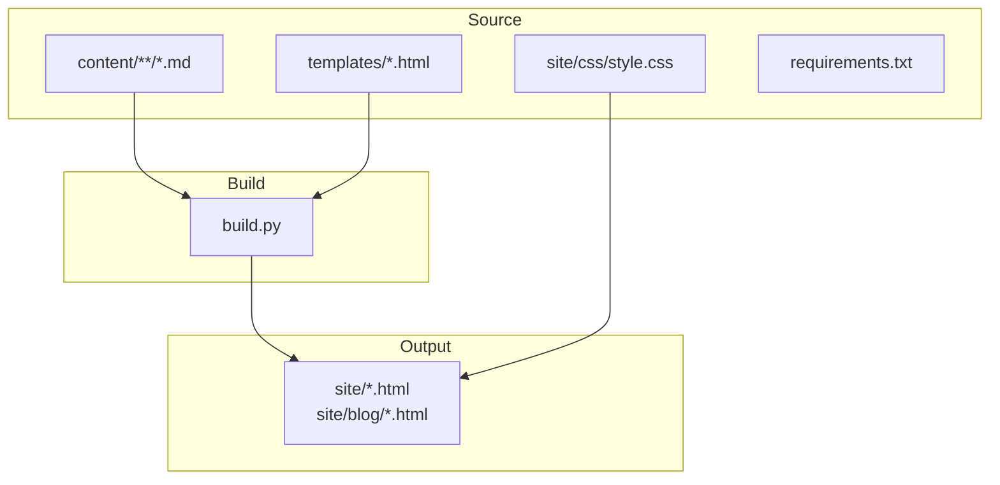
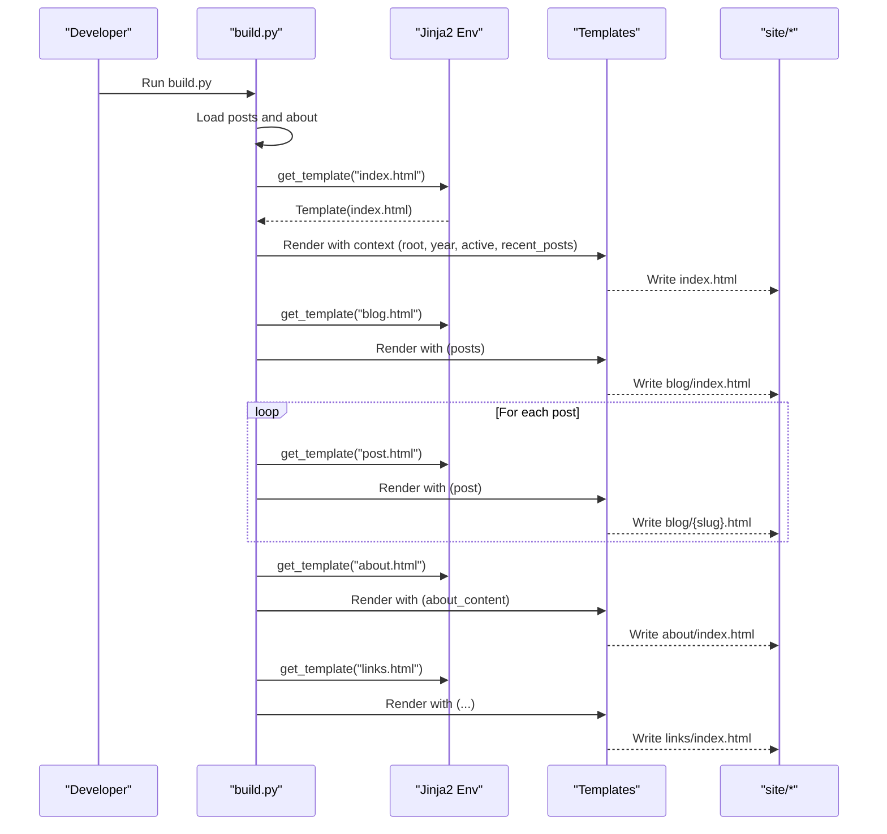
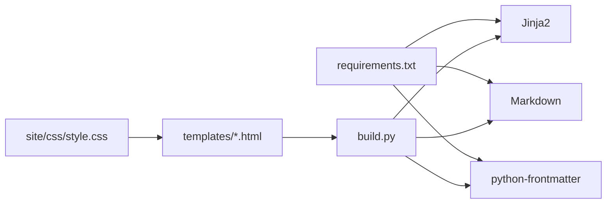

# Template Customization Guide

<cite>
**Referenced Files in This Document**
- [build.py](file://build.py)
- [base.html](file://templates/base.html)
- [index.html](file://templates/index.html)
- [blog.html](file://templates/blog.html)
- [post.html](file://templates/post.html)
- [about.html](file://templates/about.html)
- [links.html](file://templates/links.html)
- [style.css](file://site/css/style.css)
- [requirements.txt](file://requirements.txt)
- [welcome-to-seisamuse.md](file://content/posts/welcome-to-seisamuse.md)
- [about.md](file://content/about.md)
</cite>

## Table of Contents
1. [Introduction](#introduction)
2. [Project Structure](#project-structure)
3. [Core Components](#core-components)
4. [Architecture Overview](#architecture-overview)
5. [Detailed Component Analysis](#detailed-component-analysis)
6. [Dependency Analysis](#dependency-analysis)
7. [Performance Considerations](#performance-considerations)
8. [Troubleshooting Guide](#troubleshooting-guide)
9. [Conclusion](#conclusion)
10. [Appendices](#appendices)

## Introduction
This guide explains how to safely customize the Seisamuse templates while preserving functionality and maintainability. It covers:
- Adding new sections and modifying layout elements
- Changing visual styling via CSS variables and selectors
- Adding new template variables and modifying existing ones
- Step-by-step examples for common customizations (social links, analytics, header layout)
- Debugging techniques and error handling strategies
- Compatibility and update best practices
- Common pitfalls and troubleshooting advice

## Project Structure
Seisamuse uses Jinja2 templates under the templates directory and renders them into the site directory. Content Markdown files live under content, and the build script orchestrates loading, transforming, and rendering.

**Diagram sources**
- [build.py:154-236](file://build.py#L154-L236)
- [requirements.txt:1-4](file://requirements.txt#L1-L4)

**Section sources**
- [build.py:22-27](file://build.py#L22-L27)
- [requirements.txt:1-4](file://requirements.txt#L1-L4)

## Core Components
- Templates: Base layout and page-specific templates define blocks and variables passed by the builder.
- Builder: Loads content, transforms Markdown, computes derived data, and renders templates.
- Stylesheet: Provides CSS variables and responsive styles used across templates.

Key template variables and blocks:
- Variables: root, year, active, recent_posts, posts, post, about_content
- Blocks: title, description, content (inherited via base.html)

How variables are supplied:
- The builder constructs a common context and passes it to each template render call.

**Section sources**
- [build.py:163-167](file://build.py#L163-L167)
- [build.py:179-187](file://build.py#L179-L187)
- [build.py:190-198](file://build.py#L190-L198)
- [build.py:202-211](file://build.py#L202-L211)
- [build.py:214-222](file://build.py#L214-L222)
- [build.py:225-232](file://build.py#L225-L232)
- [base.html:6](file://templates/base.html#L6)
- [base.html:35](file://templates/base.html#L35)

## Architecture Overview
The build pipeline loads Markdown content, converts it to HTML, computes metadata, and renders Jinja2 templates into static HTML.

**Diagram sources**
- [build.py:154-236](file://build.py#L154-L236)
- [index.html:1-73](file://templates/index.html#L1-L73)
- [blog.html:1-27](file://templates/blog.html#L1-L27)
- [post.html:1-30](file://templates/post.html#L1-L30)
- [about.html:1-12](file://templates/about.html#L1-L12)
- [links.html:1-48](file://templates/links.html#L1-L48)

## Detailed Component Analysis

### Base Template and Navigation
The base template defines the global layout, navigation, and footer. It exposes blocks for title, description, and content, and uses variables like root, year, and active for navigation highlighting.

Customization tips:
- To add a new navigation item, edit the navigation list and ensure the active variable matches the current page.
- To change meta tags, modify the title and description blocks.

**Section sources**
- [base.html:14-25](file://templates/base.html#L14-L25)
- [base.html:6](file://templates/base.html#L6)
- [base.html:35](file://templates/base.html#L35)

### Home Page Template
The home page extends the base template and injects recent posts. It includes a hero section, recent posts list, and a projects/resources grid.

Common customizations:
- Add new sections by inserting new blocks inside the content block.
- Modify the hero by editing image, text, and social links.
- Adjust the number of recent posts by changing the slice passed to the template.

**Section sources**
- [index.html:1-73](file://templates/index.html#L1-L73)

### Blog Listing Template
The blog listing displays all posts with dates, excerpts, and tags. It also handles empty states.

Customization ideas:
- Add pagination by slicing posts and introducing prev/next variables.
- Enhance tag filtering or add category support by extending the builder.

**Section sources**
- [blog.html:1-27](file://templates/blog.html#L1-L27)

### Individual Post Template
Each post uses the base template and renders structured metadata (date, reading time, tags) and content.

Customization ideas:
- Add author bio, related posts, or social sharing buttons.
- Introduce post-specific variables in the builder and pass them to the template.

**Section sources**
- [post.html:1-30](file://templates/post.html#L1-L30)

### About Page Template
The about page renders preprocessed Markdown content into a styled container.

Customization ideas:
- Add profile image, contact info cards, or sections for education/publications.
- Extend the Markdown frontmatter to supply additional structured data.

**Section sources**
- [about.html:1-12](file://templates/about.html#L1-L12)
- [about.md:1-39](file://content/about.md#L1-L39)

### Links/Resources Template
The links page presents a grid of external projects and resources.

Customization ideas:
- Add new link cards by appending entries to the template.
- Introduce categories or badges for filtering.

**Section sources**
- [links.html:1-48](file://templates/links.html#L1-L48)

### CSS Styling and Theming
The stylesheet defines CSS variables for colors, typography, and spacing. It also includes responsive breakpoints and dark mode support.

Customization ideas:
- Change accent colors or brand colors by updating variables in :root.
- Add new component classes (e.g., .social-links) and apply them in templates.
- Extend responsive rules for new layout elements.

**Section sources**
- [style.css:13-23](file://site/css/style.css#L13-L23)
- [style.css:479-512](file://site/css/style.css#L479-L512)

## Dependency Analysis
The build script depends on Jinja2 for templating, markdown for content rendering, and python-frontmatter for metadata parsing. Templates depend on the builder-provided context.

**Diagram sources**
- [requirements.txt:1-4](file://requirements.txt#L1-L4)
- [build.py:18-20](file://build.py#L18-L20)

**Section sources**
- [requirements.txt:1-4](file://requirements.txt#L1-L4)
- [build.py:18-20](file://build.py#L18-L20)

## Performance Considerations
- Keep template logic minimal; compute heavy data in the builder.
- Reuse computed variables (e.g., recent_posts) across templates to avoid redundant work.
- Prefer CSS variables for theming to reduce duplication and improve maintainability.
- Avoid excessive DOM nesting in templates to keep rendering fast.

## Troubleshooting Guide
Common issues and resolutions:
- Missing or broken images: Verify image paths and fallbacks (e.g., onerror attributes).
- Incorrect navigation highlighting: Ensure the active variable matches the page.
- Empty blog listings: Confirm posts are present and frontmatter is valid.
- Styling not applied: Check CSS class names match the stylesheet and that variables are defined.
- Build errors: Validate Jinja2 syntax in templates and ensure required dependencies are installed.

Debugging steps:
- Temporarily add placeholder content blocks to isolate rendering issues.
- Print intermediate data in the builder (e.g., post metadata) to verify correctness.
- Use browser dev tools to inspect rendered HTML and CSS.

**Section sources**
- [index.html:8](file://templates/index.html#L8)
- [base.html:19](file://templates/base.html#L19)
- [build.py:121-127](file://build.py#L121-L127)
- [requirements.txt:1-4](file://requirements.txt#L1-L4)

## Conclusion
By understanding the template hierarchy, the builder’s context, and the stylesheet variables, you can safely introduce new sections, adjust layouts, and refine visuals. Always test locally, keep changes minimal, and preserve the base template’s structure to ease future updates.

## Appendices

### Safe Modification Practices
- Backup templates before major changes.
- Add new variables in the builder and pass them consistently across templates.
- Use CSS classes already defined in the stylesheet to maintain design coherence.
- Keep navigation items synchronized with the active variable.

### Adding New Template Variables
Steps:
1. Compute the new data in the builder (e.g., load additional content or derive metrics).
2. Add the variable to the context dictionary used when rendering the template.
3. Reference the variable in the appropriate template block.
4. Test rendering and handle missing data gracefully.

Example reference paths:
- [build.py:179-187](file://build.py#L179-L187)
- [build.py:202-211](file://build.py#L202-L211)

### Modifying Existing Variables
Examples:
- Adjust the active variable to highlight the correct navigation item.
- Modify the root variable for subdirectory deployments (if applicable).
- Extend post metadata (e.g., reading_time) by adjusting the builder’s post processing.

Example reference paths:
- [build.py:184](file://build.py#L184)
- [build.py:208](file://build.py#L208)
- [post.html:11](file://templates/post.html#L11)

### Popular Customizations

#### Add Social Media Links to the Hero
Steps:
1. Edit the hero section in the home template to include new anchor elements.
2. Ensure links use the root variable for internal paths and target blank for external links.
3. Style new links using existing CSS classes or add new ones in the stylesheet.

Example reference paths:
- [index.html:13-17](file://templates/index.html#L13-L17)
- [style.css:243-260](file://site/css/style.css#L243-L260)

#### Implement Analytics Tracking
Steps:
1. Add analytics script tags to the base template head or body.
2. Wrap analytics code in conditional checks if privacy settings require consent.
3. Validate placement by inspecting the rendered HTML.

Example reference paths:
- [base.html:3](file://templates/base.html#L3)
- [base.html:41](file://templates/base.html#L41)

#### Modify the Header Layout
Steps:
1. Adjust the navigation list in the base template to reorder or add items.
2. Update the active variable per page to reflect the new layout.
3. Add responsive toggles or styles if needed.

Example reference paths:
- [base.html:14-25](file://templates/base.html#L14-L25)
- [base.html:490-502](file://templates/base.html#L490-L502)

### Maintaining Compatibility During Updates
- Track changes in a version control system and review diffs carefully.
- Avoid overriding base blocks; extend them instead.
- Keep custom CSS modular and scoped to minimize conflicts.
- Pin dependency versions to prevent unexpected behavior.

### Best Practices for Template Organization
- Group related templates by page type (homepage, listing, single item).
- Use consistent naming for blocks and variables.
- Centralize shared data in the builder to avoid duplication.
- Document custom variables and their expected types.

### Common Pitfalls and Fixes
- Forgetting to pass a required variable leads to template errors; add defaults in the builder.
- Incorrect relative paths break assets; use the root variable consistently.
- Overriding base blocks without inheriting can remove essential layout; always extend base.html.

**Section sources**
- [base.html:14-25](file://templates/base.html#L14-L25)
- [index.html:13-17](file://templates/index.html#L13-L17)
- [build.py:164-167](file://build.py#L164-L167)