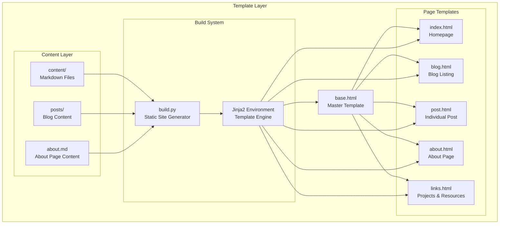
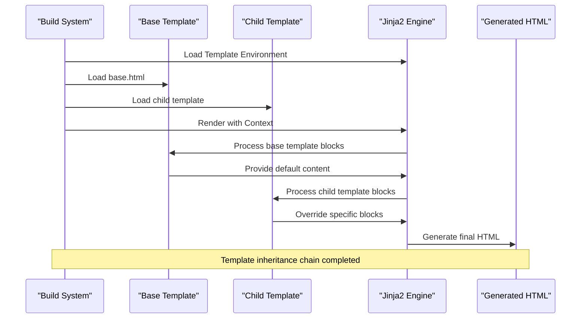
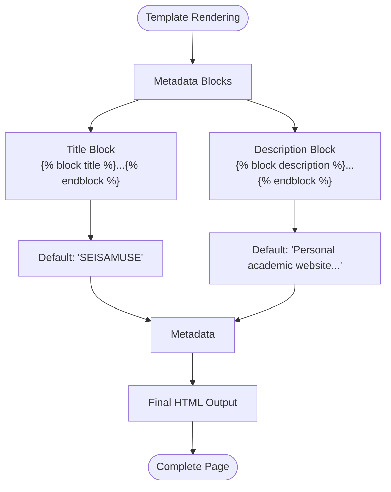
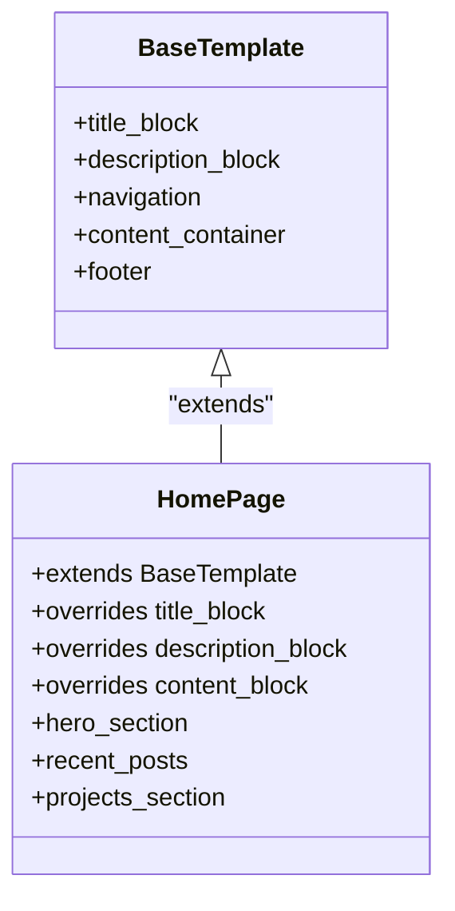
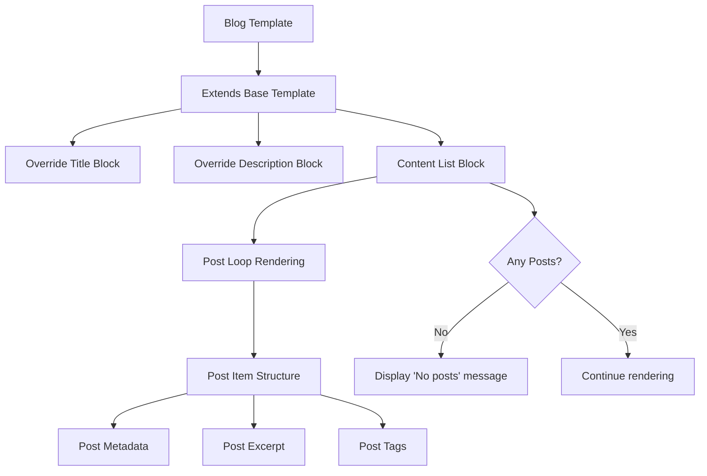
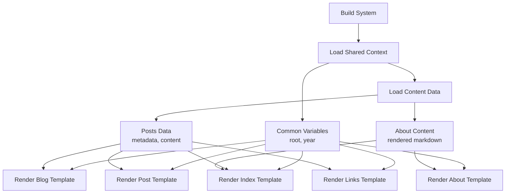
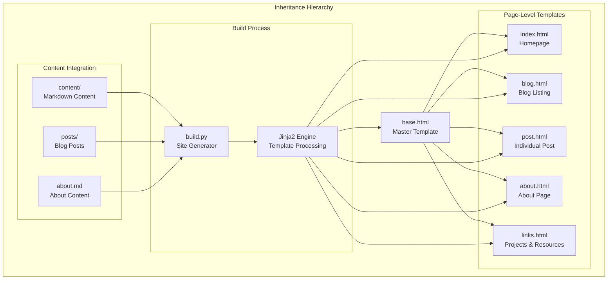
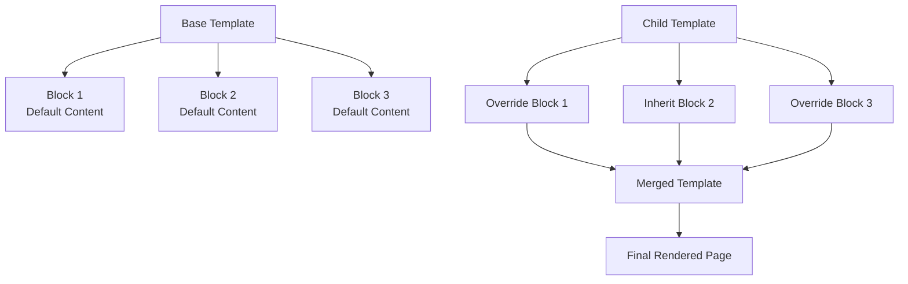
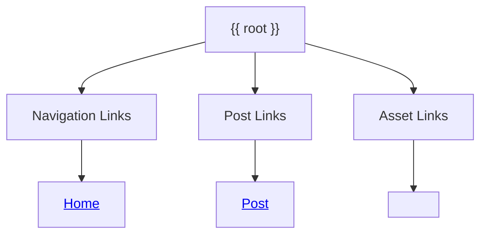
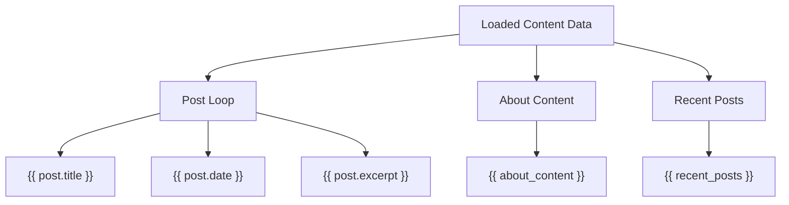

# Template Inheritance Pattern

<cite>
**Referenced Files in This Document**
- [base.html](file://templates/base.html)
- [index.html](file://templates/index.html)
- [about.html](file://templates/about.html)
- [blog.html](file://templates/blog.html)
- [post.html](file://templates/post.html)
- [links.html](file://templates/links.html)
- [build.py](file://build.py)
- [about.md](file://content/about.md)
- [welcome-to-seisamuse.md](file://content/posts/welcome-to-seisamuse.md)
</cite>

## Table of Contents
1. [Introduction](#introduction)
2. [Project Structure](#project-structure)
3. [Core Components](#core-components)
4. [Architecture Overview](#architecture-overview)
5. [Detailed Component Analysis](#detailed-component-analysis)
6. [Template Inheritance Chain](#template-inheritance-chain)
7. [Block System Implementation](#block-system-implementation)
8. [Variable Substitution Patterns](#variable-substitution-patterns)
9. [Best Practices and Naming Conventions](#best-practices-and-naming-conventions)
10. [Performance Considerations](#performance-considerations)
11. [Troubleshooting Guide](#troubleshooting-guide)
12. [Conclusion](#conclusion)

## Introduction

Seisamuse employs a sophisticated template inheritance pattern built on Jinja2 to create a maintainable and extensible static website architecture. The system centers around a master template (`base.html`) that defines the foundational structure and reusable components, while specialized templates extend this base to create page-specific content. This pattern enables efficient content management, consistent styling, and streamlined development workflows for academic and professional websites.

The inheritance system allows developers to define common structural elements once in the base template while enabling flexible customization through block overrides and variable substitution. This approach is particularly valuable for academic websites that require consistent navigation, metadata handling, and responsive design while accommodating diverse content types such as blog posts, research articles, and portfolio projects.

## Project Structure

The template inheritance system in Seisamuse follows a clear hierarchical organization that promotes maintainability and scalability:

**Diagram sources**
- [base.html:1-43](file://templates/base.html#L1-L43)
- [index.html:1-73](file://templates/index.html#L1-L73)
- [build.py:47-53](file://build.py#L47-L53)

The project structure demonstrates a clean separation of concerns where the base template handles structural elements while specialized templates focus on content presentation. This organization facilitates easy maintenance and extension of the website's appearance and functionality.

**Section sources**
- [base.html:1-43](file://templates/base.html#L1-L43)
- [index.html:1-73](file://templates/index.html#L1-L73)
- [build.py:22-31](file://build.py#L22-L31)

## Core Components

The template inheritance system in Seisamuse consists of several key components that work together to create a cohesive templating architecture:

### Base Template Foundation

The `base.html` template serves as the cornerstone of the inheritance system, establishing the fundamental structure and reusable elements that all child templates inherit. This master template defines the complete HTML document structure including metadata, navigation, and layout containers.

### Block System Architecture

The block system enables selective customization of template elements through named placeholders that child templates can override. The system supports both content blocks and metadata blocks, allowing for granular control over different aspects of page rendering.

### Variable Substitution Framework

The system incorporates dynamic variable substitution through Jinja2's templating capabilities, enabling runtime content injection and context-aware rendering. Variables such as `root`, `year`, and page-specific data are seamlessly integrated into the template structure.

### Template Context Management

The build system manages template contexts through the `build.py` script, which prepares shared variables and page-specific data before rendering. This centralized approach ensures consistency across all rendered pages while maintaining flexibility for individual page customization.

**Section sources**
- [base.html:6-39](file://templates/base.html#L6-L39)
- [build.py:163-167](file://build.py#L163-L167)

## Architecture Overview

The template inheritance architecture in Seisamuse follows a hierarchical pattern that maximizes code reuse while enabling targeted customization:

**Diagram sources**
- [build.py:177-232](file://build.py#L177-L232)
- [base.html:1-43](file://templates/base.html#L1-L43)

The architecture ensures that all child templates inherit the structural foundation from the base template while selectively overriding specific elements through the block system. This approach minimizes code duplication and maintains visual consistency across the entire website.

## Detailed Component Analysis

### Base Template Analysis

The `base.html` template establishes the foundational structure for all pages in the Seisamuse website. It defines essential structural elements including metadata blocks, navigation components, and content containers that serve as the inheritance foundation for all child templates.

#### Metadata Block System

The base template implements a sophisticated metadata block system that handles both title and description elements:

**Diagram sources**
- [base.html:6-7](file://templates/base.html#L6-L7)

The metadata blocks provide sensible defaults while allowing child templates to customize these elements for SEO optimization and social media sharing.

#### Navigation and Layout Structure

The base template includes a responsive navigation system with active state management and a main content container that maintains consistent spacing and typography across all pages.

**Section sources**
- [base.html:14-31](file://templates/base.html#L14-L31)

### Child Template Implementation

Each child template in Seisamuse extends the base template while implementing specific content blocks tailored to their purpose. The implementation demonstrates various inheritance patterns and customization approaches.

#### Homepage Template Pattern

The `index.html` template exemplifies the inheritance pattern by extending the base template and overriding multiple blocks to create a comprehensive landing page:

**Diagram sources**
- [index.html:1-73](file://templates/index.html#L1-L73)
- [base.html:1-43](file://templates/base.html#L1-L43)

The homepage template demonstrates complex content composition through multiple content blocks and dynamic content rendering.

#### Blog Template Architecture

The `blog.html` template showcases list-based content rendering with pagination-like functionality and conditional content display:

**Diagram sources**
- [blog.html:1-27](file://templates/blog.html#L1-L27)

The blog template implements conditional rendering logic to handle empty content scenarios gracefully.

**Section sources**
- [index.html:5-72](file://templates/index.html#L5-L72)
- [blog.html:5-26](file://templates/blog.html#L5-L26)

### Template Context Integration

The build system integrates template context data through the `build.py` script, which manages shared variables and page-specific content before rendering:

**Diagram sources**
- [build.py:163-232](file://build.py#L163-L232)

The context management system ensures that all templates receive consistent data while allowing for page-specific customization through block overrides.

**Section sources**
- [build.py:163-232](file://build.py#L163-L232)

## Template Inheritance Chain

The inheritance chain in Seisamuse follows a clear hierarchical pattern that enables efficient code reuse and targeted customization:

**Diagram sources**
- [base.html:1-43](file://templates/base.html#L1-L43)
- [index.html:1](file://templates/index.html#L1)
- [blog.html:1](file://templates/blog.html#L1)
- [post.html:1](file://templates/post.html#L1)
- [about.html:1](file://templates/about.html#L1)
- [links.html:1](file://templates/links.html#L1)

The inheritance chain ensures that all child templates inherit structural elements from the base template while maintaining their unique content and presentation characteristics. This hierarchical approach enables easy maintenance and consistent visual identity across the entire website.

**Section sources**
- [base.html:1-43](file://templates/base.html#L1-L43)
- [index.html:1](file://templates/index.html#L1)
- [blog.html:1](file://templates/blog.html#L1)
- [post.html:1](file://templates/post.html#L1)
- [about.html:1](file://templates/about.html#L1)
- [links.html:1](file://templates/links.html#L1)

## Block System Implementation

The block system in Seisamuse provides a flexible mechanism for template customization through named placeholders that child templates can override. This system enables precise control over different aspects of page rendering while maintaining structural consistency.

### Block Types and Functions

The template inheritance system implements several distinct block types, each serving specific purposes in the page rendering process:

#### Structural Blocks

Structural blocks define the foundational elements of the page layout and remain consistent across all templates:

- **Content Container**: Provides the main content area with consistent padding and styling
- **Navigation Elements**: Handles menu structure and active state management
- **Footer Components**: Manages copyright information and external links

#### Content Blocks

Content blocks enable child templates to define page-specific content while inheriting the surrounding structure:

- **Hero Sections**: Featured content areas for homepage and landing pages
- **List Containers**: Structured presentation of collections such as blog posts
- **Article Bodies**: Individual content rendering for detailed pages

#### Metadata Blocks

Metadata blocks control SEO-related elements that vary between pages:

- **Title Blocks**: Dynamic page titles with fallback defaults
- **Description Blocks**: Meta descriptions for search engine optimization

### Block Override Mechanism

The block override mechanism allows child templates to selectively replace specific elements while preserving inherited functionality:

**Diagram sources**
- [base.html:29](file://templates/base.html#L29)
- [index.html:2-3](file://templates/index.html#L2-L3)

The override mechanism ensures that child templates only need to specify changes rather than duplicating entire structural elements.

**Section sources**
- [base.html:6-39](file://templates/base.html#L6-L39)
- [index.html:2-3](file://templates/index.html#L2-L3)

## Variable Substitution Patterns

The template inheritance system incorporates dynamic variable substitution through Jinja2's templating capabilities, enabling runtime content injection and context-aware rendering throughout the website.

### Context Variables

The build system manages several categories of context variables that are made available to all templates:

#### Global Variables

Global variables provide consistent information across all pages in the website:

- **Root Path**: Relative path for linking between pages
- **Year**: Current year for copyright information
- **Active State**: Navigation highlighting for current page

#### Content Variables

Content variables carry page-specific data from the content management system:

- **Post Data**: Individual blog post metadata and content
- **About Content**: Rendered markdown content for the about page
- **Recent Posts**: Limited set of posts for homepage display

### Variable Usage Patterns

Variables are integrated into templates through consistent patterns that ensure reliability and maintainability:

#### Path Variables

Path variables such as `root` enable flexible linking between pages regardless of deployment location:

**Diagram sources**
- [base.html:8](file://templates/base.html#L8)
- [index.html:29](file://templates/index.html#L29)

#### Dynamic Content Variables

Dynamic content variables enable content-driven rendering based on loaded data:

**Diagram sources**
- [build.py:182-210](file://build.py#L182-L210)

The variable substitution system ensures that templates remain flexible while maintaining consistent data presentation across the website.

**Section sources**
- [build.py:163-167](file://build.py#L163-L167)
- [index.html:26-38](file://templates/index.html#L26-L38)

## Best Practices and Naming Conventions

The template inheritance system in Seisamuse follows established best practices and naming conventions that promote maintainability, readability, and scalability across the website architecture.

### Template Naming Conventions

Consistent naming conventions ensure clarity and predictability in the template hierarchy:

#### Base Template Naming
- **base.html**: Reserved exclusively for the master template
- Must contain all structural elements and reusable components
- Should avoid page-specific content or logic

#### Page Template Naming
- **index.html**: Homepage template
- **blog.html**: Blog listing template  
- **post.html**: Individual post template
- **about.html**: About page template
- **links.html**: Projects and resources template

#### Content-Based Naming
Templates should reflect their primary content type or purpose, enabling developers to quickly identify template functions.

### Block Organization Principles

Effective block organization enhances template maintainability and reduces complexity:

#### Logical Grouping
Blocks should be organized by logical content groups rather than arbitrary ordering. Related functionality should be grouped together within the template structure.

#### Consistent Naming
Block names should clearly indicate their purpose and content type, enabling easy identification and modification by developers.

#### Minimal Overrides
Child templates should override only the blocks necessary for their specific functionality, avoiding unnecessary modifications to inherited elements.

### Inheritance Pattern Guidelines

Following established inheritance patterns ensures consistency and prevents template conflicts:

#### Single Inheritance Point
Each child template should extend the base template at the top of the file, making inheritance relationships immediately apparent.

#### Block Override Strategy
Child templates should override blocks systematically, starting with metadata blocks (title, description) followed by content blocks, ensuring proper inheritance chain maintenance.

#### Variable Usage Consistency
Context variables should be used consistently across templates, with clear documentation of expected variable types and availability.

### Template Organization Strategies

Effective template organization promotes maintainability and scalability:

#### Feature-Based Organization
Templates should be organized by feature or content type rather than arbitrary grouping, enabling focused development and testing.

#### Reusable Component Patterns
Common UI components should be designed as reusable blocks or partial templates that can be included across multiple pages.

#### Documentation Integration
Template files should include clear documentation of their purpose, expected context variables, and usage patterns to facilitate maintenance and extension.

**Section sources**
- [base.html:1-43](file://templates/base.html#L1-L43)
- [index.html:1](file://templates/index.html#L1)
- [blog.html:1](file://templates/blog.html#L1)
- [post.html:1](file://templates/post.html#L1)
- [about.html:1](file://templates/about.html#L1)
- [links.html:1](file://templates/links.html#L1)

## Performance Considerations

The template inheritance system in Seisamuse incorporates several performance optimization strategies that balance functionality with efficiency, ensuring fast page rendering and maintainable code architecture.

### Template Compilation Efficiency

The Jinja2 template engine optimizes template compilation and caching, reducing overhead during repeated rendering operations. The build system leverages these optimizations through efficient template loading and context management.

### Memory Usage Optimization

Template inheritance minimizes memory usage by sharing structural elements across multiple pages rather than duplicating HTML markup. This approach reduces both memory footprint and processing overhead.

### Content Processing Efficiency

The build system processes content efficiently through batch operations, loading all necessary data before template rendering to minimize I/O operations and improve overall performance.

### Caching Strategies

While the current implementation focuses on static site generation, the template architecture supports future caching strategies for frequently accessed pages and assets.

## Troubleshooting Guide

Common issues and solutions when working with the template inheritance system in Seisamuse:

### Template Inheritance Issues

**Problem**: Child templates not inheriting base template structure
**Solution**: Verify that the `` statement is present at the top of child templates and that the base template path is correct.

**Problem**: Block overrides not taking effect
**Solution**: Ensure block names match exactly between parent and child templates, and that block syntax is properly closed with ``.

### Variable Substitution Problems

**Problem**: Variables not rendering correctly in templates
**Solution**: Verify that variables are properly passed in the template context and that variable names match between build script and templates.

**Problem**: Relative paths not working correctly
**Solution**: Check that the `root` variable is properly set in the template context and used consistently throughout templates.

### Build Process Issues

**Problem**: Template rendering errors during build
**Solution**: Review template syntax for proper Jinja2 syntax and ensure all required context variables are provided by the build system.

**Problem**: Missing content in generated pages
**Solution**: Verify that content files exist in the expected locations and that the build system is correctly loading and processing content data.

**Section sources**
- [build.py:177-232](file://build.py#L177-L232)
- [base.html:1-43](file://templates/base.html#L1-L43)

## Conclusion

The template inheritance pattern in Seisamuse represents a mature and well-architected solution for building maintainable, scalable static websites. Through the strategic use of a master template, block system, and variable substitution, the system achieves an optimal balance between code reuse and customization flexibility.

The inheritance chain provides a clear architectural foundation that enables efficient content management while maintaining visual consistency across diverse content types. The block system offers granular control over template customization, allowing developers to create specialized pages without sacrificing structural integrity.

Key strengths of the implementation include:

- **Maintainability**: Centralized structural elements reduce code duplication and simplify updates
- **Flexibility**: Block overrides enable targeted customization while preserving inheritance benefits  
- **Scalability**: Hierarchical organization supports growth to larger websites with multiple content types
- **Performance**: Efficient template processing and context management ensure fast rendering
- **Developer Experience**: Clear naming conventions and consistent patterns facilitate team collaboration

The system successfully addresses the core requirements of academic and professional websites by providing a robust foundation for content presentation while enabling the flexibility needed for diverse content types and presentation styles. This architecture serves as an excellent model for other static site generators seeking to balance simplicity with powerful customization capabilities.