# Template System

<cite>
**Referenced Files in This Document**
- [base.html](file://templates/base.html)
- [index.html](file://templates/index.html)
- [blog.html](file://templates/blog.html)
- [post.html](file://templates/post.html)
- [about.html](file://templates/about.html)
- [links.html](file://templates/links.html)
- [build.py](file://build.py)
- [style.css](file://site/css/style.css)
- [about.md](file://content/about.md)
- [welcome-to-seisamuse.md](file://content/posts/welcome-to-seisamuse.md)
- [environmental-seismology-intro.md](file://content/posts/environmental-seismology-intro.md)
- [requirements.txt](file://requirements.txt)
</cite>

## Table of Contents
1. [Introduction](#introduction)
2. [Project Structure](#project-structure)
3. [Core Components](#core-components)
4. [Architecture Overview](#architecture-overview)
5. [Detailed Component Analysis](#detailed-component-analysis)
6. [Dependency Analysis](#dependency-analysis)
7. [Performance Considerations](#performance-considerations)
8. [Troubleshooting Guide](#troubleshooting-guide)
9. [Conclusion](#conclusion)
10. [Appendices](#appendices)

## Introduction
This document explains Seisamuse’s Jinja2-based templating architecture. It covers the template inheritance pattern starting from base.html, how specialized templates extend it, the template context variables available to each page type, the rendering pipeline from the build script, responsive design and CSS integration, customization techniques, conditional logic, practical modification examples, debugging and error handling, performance considerations, and guidelines for maintaining template consistency.

## Project Structure
The site uses a minimal static site generator that:
- Loads Markdown content with frontmatter metadata
- Converts Markdown to HTML
- Renders Jinja2 templates with a shared context
- Writes static HTML to the site directory

Key directories and files:
- content/: Markdown posts and pages
- templates/: Jinja2 templates with inheritance
- site/: built static output (HTML + CSS)
- build.py: site builder and renderer
- requirements.txt: Python dependencies

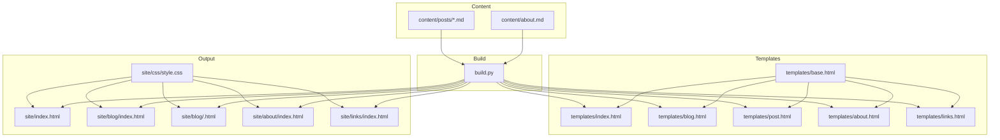

**Diagram sources**
- [build.py:154-236](file://build.py#L154-L236)
- [base.html:1-43](file://templates/base.html#L1-L43)
- [index.html:1-73](file://templates/index.html#L1-L73)
- [blog.html:1-27](file://templates/blog.html#L1-L27)
- [post.html:1-30](file://templates/post.html#L1-L30)
- [about.html:1-12](file://templates/about.html#L1-L12)
- [links.html:1-48](file://templates/links.html#L1-L48)
- [style.css:1-513](file://site/css/style.css#L1-L513)

**Section sources**
- [build.py:154-236](file://build.py#L154-L236)
- [requirements.txt:1-4](file://requirements.txt#L1-L4)

## Core Components
- Base template: Provides the shared layout, navigation, meta tags, and blocks for title, description, and content.
- Specialized templates: Extend base.html and define page-specific blocks and content.
- Build script: Loads content, converts Markdown, computes derived data, and renders templates with a shared context.
- CSS: Provides responsive design and theme tokens.

Key template context variables:
- root: Relative path prefix for links
- year: Current year for footer
- active: Active navigation marker for base.html
- recent_posts: List of posts for the home page
- posts: List of posts for the blog listing
- post: Single post object for post pages
- about_content: Rendered about page content

**Section sources**
- [base.html:14-39](file://templates/base.html#L14-L39)
- [index.html:178-187](file://build.py#L178-L187)
- [blog.html:190-198](file://build.py#L190-L198)
- [post.html:200-212](file://build.py#L200-L212)
- [about.html:213-222](file://build.py#L213-L222)
- [links.html:224-232](file://build.py#L224-L232)

## Architecture Overview
The rendering pipeline:
1. Build script initializes a Jinja2 environment and loads content.
2. For each page, it prepares a context dictionary and renders the appropriate template.
3. The rendered HTML is written to the site directory.

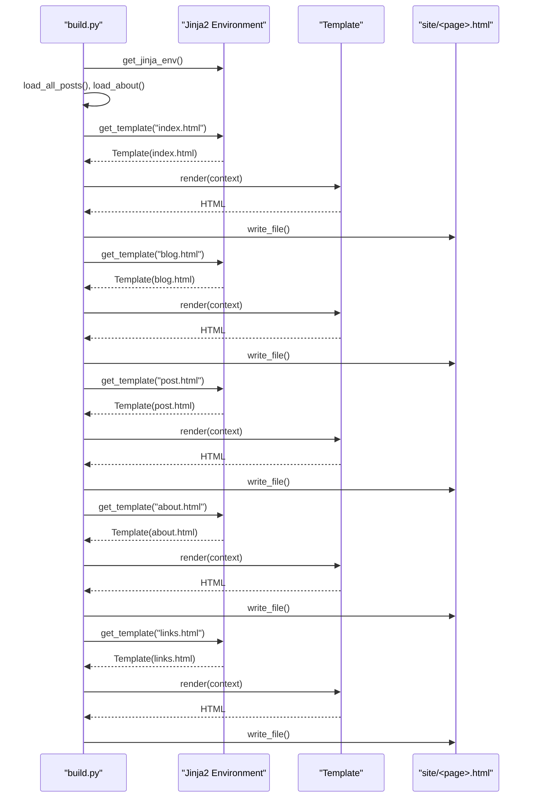

**Diagram sources**
- [build.py:47-53](file://build.py#L47-L53)
- [build.py:178-187](file://build.py#L178-L187)
- [build.py:190-198](file://build.py#L190-L198)
- [build.py:200-212](file://build.py#L200-L212)
- [build.py:213-222](file://build.py#L213-L222)
- [build.py:224-232](file://build.py#L224-L232)

## Detailed Component Analysis

### Base Template and Navigation
- Defines the HTML skeleton, meta tags, and stylesheets.
- Provides blocks for title and description.
- Implements a responsive navigation bar with an active-state indicator controlled by the active context variable.
- Exposes a content block for child templates.

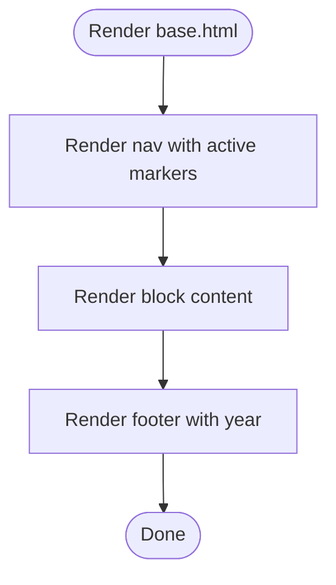

**Diagram sources**
- [base.html:14-39](file://templates/base.html#L14-L39)

**Section sources**
- [base.html:14-39](file://templates/base.html#L14-L39)

### Home Page Template (index.html)
- Extends base.html and sets page-specific title and description.
- Renders a hero section with avatar and social links.
- Iterates over recent_posts to build a post list.
- Uses conditional logic to show excerpts and tags when present.

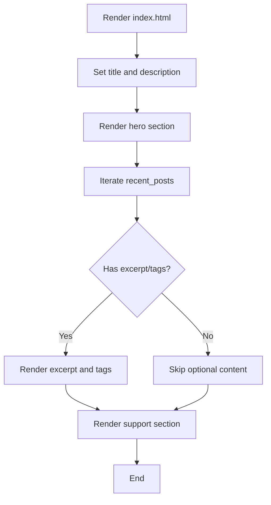

**Diagram sources**
- [index.html:1-73](file://templates/index.html#L1-L73)

**Section sources**
- [index.html:1-73](file://templates/index.html#L1-L73)

### Blog Listing Template (blog.html)
- Extends base.html and defines title and description.
- Renders a full list of posts with dates, titles, excerpts, and tags.
- Includes a fallback message when no posts are present.

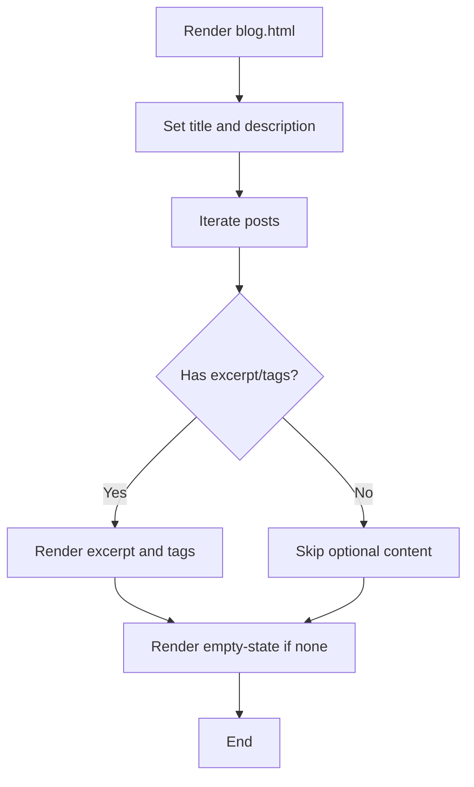

**Diagram sources**
- [blog.html:1-27](file://templates/blog.html#L1-L27)

**Section sources**
- [blog.html:1-27](file://templates/blog.html#L1-L27)

### Individual Post Template (post.html)
- Extends base.html and dynamically sets title and description from the post object.
- Renders post header with date, reading time, and tags.
- Renders the post content as raw HTML.
- Provides a back-to-blog navigation.

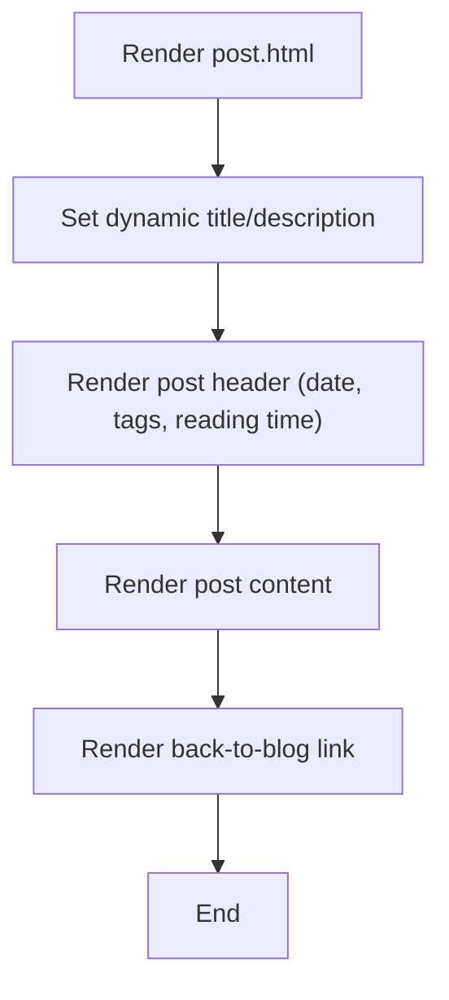

**Diagram sources**
- [post.html:1-30](file://templates/post.html#L1-L30)

**Section sources**
- [post.html:1-30](file://templates/post.html#L1-L30)

### About Page Template (about.html)
- Extends base.html and sets title and description.
- Renders pre-rendered about_content passed from the build script.

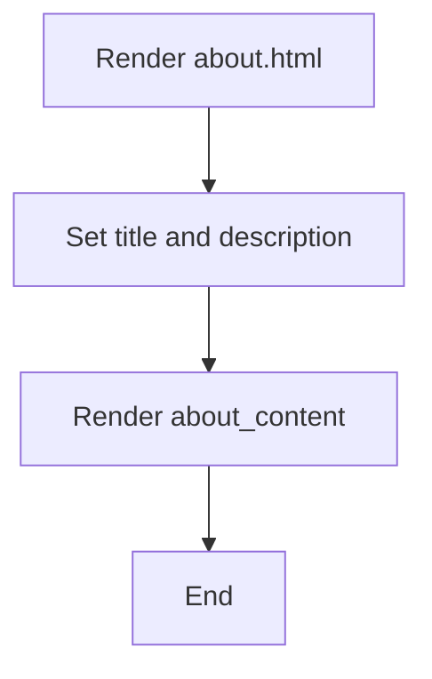

**Diagram sources**
- [about.html:1-12](file://templates/about.html#L1-L12)

**Section sources**
- [about.html:1-12](file://templates/about.html#L1-L12)

### Links Page Template (links.html)
- Extends base.html and sets title and description.
- Renders a grid of link cards and a support section.

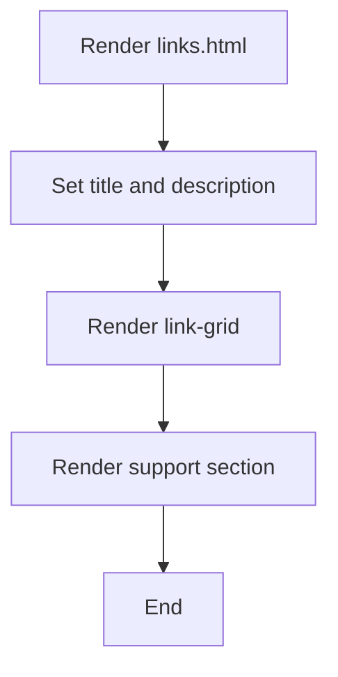

**Diagram sources**
- [links.html:1-48](file://templates/links.html#L1-L48)

**Section sources**
- [links.html:1-48](file://templates/links.html#L1-L48)

### Template Context Variables and Rendering
- Shared context keys: root, year
- Page-specific keys:
  - Home: recent_posts
  - Blog listing: posts
  - Post pages: post
  - About: about_content
- The build script passes active to highlight the current navigation item.

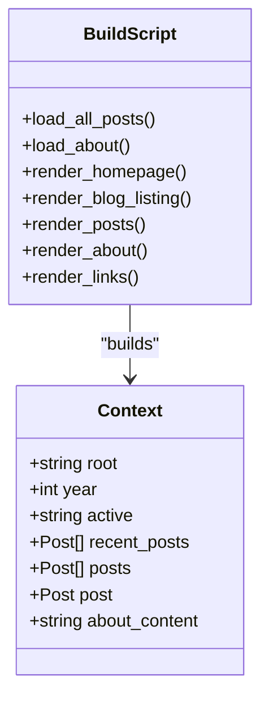

**Diagram sources**
- [build.py:163-167](file://build.py#L163-L167)
- [build.py:178-187](file://build.py#L178-L187)
- [build.py:190-198](file://build.py#L190-L198)
- [build.py:200-212](file://build.py#L200-L212)
- [build.py:213-222](file://build.py#L213-L222)
- [build.py:224-232](file://build.py#L224-L232)

**Section sources**
- [build.py:163-167](file://build.py#L163-L167)
- [build.py:178-187](file://build.py#L178-L187)
- [build.py:190-198](file://build.py#L190-L198)
- [build.py:200-212](file://build.py#L200-L212)
- [build.py:213-222](file://build.py#L213-L222)
- [build.py:224-232](file://build.py#L224-L232)

### Responsive Design and CSS Integration
- CSS uses CSS variables for theme tokens and supports light/dark mode via prefers-color-scheme media query.
- Responsive breakpoints adjust typography and layout for small screens.
- Navigation becomes a collapsible menu on mobile devices.

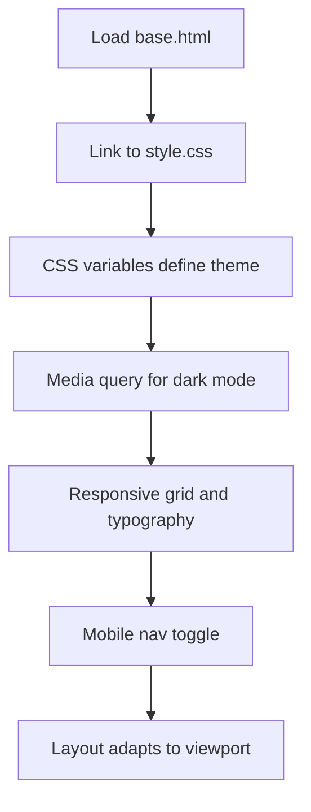

**Diagram sources**
- [base.html:8](file://templates/base.html#L8)
- [style.css:13-23](file://site/css/style.css#L13-L23)
- [style.css:465-476](file://site/css/style.css#L465-L476)
- [style.css:478-512](file://site/css/style.css#L478-L512)
- [base.html:17-24](file://templates/base.html#L17-L24)

**Section sources**
- [base.html:8](file://templates/base.html#L8)
- [style.css:13-23](file://site/css/style.css#L13-L23)
- [style.css:465-476](file://site/css/style.css#L465-L476)
- [style.css:478-512](file://site/css/style.css#L478-L512)
- [base.html:17-24](file://templates/base.html#L17-L24)

### Template Customization Techniques
- Add new blocks in base.html and override them in child templates.
- Introduce new context variables in build.py and pass them to templates.
- Use Jinja2 conditionals and loops to handle optional content gracefully.
- Extend CSS variables and media queries for responsive adjustments.

Practical examples:
- Adding a new page: create a new template extending base.html, add a route in build.py, and pass any required context.
- Modifying navigation: update base.html’s nav block and adjust active logic.
- Enhancing post rendering: extend post.html to include additional metadata or related content.

**Section sources**
- [base.html:14-39](file://templates/base.html#L14-L39)
- [index.html:1-73](file://templates/index.html#L1-L73)
- [blog.html:1-27](file://templates/blog.html#L1-L27)
- [post.html:1-30](file://templates/post.html#L1-L30)
- [about.html:1-12](file://templates/about.html#L1-L12)
- [links.html:1-48](file://templates/links.html#L1-L48)
- [build.py:178-187](file://build.py#L178-L187)
- [build.py:190-198](file://build.py#L190-L198)
- [build.py:200-212](file://build.py#L200-L212)
- [build.py:213-222](file://build.py#L213-L222)
- [build.py:224-232](file://build.py#L224-L232)

### Conditional Logic and Variable Usage
- Navigation active state: base.html checks the active context variable to apply an active class.
- Optional content: index.html and blog.html conditionally render excerpts and tags.
- Empty-state handling: blog.html displays a message when no posts are present.
- Dynamic metadata: post.html sets title and description from the post object.

**Section sources**
- [base.html:19-22](file://templates/base.html#L19-L22)
- [index.html:30-35](file://templates/index.html#L30-L35)
- [blog.html:13-18](file://templates/blog.html#L13-L18)
- [blog.html:23-25](file://templates/blog.html#L23-L25)
- [post.html:2-3](file://templates/post.html#L2-L3)

### Practical Examples
- Modify the home hero section: edit index.html to change the avatar, subtitle, or social links.
- Add a new post tag display: extend post.html to render additional tag styles or counts.
- Customize the about page: edit about.html to include extra sections or images.
- Create a new page: add a new template extending base.html and register it in build.py.

**Section sources**
- [index.html:5-18](file://templates/index.html#L5-L18)
- [post.html:6-28](file://templates/post.html#L6-L28)
- [about.html:5-11](file://templates/about.html#L5-L11)
- [build.py:178-187](file://build.py#L178-L187)
- [build.py:190-198](file://build.py#L190-L198)
- [build.py:200-212](file://build.py#L200-L212)
- [build.py:213-222](file://build.py#L213-L222)
- [build.py:224-232](file://build.py#L224-L232)

## Dependency Analysis
- Jinja2: Template engine for rendering
- markdown: Markdown to HTML conversion
- python-frontmatter: Parsing YAML frontmatter from Markdown

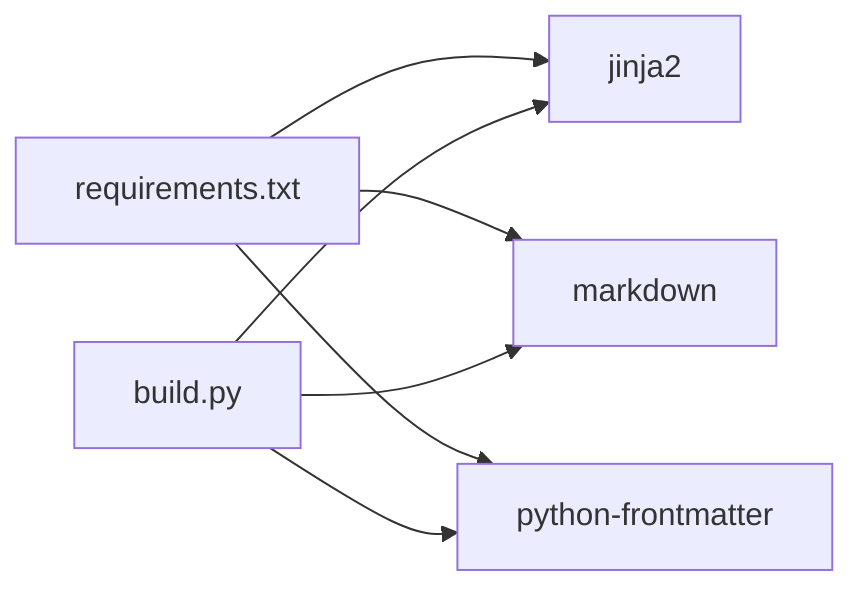

**Diagram sources**
- [requirements.txt:1-4](file://requirements.txt#L1-L4)
- [build.py:18-20](file://build.py#L18-L20)

**Section sources**
- [requirements.txt:1-4](file://requirements.txt#L1-L4)
- [build.py:18-20](file://build.py#L18-L20)

## Performance Considerations
- Minimize heavy computations inside templates; compute derived data in build.py (e.g., reading time estimation).
- Reuse shared context to reduce repeated work.
- Keep templates simple and avoid deep nesting of loops and conditionals.
- Use CSS variables and media queries efficiently to avoid layout thrashing.

[No sources needed since this section provides general guidance]

## Troubleshooting Guide
Common issues and resolutions:
- Missing context variables: Ensure build.py passes required variables to each template.
- Incorrect active navigation: Verify the active context value matches the expected string.
- Broken links: Confirm root context is correct for relative paths.
- Markdown rendering problems: Check markdown extensions and ensure content frontmatter is valid.
- CSS not loading: Verify the stylesheet path in base.html matches the actual file location.

Debugging tips:
- Temporarily print context variables in build.py during development.
- Validate Jinja2 syntax errors by rendering templates individually.
- Inspect generated HTML in the site directory to confirm structure.

**Section sources**
- [build.py:163-167](file://build.py#L163-L167)
- [base.html:8](file://templates/base.html#L8)
- [build.py:178-187](file://build.py#L178-L187)
- [build.py:190-198](file://build.py#L190-L198)
- [build.py:200-212](file://build.py#L200-L212)
- [build.py:213-222](file://build.py#L213-L222)
- [build.py:224-232](file://build.py#L224-L232)

## Conclusion
Seisamuse’s template system centers on a robust base.html with clear inheritance and a consistent rendering pipeline driven by build.py. By leveraging Jinja2’s blocks, conditionals, and loops, and by passing a minimal, shared context, the site remains maintainable and extensible. The responsive CSS ensures accessibility across devices, while the modular design simplifies customization and future enhancements.

[No sources needed since this section summarizes without analyzing specific files]

## Appendices

### Template Context Reference
- root: String used to prefix internal links
- year: Integer for dynamic footer year
- active: String indicating current navigation item
- recent_posts: List of post dictionaries for home page
- posts: List of post dictionaries for blog listing
- post: Single post dictionary for post pages
- about_content: Rendered HTML for the about page

**Section sources**
- [build.py:163-167](file://build.py#L163-L167)
- [build.py:178-187](file://build.py#L178-L187)
- [build.py:190-198](file://build.py#L190-L198)
- [build.py:200-212](file://build.py#L200-L212)
- [build.py:213-222](file://build.py#L213-L222)
- [build.py:224-232](file://build.py#L224-L232)

### Content Metadata and Derived Data
- Posts: Loaded via frontmatter, converted to HTML, and enriched with derived fields such as reading time and excerpts.
- About: Loaded and converted to HTML for direct insertion.

**Section sources**
- [build.py:73-112](file://build.py#L73-L112)
- [build.py:133-139](file://build.py#L133-L139)
- [welcome-to-seisamuse.md:1-6](file://content/posts/welcome-to-seisamuse.md#L1-L6)
- [environmental-seismology-intro.md:1-6](file://content/posts/environmental-seismology-intro.md#L1-L6)
- [about.md:1-3](file://content/about.md#L1-L3)