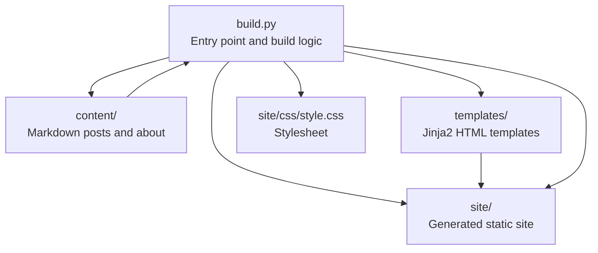
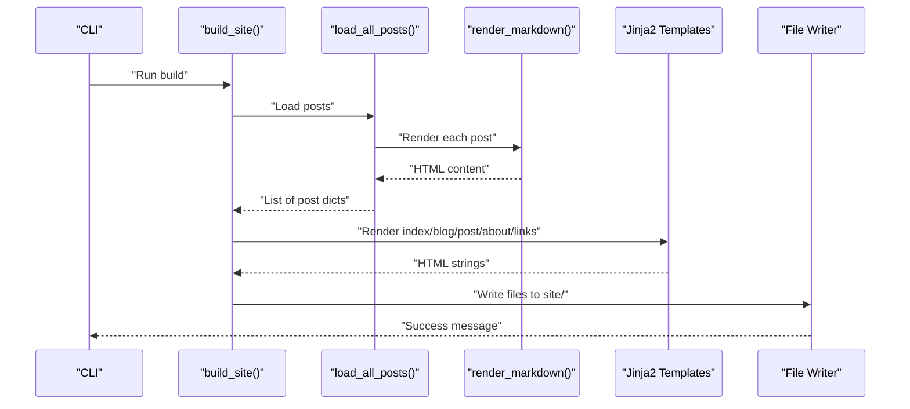
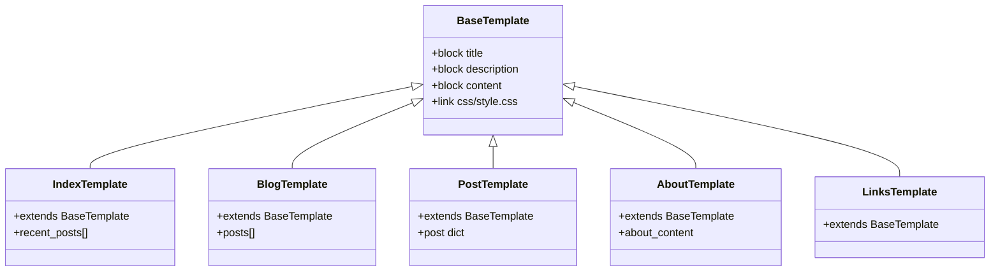
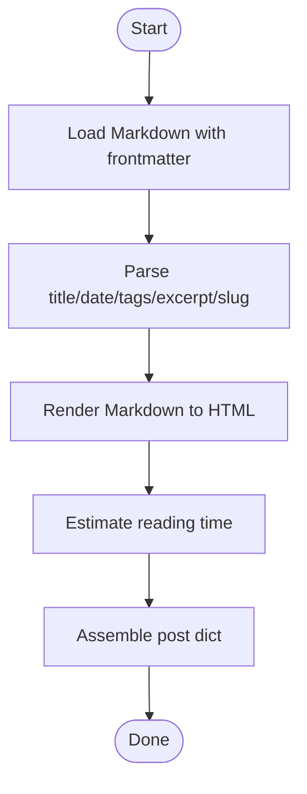
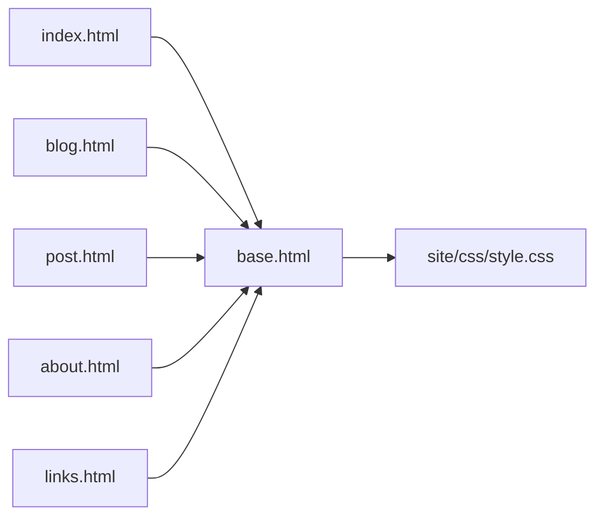

# Troubleshooting and FAQ

<cite>
**Referenced Files in This Document**
- [build.py](file://build.py)
- [requirements.txt](file://requirements.txt)
- [content/about.md](file://content/about.md)
- [content/posts/welcome-to-seisamuse.md](file://content/posts/welcome-to-seisamuse.md)
- [content/posts/environmental-seismology-intro.md](file://content/posts/environmental-seismology-intro.md)
- [templates/base.html](file://templates/base.html)
- [templates/index.html](file://templates/index.html)
- [templates/blog.html](file://templates/blog.html)
- [templates/post.html](file://templates/post.html)
- [templates/about.html](file://templates/about.html)
- [templates/links.html](file://templates/links.html)
- [site/css/style.css](file://site/css/style.css)
</cite>

## Table of Contents
1. [Introduction](#introduction)
2. [Project Structure](#project-structure)
3. [Core Components](#core-components)
4. [Architecture Overview](#architecture-overview)
5. [Detailed Component Analysis](#detailed-component-analysis)
6. [Dependency Analysis](#dependency-analysis)
7. [Performance Considerations](#performance-considerations)
8. [Troubleshooting Guide](#troubleshooting-guide)
9. [Conclusion](#conclusion)
10. [Appendices](#appendices)

## Introduction
This document provides a practical troubleshooting and FAQ guide for the Seisamuse static site builder. It focuses on resolving installation issues, build-time errors, runtime problems, and deployment concerns. It also includes debugging techniques for templates, CSS, and content formatting, along with performance tips and answers to frequent questions about customization and migration.

## Project Structure
Seisamuse is a minimal static site generator that converts Markdown content into HTML using Jinja2 templates. The build process reads content from the content directory, renders Markdown to HTML, and writes static files to the site directory.

**Diagram sources**
- [build.py:154-236](file://build.py#L154-L236)
- [templates/base.html:1-43](file://templates/base.html#L1-43)
- [site/css/style.css:1-513](file://site/css/style.css#L1-L513)

**Section sources**
- [build.py:154-236](file://build.py#L154-L236)
- [templates/base.html:1-43](file://templates/base.html#L1-L43)
- [site/css/style.css:1-513](file://site/css/style.css#L1-L513)

## Core Components
- Content loader: Reads Markdown files with frontmatter metadata and converts content to HTML.
- Template engine: Uses Jinja2 to render templates with computed context.
- File writer: Ensures directories exist and writes rendered HTML to the site directory.
- Local server: Starts a simple HTTP server for preview during development.

Key behaviors and failure points:
- Missing or malformed frontmatter in content files can cause parsing errors.
- Missing template files or incorrect template names will raise template lookup errors.
- Directory permissions or write failures will prevent output generation.
- Serving requires the site directory to be present and readable.

**Section sources**
- [build.py:73-130](file://build.py#L73-L130)
- [build.py:154-236](file://build.py#L154-L236)
- [build.py:239-253](file://build.py#L239-L253)

## Architecture Overview
The build pipeline follows a predictable flow: load content → render Markdown → compute context → render templates → write files.

**Diagram sources**
- [build.py:154-236](file://build.py#L154-L236)
- [build.py:56-64](file://build.py#L56-L64)
- [build.py:115-130](file://build.py#L115-L130)

## Detailed Component Analysis

### Template System
Templates extend a base layout and inject dynamic content via blocks. Common issues include:
- Missing base template or incorrect relative paths.
- Undefined variables passed to templates (e.g., missing keys in post dictionaries).
- Incorrect root context affecting asset URLs.

**Diagram sources**
- [templates/base.html:1-43](file://templates/base.html#L1-L43)
- [templates/index.html:1-73](file://templates/index.html#L1-L73)
- [templates/blog.html:1-27](file://templates/blog.html#L1-L27)
- [templates/post.html:1-30](file://templates/post.html#L1-L30)
- [templates/about.html:1-12](file://templates/about.html#L1-L12)
- [templates/links.html:1-48](file://templates/links.html#L1-L48)

**Section sources**
- [templates/base.html:1-43](file://templates/base.html#L1-L43)
- [templates/index.html:1-73](file://templates/index.html#L1-L73)
- [templates/blog.html:1-27](file://templates/blog.html#L1-L27)
- [templates/post.html:1-30](file://templates/post.html#L1-L30)
- [templates/about.html:1-12](file://templates/about.html#L1-L12)
- [templates/links.html:1-48](file://templates/links.html#L1-L48)

### Content Processing
Content is loaded via frontmatter and processed into structured dictionaries. Issues often arise from:
- Malformed YAML frontmatter.
- Unexpected data types for date or tags.
- Empty or missing excerpts forcing fallback logic.

**Diagram sources**
- [build.py:73-112](file://build.py#L73-L112)

**Section sources**
- [build.py:73-112](file://build.py#L73-L112)

### Asset Pipeline
CSS is linked from the base template and used across pages. Problems commonly involve:
- Missing or inaccessible stylesheet.
- Relative URL mismatches when serving from subdirectories.

**Diagram sources**
- [templates/base.html:8](file://templates/base.html#L8)
- [site/css/style.css:1-513](file://site/css/style.css#L1-L513)

**Section sources**
- [templates/base.html:8](file://templates/base.html#L8)
- [site/css/style.css:1-513](file://site/css/style.css#L1-L513)

## Dependency Analysis
External libraries and minimum versions:
- Jinja2 >= 3.1
- markdown >= 3.5
- python-frontmatter >= 1.0

Failure symptoms:
- Import errors indicating missing packages.
- Version conflicts causing unexpected behavior.

Resolution steps:
- Install dependencies using the provided requirements file.
- Upgrade pip and use a virtual environment to avoid system conflicts.

**Section sources**
- [requirements.txt:1-4](file://requirements.txt#L1-L4)
- [build.py:18-20](file://build.py#L18-L20)

## Performance Considerations
- Minimize heavy Markdown features if building large sites.
- Keep the number of posts manageable to reduce processing time.
- Avoid excessive image sizes; compress assets before building.
- Use the built-in local server for quick previews; avoid unnecessary rebuilds.

[No sources needed since this section provides general guidance]

## Troubleshooting Guide

### Installation and Environment
Symptoms
- Python import errors for Jinja2, markdown, or frontmatter.
- Conflicts with system Python packages.
- Virtual environment activation issues.

Resolutions
- Create and activate a dedicated virtual environment.
- Install dependencies from the requirements file.
- Verify Python version compatibility and upgrade pip if needed.

Step-by-step
1. Create a virtual environment and activate it.
2. Upgrade pip.
3. Install dependencies from the requirements file.
4. Re-run the build script.

**Section sources**
- [requirements.txt:1-4](file://requirements.txt#L1-4)
- [build.py:155-158](file://build.py#L155-L158)

### Build-Time Errors
Common issues
- Missing content directory or posts.
- Template lookup failures.
- Frontmatter parsing errors.
- Markdown rendering exceptions.

Debugging steps
- Confirm content directory exists and contains Markdown files.
- Verify template names match those used in the build logic.
- Inspect frontmatter syntax in Markdown files.
- Run the build in isolation to capture stack traces.

Resolution checklist
- Ensure content/posts contains valid Markdown with proper frontmatter.
- Confirm templates/base.html exists and is readable.
- Fix YAML syntax errors in frontmatter.
- Re-run the build after correcting content.

**Section sources**
- [build.py:115-130](file://build.py#L115-L130)
- [build.py:178-232](file://build.py#L178-L232)
- [content/posts/welcome-to-seisamuse.md:1-53](file://content/posts/welcome-to-seisamuse.md#L1-L53)
- [content/posts/environmental-seismology-intro.md:1-41](file://content/posts/environmental-seismology-intro.md#L1-L41)

### Runtime Issues (Local Preview Server)
Symptoms
- Server fails to start or immediately exits.
- Port already in use.
- Cannot access served files.

Resolutions
- Choose a different port if the default is taken.
- Ensure the site directory exists and is readable.
- Stop any conflicting processes using the port.

**Section sources**
- [build.py:239-253](file://build.py#L239-L253)

### File Permission Errors
Symptoms
- Write failures when generating site files.
- Partial builds or missing output.

Resolutions
- Check write permissions for the repository directory.
- Run the build with appropriate privileges.
- Clear partial artifacts and retry.

**Section sources**
- [build.py:147-151](file://build.py#L147-L151)

### Output Generation Failures
Symptoms
- Missing pages or incomplete site.
- Unexpected empty blog listings.

Resolutions
- Confirm content/posts exists and is populated.
- Validate frontmatter completeness and correctness.
- Ensure template rendering succeeds without undefined variables.

**Section sources**
- [build.py:170-172](file://build.py#L170-L172)
- [build.py:189-198](file://build.py#L189-L198)
- [build.py:200-212](file://build.py#L200-L212)
- [build.py:213-222](file://build.py#L213-L222)
- [build.py:224-232](file://build.py#L224-L232)

### Debugging Template Issues
Symptoms
- Broken layout or missing navigation.
- Incorrect or missing content blocks.
- Asset URLs not resolving.

Debugging steps
- Temporarily simplify templates to isolate the issue.
- Add placeholders to verify block rendering.
- Check the root variable usage for asset paths.

Resolution checklist
- Ensure base.html is present and linked correctly.
- Verify active page markers and block names.
- Confirm root context is set appropriately for nested paths.

**Section sources**
- [templates/base.html:1-43](file://templates/base.html#L1-43)
- [templates/index.html:1-73](file://templates/index.html#L1-L73)
- [templates/blog.html:1-27](file://templates/blog.html#L1-L27)
- [templates/post.html:1-30](file://templates/post.html#L1-L30)
- [templates/about.html:1-12](file://templates/about.html#L1-L12)
- [templates/links.html:1-48](file://templates/links.html#L1-L48)

### Debugging CSS and Styling Problems
Symptoms
- Styles not applied or broken layout.
- Assets not loading due to incorrect paths.

Debugging steps
- Verify the stylesheet link in the base template.
- Check that the CSS file exists in the expected location.
- Test locally with the built-in server.

Resolution checklist
- Confirm the stylesheet path matches the site structure.
- Validate CSS selectors and media queries.
- Rebuild and refresh the browser cache.

**Section sources**
- [templates/base.html:8](file://templates/base.html#L8)
- [site/css/style.css:1-513](file://site/css/style.css#L1-L513)

### Debugging Content Formatting Errors
Symptoms
- Incorrect excerpts, dates, or reading time.
- Missing or truncated content.

Debugging steps
- Inspect frontmatter fields and ensure correct types.
- Review excerpt generation logic and fallbacks.
- Validate Markdown rendering and extensions.

Resolution checklist
- Fix frontmatter keys and values.
- Adjust excerpt length or remove problematic content.
- Re-render content and rebuild.

**Section sources**
- [build.py:73-112](file://build.py#L73-L112)
- [build.py:56-64](file://build.py#L56-L64)
- [content/about.md:1-36](file://content/about.md#L1-L36)
- [content/posts/welcome-to-seisamuse.md:1-53](file://content/posts/welcome-to-seisamuse.md#L1-L53)
- [content/posts/environmental-seismology-intro.md:1-41](file://content/posts/environmental-seismology-intro.md#L1-L41)

### Deployment and Hosting
Common issues
- Incorrect asset paths on hosted domains.
- Missing index file or wrong directory structure.
- Case sensitivity on certain hosts.

Resolutions
- Validate root context and asset URLs.
- Ensure the site directory is deployed as the web root.
- Test on the target host’s staging environment first.

**Section sources**
- [templates/base.html:8](file://templates/base.html#L8)
- [build.py:178-232](file://build.py#L178-L232)

### Frequently Asked Questions

Q: How do I add a new blog post?
A: Place a Markdown file with frontmatter in the content/posts directory and rebuild the site. Ensure the frontmatter includes title, date, and optional tags and excerpt.

Q: How do I customize the about page?
A: Edit the content/about.md file and rebuild. The page is generated from the about template.

Q: How do I change the site’s appearance?
A: Modify the CSS in site/css/style.css and rebuild. The base template links to this stylesheet.

Q: How do I preview locally?
A: Run the build script with the serve argument to start a local server.

Q: How do I fix “template not found” errors?
A: Ensure templates/base.html exists and that template names in the build logic match actual filenames.

Q: How do I handle frontmatter errors?
A: Validate YAML syntax in the frontmatter block and ensure required fields are present.

Q: How do I migrate content from another platform?
A: Convert existing content to Markdown with compatible frontmatter and place under content/posts or content/about.

Q: How do I optimize build performance?
A: Keep content concise, limit heavy Markdown features, and avoid large images.

**Section sources**
- [build.py:154-236](file://build.py#L154-L236)
- [build.py:115-130](file://build.py#L115-L130)
- [content/about.md:1-36](file://content/about.md#L1-L36)
- [site/css/style.css:1-513](file://site/css/style.css#L1-L513)
- [templates/base.html:8](file://templates/base.html#L8)

## Conclusion
By following the structured troubleshooting steps and understanding the build pipeline, most issues can be resolved quickly. Focus on validating content and frontmatter, ensuring templates and assets are present, and confirming environment and dependency setup. Use the provided resolutions to address installation, build, runtime, and deployment challenges efficiently.

[No sources needed since this section summarizes without analyzing specific files]

## Appendices

### Quick Fix Checklist
- Dependencies installed and up to date.
- Virtual environment active.
- Content directory exists and is readable.
- Templates present and named correctly.
- Frontmatter valid and complete.
- Site directory writable.
- Local server port available.

**Section sources**
- [requirements.txt:1-4](file://requirements.txt#L1-4)
- [build.py:154-236](file://build.py#L154-L236)
- [build.py:239-253](file://build.py#L239-L253)