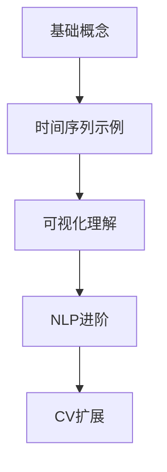

&emsp;&emsp;今天学习注意力机制（[Attention Mechanism](https://towardsdatascience.com/hands-on-attention-mechanism-for-time-series-classification-with-python/)）。
<!--less-->
&emsp;&emsp;注意力机制的核心思想是让模型能够动态聚焦于输入数据中最相关的部分。在时间序列分类中：
工作原理：

通过计算每个时间步的"重要性分数"（attention score）

使用softmax函数将这些分数转换为0-1之间的权重

对时间步特征进行加权求和，生成上下文向量（context vector）
数学表示：

   $e_i = f(h_i)$  # 计算每个隐藏状态h_i的能量分数
   $α_i = exp(e_i) / Σ exp(e_j)$  # softmax归一化
   $context = Σ (α_i * h_i)$  # 加权上下文向量
与传统模型的对比：

|模型类型 |处理变长异常能力 |可解释性 |计算效率|
|-------|------|------|------|
|FFN |❌ 固定位置依赖 |❌ 黑盒 |⭐⭐⭐⭐|
|CNN |△ 局部感受野 |△ 中等 |⭐⭐⭐⭐|
|Attention | ✅ 动态聚焦| ✅ 高（权重可视化）| ⭐⭐⭐|

双向LSTM（BiLSTM）
作用：作为特征提取器，捕获时间序列的前后依赖关系

双向性：同时考虑过去和未来信息
  
  前向：h_forward = LSTM(从t=0到t=T)
  后向：h_backward = LSTM(从t=T到t=0)
  最终状态：h = [h_forward; h_backward]

异常检测机制


模型架构

```python
AttentionModel(
  (lstm): LSTM(1, 32, bidirectional=True)
  (attention): Sequential(
    (0): Linear(in_features=64, out_features=64)
    (1): Tanh()
    (2): Linear(in_features=64, out_features=1)
  )
  (classifier): Sequential(
    (0): Linear(in_features=64, out_features=1)
    (1): Sigmoid()
  )
)
```

评估指标
ROC-AUC：衡量模型区分正负样本的能力

值域[0,1]，>0.9表示优秀模型
F1-Score：精确率和召回率的调和平均
```
   F1 = 2  (Precision  Recall) / (Precision + Recall)
``` 
混淆矩阵：

   |            |预测正常  |  预测异常|
   |------|------|------|
   |实际正常   |TN (真负例)  |FP (假正例)|
   |实际异常   |FN (假负例)  |TP (真正例)|
   

"学习注意力机制的最佳途径不是NLP而是时间序列"
优势：
1. 复杂度降低：
### NLP需要词嵌入/位置编码等额外层
### 时间序列可直接使用原始数值数据
### 示例：NLP处理流程 vs 时间序列处理
```
     # NLP
     文本 → 分词 → 嵌入 → 位置编码 → 注意力
     # 时间序列
     原始信号 → 注意力
``` 
2. 直观可视化：
  时间序列的注意力权重可直接叠加在信号图上
  NLP的注意力热力图需要专业知识解释
3. 计算效率：
  时间序列可生成小型合成数据集（文中5000样本）
  训练在CPU上仅需几分钟（NLP模型通常需要GPU小时级训练）

局限性：
1. 语义理解缺失：
 NLP任务能更好展示注意力处理语义关系的能力
 如：指代消解"The animal didn't cross the street because it was too tired"
2. 实际应用偏差：
  工业界注意力应用仍以NLP为主（BERT, GPT等）
  时间序列注意力研究相对较少

改进建议:
1. 混合学习路径（推荐）



2. 增强时间序列实验设计
  多类型异常：
``` python
  # 当前：仅平坦异常
  wave[loc:end] = wave[loc] 
  
  # 建议增加：
  wave[loc:end] = 0  # 零值异常
  wave[loc:end] = random_noise()  # 噪声异常
  wave = add_spike(loc)  # 尖峰异常
``` 
多变量时间序列：
``` python
    # 当前：单变量正弦波
  X.shape = (5000, 500, 1)
  
  # 改进：多变量
  X_multi = np.stack([sine_wave, 
                      cosine_wave, 
                      random_walk], axis=-1)
```
3. 模型架构优化

多头注意力（Multi-Head Attention）：
``` python
    # 当前：单头
  self.attention = nn.Sequential(...)
  
  # 改进：多头
  self.multihead_attn = nn.MultiheadAttention(
      embed_dim=64, num_heads=4
  )
``` 
位置编码增强：
``` python
    # 当前：依赖LSTM的顺序处理
  # 改进：显式位置编码
  position = torch.arange(0, seq_len).unsqueeze(1)
  pe = torch.sin(position / 10000(2*i/d_model))
``` 
4. 可解释性增强

定量评估指标：
``` python
    def attention_accuracy(att_weights, anomaly_loc):
      """计算注意力聚焦异常区域的准确度"""
      focus_region = att_weights.argmax()-10 : att_weights.argmax()+10
      overlap = len(set(focus_region) & set(anomaly_loc))
      return overlap / len(anomaly_loc)
``` 
对比可视化：

|样本类型 |正常样本| 异常样本|
|------|------|------|
|注意力分布| 均匀分布| 峰值在异常区|
|典型模式| | |

时间序列提供了更简洁直观的注意力学习路径。但在工业实践中，建议：
1. 以时间序列作为入门起点
2. 通过NLP任务深化语义理解
3. 最终扩展到多模态应用
"注意力机制不是领域特定的工具，而是数据关系的动态透镜——时间序列提供了最干净的镜片来观察其本质。"

python脚本例子：
```
import numpy as np
import matplotlib.pyplot as plt
import torch
import torch.nn as nn
import torch.optim as optim
from torch.utils.data import Dataset, DataLoader, TensorDataset
from sklearn.model_selection import train_test_split
from sklearn.metrics import accuracy_score, precision_score, recall_score, f1_score, confusion_matrix, roc_auc_score

# 配置参数
class Config:
    num_points = 500        # 时间序列长度
    dataset_size = 5000     # 数据集大小
    normal_ratio = 0.5      # 正常样本比例
    min_freq = 1            # 最小频率
    max_freq = 4            # 最大频率
    min_amp = 1             # 最小振幅
    max_amp = 10            # 最大振幅
    min_loc_ratio = 0.0     # 异常位置最小比例
    max_loc_ratio = 0.9     # 异常位置最大比例
    min_length_ratio = 0.1  # 异常长度最小比例
    max_length_ratio = 0.5  # 异常长度最大比例
    batch_size = 32         # 批大小
    lr = 0.001              # 学习率
    num_epochs = 15         # 训练轮数
    hidden_dim = 32         # LSTM隐藏层维度
    device = torch.device('cuda' if torch.cuda.is_available() else 'cpu')
    patience = 5            # 早停耐心值

config = Config()

# 1. 数据生成
def generate_sine_wave(length, freq, amp):
    """生成正弦波"""
    t = np.linspace(0, 2*np.pi, length)
    return amp * np.sin(freq * t)

def generate_dataset(config):
    """生成数据集"""
    X = []
    y = []
    
    for _ in range(config.dataset_size):
        # 随机生成频率和振幅
        freq = np.random.uniform(config.min_freq, config.max_freq)
        amp = np.random.uniform(config.min_amp, config.max_amp)
        
        # 生成正常或异常样本
        if np.random.rand() < config.normal_ratio:
            # 正常样本
            wave = generate_sine_wave(config.num_points, freq, amp)
            label = 0
        else:
            # 异常样本：生成正弦波并在随机位置插入平坦段
            wave = generate_sine_wave(config.num_points, freq, amp)
            # 随机选择异常位置和长度（按比例）
            loc_ratio = np.random.uniform(config.min_loc_ratio, config.max_loc_ratio)
            length_ratio = np.random.uniform(config.min_length_ratio, config.max_length_ratio)
            loc = int(loc_ratio * config.num_points)
            length = int(length_ratio * config.num_points)
            end = min(loc + length, config.num_points)
            # 将选定区域替换为常数值（取开始点的值）
            wave[loc:end] = wave[loc]
            label = 1
        
        X.append(wave)
        y.append(label)
    
    # 转换为numpy数组
    X = np.array(X)
    y = np.array(y)
    
    # 转换为PyTorch张量
    X_tensor = torch.tensor(X, dtype=torch.float32).unsqueeze(-1)  # (N, T, 1)
    y_tensor = torch.tensor(y, dtype=torch.float32)  # (N,)
    
    return X_tensor, y_tensor

# 2. 模型定义
class AttentionModel(nn.Module):
    def __init__(self, input_dim=1, hidden_dim=32):
        super(AttentionModel, self).__init__()
        # 双向LSTM
        self.lstm = nn.LSTM(
            input_size=input_dim,
            hidden_size=hidden_dim,
            batch_first=True,
            bidirectional=True
        )
        # 注意力权重计算
        self.attention = nn.Sequential(
            nn.Linear(2 * hidden_dim, 64),
            nn.Tanh(),
            nn.Linear(64, 1)
        )
        # 分类器
        self.classifier = nn.Sequential(
            nn.Linear(2 * hidden_dim, 1),
            nn.Sigmoid()
        )
    
    def forward(self, x):
        # LSTM处理
        lstm_out, _ = self.lstm(x)  # (batch_size, seq_len, 2*hidden_dim)
        
        # 计算注意力权重
        e = self.attention(lstm_out).squeeze(-1)  # (batch_size, seq_len)
        alpha = torch.softmax(e, dim=1)  # 归一化权重
        alpha_expanded = alpha.unsqueeze(-1)  # (batch_size, seq_len, 1)
        
        # 加权得到上下文向量
        context = torch.sum(alpha_expanded * lstm_out, dim=1)  # (batch_size, 2*hidden_dim)
        
        # 分类
        out = self.classifier(context).squeeze(-1)  # (batch_size,)
        return out, alpha

# 3. 训练函数
def train_model(model, train_loader, val_loader, config):
    model.to(config.device)
    criterion = nn.BCELoss()
    optimizer = optim.Adam(model.parameters(), lr=config.lr)
    
    best_val_loss = float('inf')
    patience_counter = 0
    
    train_losses = []
    val_losses = []
    
    for epoch in range(config.num_epochs):
        # 训练阶段
        model.train()
        train_loss = 0.0
        for batch_X, batch_y in train_loader:
            batch_X, batch_y = batch_X.to(config.device), batch_y.to(config.device)
            
            optimizer.zero_grad()
            outputs, _ = model(batch_X)
            loss = criterion(outputs, batch_y)
            loss.backward()
            optimizer.step()
            
            train_loss += loss.item() * batch_X.size(0)
        
        # 计算平均训练损失
        train_loss = train_loss / len(train_loader.dataset)
        train_losses.append(train_loss)
        
        # 验证阶段
        model.eval()
        val_loss = 0.0
        with torch.no_grad():
            for batch_X, batch_y in val_loader:
                batch_X, batch_y = batch_X.to(config.device), batch_y.to(config.device)
                outputs, _ = model(batch_X)
                loss = criterion(outputs, batch_y)
                val_loss += loss.item() * batch_X.size(0)
        
        val_loss = val_loss / len(val_loader.dataset)
        val_losses.append(val_loss)
        
        print(f'Epoch {epoch+1}/{config.num_epochs} | Train Loss: {train_loss:.4f} | Val Loss: {val_loss:.4f}')
        
        # 早停检查
        if val_loss < best_val_loss:
            best_val_loss = val_loss
            patience_counter = 0
            torch.save(model.state_dict(), 'best_model.pth')
        else:
            patience_counter += 1
            if patience_counter >= config.patience:
                print(f'Early stopping at epoch {epoch+1}')
                break
    
    # 加载最佳模型
    model.load_state_dict(torch.load('best_model.pth'))
    return model, train_losses, val_losses

# 4. 评估函数
def evaluate_model(model, test_loader, config):
    model.eval()
    y_true = []
    y_pred = []
    y_score = []
    
    with torch.no_grad():
        for batch_X, batch_y in test_loader:
            batch_X, batch_y = batch_X.to(config.device), batch_y.to(config.device)
            outputs, _ = model(batch_X)
            
            # 收集真实标签和预测概率
            y_true.extend(batch_y.cpu().numpy())
            y_score.extend(outputs.cpu().numpy())
            y_pred.extend((outputs > 0.5).float().cpu().numpy())
    
    # 计算指标
    acc = accuracy_score(y_true, y_pred)
    prec = precision_score(y_true, y_pred)
    rec = recall_score(y_true, y_pred)
    f1 = f1_score(y_true, y_pred)
    auc = roc_auc_score(y_true, y_score)
    cm = confusion_matrix(y_true, y_pred)
    
    print(f'Accuracy: {acc:.4f}')
    print(f'Precision: {prec:.4f}')
    print(f'Recall: {rec:.4f}')
    print(f'F1 Score: {f1:.4f}')
    print(f'ROC AUC: {auc:.4f}')
    print('Confusion Matrix:')
    print(cm)
    
    return acc, prec, rec, f1, auc, cm

# 5. 可视化注意力
def plot_attention(wave, attention_weights, title='Attention Visualization'):
    """可视化注意力权重"""
    wave = wave.squeeze()
    attention_weights = attention_weights.squeeze()
    
    fig, ax1 = plt.subplots(figsize=(12, 4))
    
    # 绘制原始波形
    ax1.plot(wave, 'b-', label='Signal')
    ax1.set_xlabel('Time Step')
    ax1.set_ylabel('Amplitude', color='b')
    ax1.tick_params('y', colors='b')
    
    # 绘制注意力权重（红色虚线）
    ax2 = ax1.twinx()
    ax2.plot(attention_weights, 'r--', alpha=0.7, label='Attention')
    ax2.set_ylabel('Attention Weight', color='r')
    ax2.tick_params('y', colors='r')
    ax2.set_ylim(0, 1.0)
    
    plt.title(title)
    fig.tight_layout()
    plt.show()

# 主函数
def main():
    # 生成数据
    print("Generating dataset...")
    X, y = generate_dataset(config)
    
    # 划分训练集、验证集、测试集
    X_train, X_temp, y_train, y_temp = train_test_split(
        X, y, test_size=0.3, random_state=42
    )
    X_val, X_test, y_val, y_test = train_test_split(
        X_temp, y_temp, test_size=0.5, random_state=42
    )
    
    # 创建数据加载器
    train_dataset = TensorDataset(X_train, y_train)
    val_dataset = TensorDataset(X_val, y_val)
    test_dataset = TensorDataset(X_test, y_test)
    
    train_loader = DataLoader(train_dataset, batch_size=config.batch_size, shuffle=True)
    val_loader = DataLoader(val_dataset, batch_size=config.batch_size)
    test_loader = DataLoader(test_dataset, batch_size=config.batch_size)
    
    # 初始化模型
    model = AttentionModel(input_dim=1, hidden_dim=config.hidden_dim)
    
    # 训练模型
    print("Training model...")
    model, train_losses, val_losses = train_model(model, train_loader, val_loader, config)
    
    # 评估模型
    print("\nEvaluating model on test set...")
    evaluate_model(model, test_loader, config)
    
    # 可视化训练过程
    plt.figure(figsize=(10, 5))
    plt.plot(train_losses, label='Train Loss')
    plt.plot(val_losses, label='Validation Loss')
    plt.xlabel('Epochs')
    plt.ylabel('Loss')
    plt.legend()
    plt.title('Training and Validation Loss')
    plt.show()
    
    # 可视化注意力机制
    print("\nVisualizing attention for sample examples...")
    model.eval()
    with torch.no_grad():
        # 随机选择一些测试样本
        indices = np.random.choice(len(test_dataset), 4, replace=False)
        for i in indices:
            sample_X, sample_y = test_dataset[i]
            sample_X = sample_X.unsqueeze(0).to(config.device)  # 增加批次维度
            _, attention_weights = model(sample_X)
            
            # 转换回CPU和numpy
            sample_X = sample_X.cpu().numpy().squeeze()
            attention_weights = attention_weights.cpu().numpy().squeeze()
            
            # 绘制
            title = f"Sample {i} - {'Anomaly' if sample_y.item() == 1 else 'Normal'}"
            plot_attention(sample_X, attention_weights, title)

if __name__ == "__main__":
    main()
```
