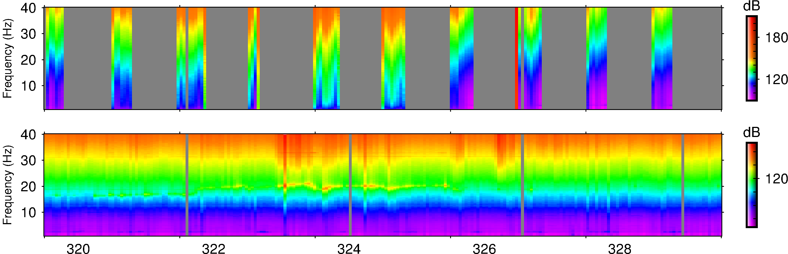
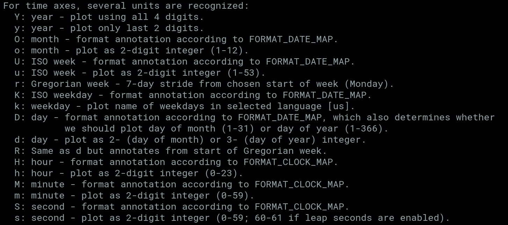
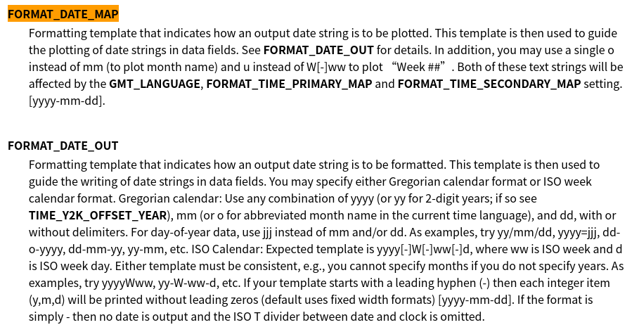

<!-- less -->
&emsp;&emsp;有些时候画图需要用到时间轴。gmt[^1]里面的时间轴是比较简单的。画basemap的时候对于对于rangeR来说加上T就好了。例如
```
-R1990T/1991T/0/1
```
&emsp;&emsp;就可以画1990年到1991年的图。然后重要的是横轴的标注annotation怎么设置，见下图：

&emsp;&emsp;要让这些单位显示出来还涉及到FORMAT_DATE_MAP的设置。其设置如下图：

&emsp;&emsp;例如封面的标注就是将FORMAT_DATE_MAP设置成jjj
```
gmt set FORMAT_DATE_MAP jjj
```
&emsp;&emsp;然后在B选项用-Bsxa10D。
[^1]:gmt版本为5.4.3，运行系统为ElmentaryOS 4.15.0-107-generic.
